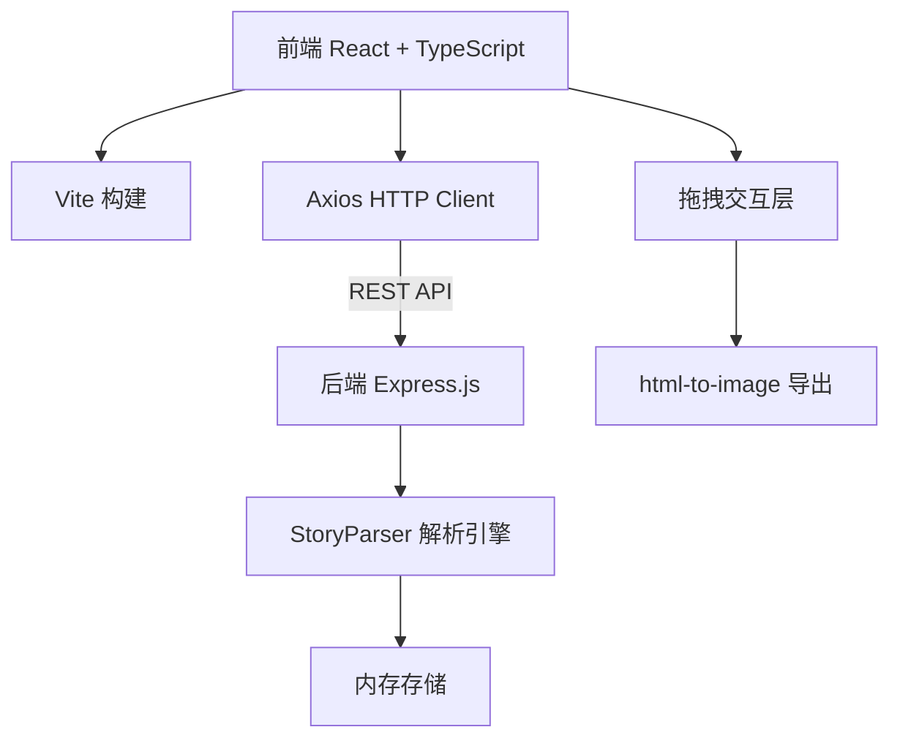
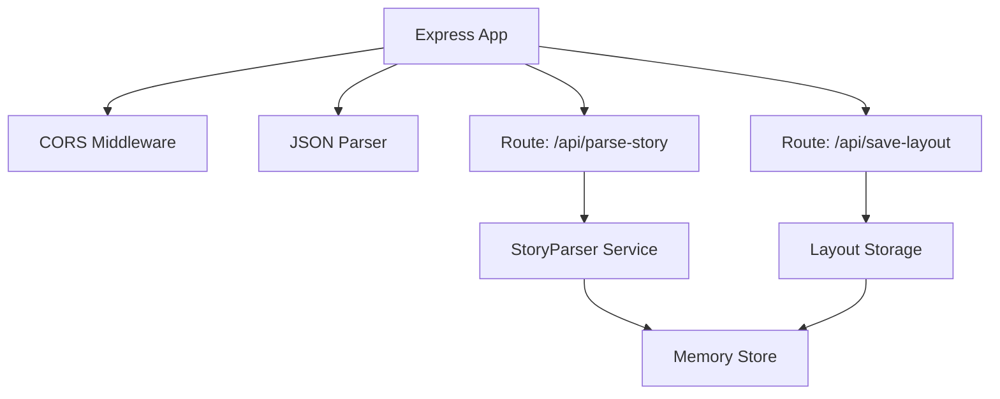
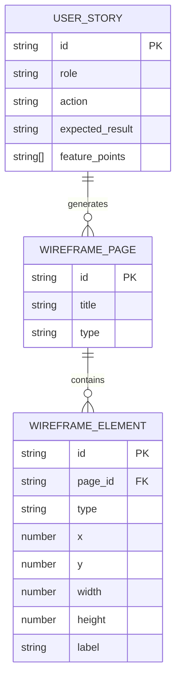

## 1. 架构设计



## 2. 技术描述

- 前端：React 18 + TypeScript + Vite 5
- 后端：Express.js 4 + TypeScript
- HTTP客户端：Axios
- 数据持久化：内存模拟
- 导出功能：html-to-image
- 样式方案：CSS-in-JS / CSS变量主题系统
- 构建工具：Vite

## 3. 路由定义

| 路由 | 用途 |
|------|------|
| / | 主应用页面 - 用户故事输入与线框图展示 |
| /api/parse-story | POST - 解析用户故事文本 |
| /api/save-layout | POST - 保存调整后的布局 |

## 4. API 定义

### 4.1 类型定义

```typescript
interface UserStory {
  id: string;
  role: string;
  action: string;
  expectedResult: string;
  featurePoints: string[];
}

interface WireframeElement {
  id: string;
  type: 'button' | 'input' | 'text' | 'nav' | 'title';
  x: number;
  y: number;
  width: number;
  height: number;
  label: string;
}

interface WireframePage {
  id: string;
  title: string;
  type: 'home' | 'login' | 'settings' | 'list' | 'detail';
  elements: WireframeElement[];
}

interface ParseStoryRequest {
  markdown: string;
}

interface ParseStoryResponse {
  stories: UserStory[];
  pages: WireframePage[];
}

interface SaveLayoutRequest {
  pageId: string;
  elements: WireframeElement[];
}

interface SaveLayoutResponse {
  success: boolean;
  message: string;
}
```

### 4.2 API 端点

**POST /api/parse-story**
- 请求体：`{ markdown: string }`
- 响应：`{ stories: UserStory[], pages: WireframePage[] }`
- 功能：解析Markdown用户故事，提取功能点，生成线框图页面数据

**POST /api/save-layout**
- 请求体：`{ pageId: string, elements: WireframeElement[] }`
- 响应：`{ success: boolean, message: string }`
- 功能：保存用户调整后的元素布局

## 5. 服务器架构图



## 6. 数据模型

### 6.1 数据模型定义



### 6.2 文件结构

```
package.json
vite.config.js
tsconfig.json
index.html
server/
  app.ts
src/
  App.tsx
  StoryParser.ts
  PrototypeRenderer.tsx
  types/
    index.ts
  store/
    useStore.ts
  components/
    WireframeCard.tsx
    DraggableElement.tsx
    ThemeToggle.tsx
    ExportProgress.tsx
```
