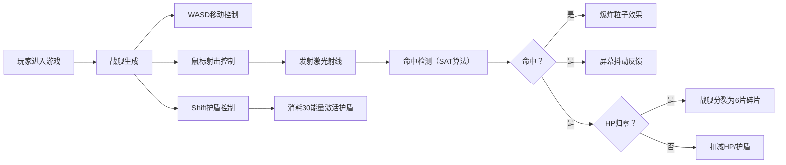

## 1. 产品概述

多人在线太空战舰对战游戏，玩家操控战舰在星域中移动、射击，与其他玩家实时交战，最终击毁所有对手。
- 目标用户：休闲游戏玩家，太空题材爱好者
- 产品价值：提供快节奏、视觉震撼的实时太空对战体验

## 2. 核心功能

### 2.1 功能模块

1. **战舰控制系统**：WASD移动、鼠标射击、Shift护盾释放
2. **战斗系统**：HP/护盾/能量三围属性、激光武器、爆炸粒子、战舰碎片
3. **场景系统**：无边界太空地图、闪烁星空背景、镜头平滑跟随
4. **UI系统**：血条/能量条显示、迷你雷达地图、科技感界面
5. **性能优化**：60fps稳定帧率、Canvas 2D渲染、粒子系统管理

### 2.3 页面详情

| 页面名称 | 模块名称 | 功能描述 |
|-----------|-------------|---------------------|
| 游戏主界面 | 战舰状态面板 | 顶部显示HP条（160px，绿到红渐变）、能量条（160px，橙色） |
| 游戏主界面 | 迷你雷达 | 右上角150x150px半透明雷达，玩家绿点、敌人红点闪烁 |
| 游戏主界面 | 战舰渲染 | 带环形护盾条（60px直径，浅蓝色）、引擎尾焰粒子 |
| 游戏主界面 | 战斗特效 | 激光射线（cyan，200px长，4px宽）、爆炸粒子、战舰碎片 |
| 游戏主界面 | 背景系统 | 数百颗闪烁星星（1-3px，1-3秒周期）、镜头平滑跟随（0.08系数） |

## 3. 核心流程

玩家进入游戏 → 战舰生成在随机位置 → WASD控制移动 → 鼠标左键射击（0.5秒冷却）→ Shift消耗30能量激活护盾（持续2秒，透明度0.6）→ 激光命中敌方产生爆炸粒子 → 被击毁战舰分裂为6片碎片 → 屏幕击中抖动反馈（5px，0.2秒）

## 4. 用户界面设计

### 4.1 设计风格

- **主色调**：深空蓝黑背景 `#0a0b1a`
- **强调色**：青色 `cyan`（激光）、浅蓝（护盾）、橙色（能量/爆炸）、绿→红渐变（血条）
- **按钮风格**：发光边框 `box-shadow: 0 0 10px rgba(0, 200, 255, 0.5)`
- **字体**：科技感 `'Orbitron', monospace`
- **动效**：屏幕抖动、粒子拖尾、星星闪烁、碎片飘散淡出

### 4.2 页面设计概述

| 页面名称 | 模块名称 | UI元素 |
|-----------|-------------|-------------|
| 游戏主界面 | Canvas全屏渲染 | 太空背景、战舰、激光、粒子 |
| 游戏主界面 | HUD状态栏 | 顶部HP条（160px）、能量条（160px）、Orbitron字体 |
| 游戏主界面 | 迷你雷达 | 右上角150x150px半透明黑背景、玩家绿点、敌人红点闪烁 |
| 游戏主界面 | 护盾显示 | 战舰周围60px直径浅蓝色环形 |
| 游戏主界面 | 击中反馈 | 屏幕偏移抖动（±5px，0.2秒） |

### 4.3 响应式设计

- 桌面端优先：Canvas自适应窗口大小
- 全屏沉浸式：游戏Canvas占满整个视口
- 触控优化：暂不考虑移动端触控操作
