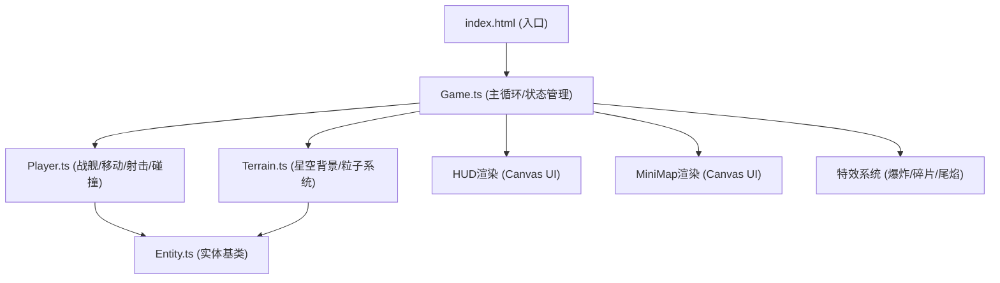

## 1. 架构设计



## 2. 技术描述

- **前端框架**：无框架，纯 TypeScript + Canvas 2D
- **构建工具**：Vite
- **语言**：TypeScript（严格模式 strict: true）
- **字体**：Google Fonts - Orbitron
- **渲染引擎**：Canvas 2D（不使用WebGL）

## 3. 项目文件结构

| 文件 | 用途 |
|-------|------|
| `package.json` | 依赖配置（typescript, vite），启动脚本 `npm run dev` |
| `vite.config.js` | Vite构建配置 |
| `tsconfig.json` | TypeScript严格模式配置 |
| `index.html` | 入口页面，包含canvas元素和UI容器 |
| `src/Game.ts` | 游戏主循环，帧率管理（60fps），全局状态更新 |
| `src/Player.ts` | 玩家战舰类，移动/射击/碰撞检测（SAT算法） |
| `src/Entity.ts` | 实体基类，战舰和激光的共同父类（位置、旋转、更新、渲染） |
| `src/Terrain.ts` | 星空背景生成，粒子系统管理（爆炸/碎片/尾焰/星星） |

## 4. 核心数据模型

### 4.1 战舰状态
```typescript
interface ShipState {
  hp: number           // 生命值 0-100
  maxHp: number
  shield: number       // 护盾值 0-100
  maxShield: number
  energy: number       // 能量值 0-100
  maxEnergy: number
  shieldActive: boolean
  shieldTimer: number
  lastShootTime: number
  color: string        // 主色
}
```

### 4.2 粒子系统
```typescript
interface Particle {
  x: number; y: number
  vx: number; vy: number
  life: number
  maxLife: number
  color: string
  size: number
  type: 'star' | 'explosion' | 'debris' | 'thrust'
}
```

### 4.3 激光
```typescript
interface Laser extends Entity {
  ownerId: number
  length: number    // 200px
  width: number     // 4px
  damage: number
  color: string     // cyan
}
```

## 5. 核心算法

### 5.1 分离轴碰撞检测（SAT）
- 战舰使用多边形轮廓表示（6-8个顶点）
- 对每个轴投影，检测重叠
- 精确到像素级的碰撞判定

### 5.2 镜头平滑跟随
```typescript
camera.x += (player.x - camera.x) * 0.08
camera.y += (player.y - camera.y) * 0.08
```

### 5.3 粒子系统上限
- 总粒子数 ≤ 500 保证无卡顿
- 星星粒子：300-500颗
- 爆炸粒子：30个/次，持续0.6秒
- 碎片粒子：6个/次，持续2秒
- 尾焰粒子：持续生成，拖尾40px

### 5.4 射击冷却
- 射击间隔：0.5秒（500ms）
- 护盾消耗：30能量，持续2秒，透明度0.6
