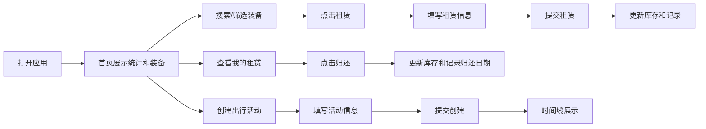

## 1. 产品概述
户外探险装备租赁与出行记录应用，为户外探险俱乐部提供会员装备租赁、归还管理以及出行行程记录功能。
- 主要解决装备库存管理、租赁流程追踪、出行活动记录的问题，目标用户为俱乐部管理员和会员
- 提升俱乐部运营效率，实现装备和出行数据的数字化管理

## 2. 核心功能

### 2.1 用户角色
| 角色 | 注册方式 | 核心权限 |
|------|----------|----------|
| 俱乐部会员 | 无需注册，租赁时填写信息 | 浏览装备、租赁装备、查看个人租赁记录、创建出行记录 |

### 2.2 功能模块
1. **首页（装备库）**：统计面板、装备搜索与筛选、装备列表展示、租赁功能
2. **出行记录页**：出行时间线展示、创建新出行活动
3. **我的租赁页**：个人租赁记录展示、装备归还功能

### 2.3 页面详情
| 页面名称 | 模块名称 | 功能描述 |
|-----------|-------------|---------------------|
| 首页（装备库） | 统计面板 | 展示总装备数、本月租赁次数、正在进行的出行数 |
| 首页（装备库） | 搜索与筛选 | 按名称模糊搜索、按类别筛选装备 |
| 首页（装备库） | 装备列表 | 卡片网格展示装备信息，包含租赁按钮 |
| 首页（装备库） | 租赁模态框 | 填写租赁信息、提交租赁请求 |
| 出行记录页 | 出行时间线 | 纵向时间轴展示所有出行活动 |
| 出行记录页 | 创建出行表单 | 填写活动信息、参与会员、提交创建 |
| 我的租赁页 | 租赁记录列表 | 展示当前租赁记录、提供归还按钮 |

## 3. 核心流程
用户打开应用 → 首页展示统计数据和装备列表 → 用户可搜索/筛选装备 → 点击租赁按钮填写信息提交 → 租赁成功后库存更新 → 用户可查看个人租赁记录并归还装备 → 用户可创建出行活动并在时间线查看

## 4. 用户界面设计
### 4.1 设计风格
- 主色调：墨绿色（#1a6b3c）和天空蓝（#3b82f6）
- 背景色：浅灰白（#f9fafb）
- 文字主色：深灰（#1f2937）
- 按钮样式：主色背景，白色文字，圆角8px，hover透明度0.8，点击scale 0.97
- 字体：使用现代无衬线字体，标题48px粗体，正文14px-16px
- 布局：顶部固定导航栏，卡片式布局
- 图标：使用emoji和Unicode图标（⛰️ 🧰 📅 🛤️）

### 4.2 页面设计概述
| 页面名称 | 模块名称 | UI元素 |
|-----------|-------------|-------------|
| 首页（装备库） | 统计面板 | 渐变背景卡片，悬停上移动画，大号数字显示 |
| 首页（装备库） | 搜索与筛选 | 带放大镜图标的搜索框（300ms防抖），胶囊形筛选按钮 |
| 首页（装备库） | 装备列表 | 卡片网格（桌面3-4列，移动2列），悬停阴影加深 |
| 首页（装备库） | 租赁模态框 | 底部弹入动画，半透明遮罩，关闭按钮hover变色 |
| 出行记录页 | 出行时间线 | 纵向时间轴，圆形标记，卡片滑入动画 |
| 我的租赁页 | 租赁记录列表 | 卡片式展示，归还按钮 |

### 4.3 响应性
- 桌面优先设计，移动端自适应
- 小于768px：卡片网格2列，搜索框和筛选按钮全宽堆叠，统计面板纵向堆叠
- 时间线日期文字在移动端调整到卡片内部
- 确保375px宽度手机可用，按钮最小高度40px，字体最小14px
- 触摸优化，确保点击区域足够大

### 4.4 动画与过渡
- 页面切换：fade 0.3s
- 模态框：从底部向上80px+淡入，0.3s ease-out
- 卡片悬停：阴影加深0.2s
- 统计卡片悬停：上移4px 0.2s
- 时间线卡片：向上滑入40px+淡入，0.4s
- 列表筛选切换：淡入淡出0.3s
- Toast提示：右上角弹出，3秒自动消失
