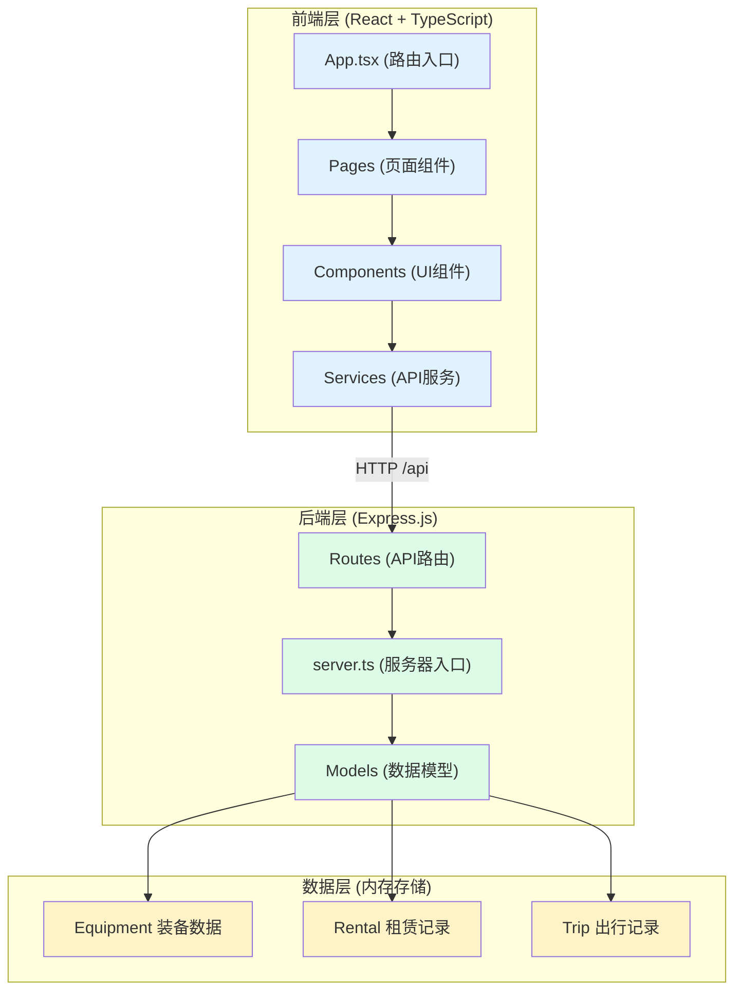
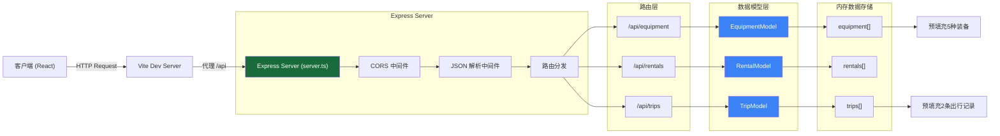
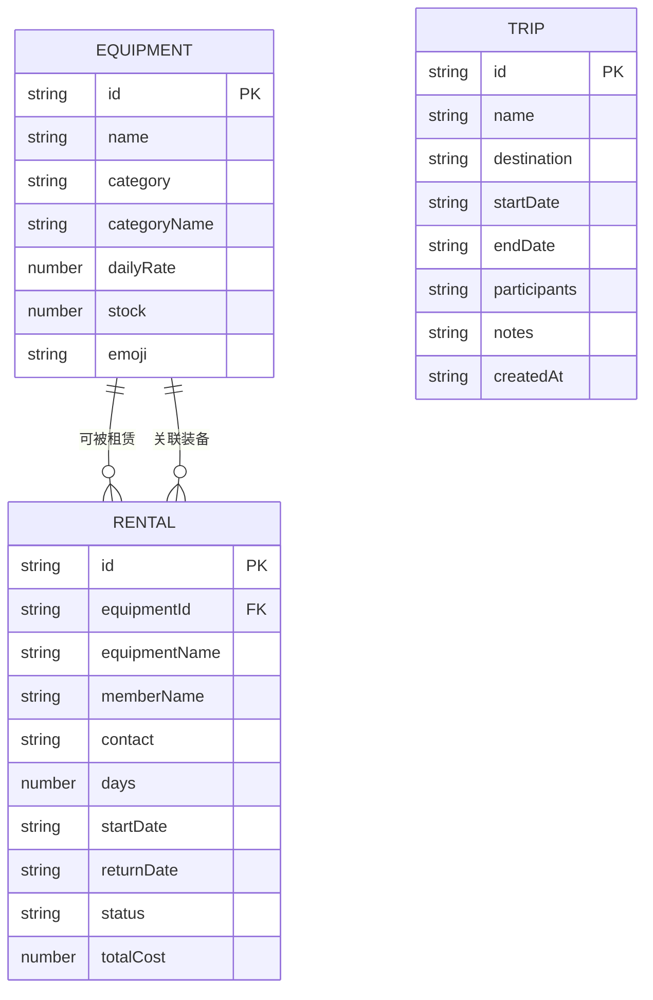

## 1. 架构设计



## 2. 技术描述
- 前端：React@18 + TypeScript + Vite + react-router-dom + axios + uuid
- 后端：Express@4 + TypeScript + cors
- 构建工具：Vite 5.x
- 状态管理：React Hooks (useState, useEffect, useCallback, useMemo) + 自定义hooks
- 数据存储：内存数组（开发环境），启动时预填充测试数据
- 包管理器：npm

## 3. 路由定义
| 路由 | 页面组件 | 用途 |
|-------|---------|------|
| / | EquipmentPage | 首页：装备库，展示统计面板、装备列表、搜索筛选 |
| /trips | TripsPage | 出行记录页：时间线展示、创建新活动 |
| /my-rentals | MyRentalsPage | 我的租赁页：租赁记录、归还功能 |

## 4. API 定义

### 4.1 类型定义

```typescript
// 装备类型
interface Equipment {
  id: string;
  name: string;
  category: 'tent' | 'sleeping_bag' | 'cookware' | 'trekking_pole';
  categoryName: string;
  dailyRate: number;
  stock: number;
  emoji: string;
}

// 租赁记录类型
interface Rental {
  id: string;
  equipmentId: string;
  equipmentName: string;
  memberName: string;
  contact: string;
  days: number;
  startDate: string;
  returnDate: string | null;
  status: 'active' | 'returned';
  totalCost: number;
}

// 出行记录类型
interface Trip {
  id: string;
  name: string;
  destination: string;
  startDate: string;
  endDate: string;
  participants: string[];
  notes: string;
  createdAt: string;
}

// API 响应格式
interface ApiResponse<T> {
  success: boolean;
  data?: T;
  error?: string;
}
```

### 4.2 装备接口

| 方法 | 路径 | 描述 | 请求参数 | 响应 |
|------|------|------|----------|------|
| GET | /api/equipment | 获取所有装备 | - | `Equipment[]` |
| GET | /api/equipment/:id | 获取单个装备 | id: string | `Equipment` |
| GET | /api/equipment/stats | 获取装备统计 | - | `{ total: number }` |

### 4.3 租赁接口

| 方法 | 路径 | 描述 | 请求参数 | 响应 |
|------|------|------|----------|------|
| GET | /api/rentals | 获取所有租赁记录 | - | `Rental[]` |
| GET | /api/rentals/member/:name | 获取会员租赁记录 | name: string | `Rental[]` |
| POST | /api/rentals | 创建租赁 | `{ equipmentId, memberName, contact, days }` | `Rental` |
| PUT | /api/rentals/:id/return | 归还装备 | id: string | `Rental` |
| GET | /api/rentals/stats/monthly | 获取本月租赁统计 | - | `{ count: number }` |

### 4.4 出行接口

| 方法 | 路径 | 描述 | 请求参数 | 响应 |
|------|------|------|----------|------|
| GET | /api/trips | 获取所有出行记录 | - | `Trip[]` |
| POST | /api/trips | 创建出行 | `{ name, destination, startDate, endDate, participants, notes }` | `Trip` |
| GET | /api/trips/active | 获取进行中的出行 | - | `{ count: number }` |

## 5. 服务器架构图



## 6. 数据模型

### 6.1 数据模型定义



### 6.2 初始化数据

```typescript
// 装备预填充数据
const initialEquipment: Equipment[] = [
  {
    id: '1',
    name: '专业高山帐篷',
    category: 'tent',
    categoryName: '帐篷',
    dailyRate: 50,
    stock: 8,
    emoji: '⛺'
  },
  {
    id: '2',
    name: '羽绒睡袋 -15°C',
    category: 'sleeping_bag',
    categoryName: '睡袋',
    dailyRate: 30,
    stock: 12,
    emoji: '🛏️'
  },
  {
    id: '3',
    name: '便携炊具套装',
    category: 'cookware',
    categoryName: '炊具',
    dailyRate: 25,
    stock: 5,
    emoji: '🍳'
  },
  {
    id: '4',
    name: '碳纤维登山杖',
    category: 'trekking_pole',
    categoryName: '登山杖',
    dailyRate: 15,
    stock: 20,
    emoji: '🥾'
  },
  {
    id: '5',
    name: '四季露营帐篷',
    category: 'tent',
    categoryName: '帐篷',
    dailyRate: 40,
    stock: 0,
    emoji: '⛺'
  }
];

// 出行记录预填充数据
const initialTrips: Trip[] = [
  {
    id: '1',
    name: '黄山徒步之旅',
    destination: '安徽黄山',
    startDate: '2026-06-20',
    endDate: '2026-06-23',
    participants: ['张三', '李四', '王五'],
    notes: '注意天气变化，备好雨具',
    createdAt: '2026-06-10'
  },
  {
    id: '2',
    name: '千岛湖露营',
    destination: '浙江千岛湖',
    startDate: '2026-07-05',
    endDate: '2026-07-07',
    participants: ['赵六', '孙七'],
    notes: '水上活动，请带换洗衣物',
    createdAt: '2026-06-12'
  }
];
```

## 7. 文件结构说明

```
project/
├── package.json              # 项目依赖和脚本
├── vite.config.js            # Vite配置，代理/api到后端
├── tsconfig.json             # TypeScript严格模式配置
├── index.html                # 入口HTML
└── src/
    ├── frontend/
    │   ├── App.tsx           # 主应用组件，路由定义
    │   ├── main.tsx          # React入口文件
    │   ├── components/       # UI组件
    │   │   ├── EquipmentList.tsx      # 装备列表组件
    │   │   ├── EquipmentCard.tsx      # 装备卡片组件
    │   │   ├── RentalModal.tsx        # 租赁模态框
    │   │   ├── StatsPanel.tsx         # 统计面板
    │   │   ├── SearchFilter.tsx       # 搜索筛选组件
    │   │   ├── TripTimeline.tsx       # 出行时间线
    │   │   ├── TripCard.tsx           # 出行卡片
    │   │   ├── TripFormModal.tsx      # 创建出行表单
    │   │   ├── RentalList.tsx         # 租赁记录列表
    │   │   ├── Navbar.tsx             # 导航栏
    │   │   └── Toast.tsx              # 提示组件
    │   ├── services/         # API服务
    │   │   ├── EquipmentService.ts    # 装备API调用
    │   │   ├── RentalService.ts       # 租赁API调用
    │   │   └── TripService.ts         # 出行API调用
    │   ├── pages/            # 页面组件
    │   │   ├── EquipmentPage.tsx      # 装备库首页
    │   │   ├── TripsPage.tsx          # 出行记录页
    │   │   └── MyRentalsPage.tsx      # 我的租赁页
    │   ├── hooks/            # 自定义hooks
    │   │   ├── useDebounce.ts         # 防抖hook
    │   │   └── useToast.ts            # Toast提示hook
    │   ├── types/            # 类型定义
    │   │   └── index.ts               # 共享类型
    │   └── styles/           # 全局样式
    │       └── index.css              # CSS样式和动画
    └── backend/
        ├── server.ts         # Express服务器入口
        ├── models/           # 数据模型
        │   ├── EquipmentModel.ts      # 装备数据模型
        │   ├── RentalModel.ts         # 租赁数据模型
        │   └── TripModel.ts           # 出行数据模型
        └── types/            # 后端类型
            └── index.ts               # 后端类型定义
```
