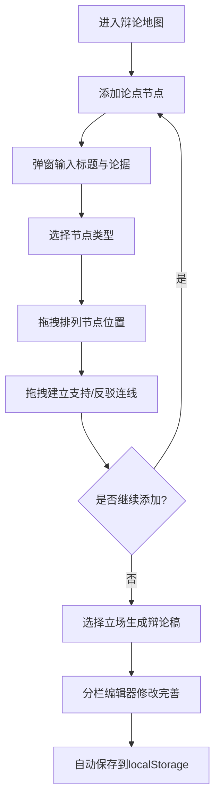

## 1. 产品概述

在线团队辩论准备与论点管理平台，帮助辩论队成员在赛前通过可视化辩论地图收集资料、整理论点、模拟攻防，并自动生成结构化辩论稿。目标用户为高校辩论队、辩论爱好者及竞赛备赛团队。

## 2. 核心功能

### 2.1 用户角色

| 角色 | 注册方式 | 核心权限 |
|------|----------|----------|
| 辩论队成员 | 直接使用 | 创建/编辑论点节点、建立论点关系、生成辩论稿、保存布局 |

### 2.2 功能模块

1. **辩论地图页面**：可视化画布（节点+连线）、悬浮工具栏、节点弹窗编辑器
2. **辩论稿生成页面**：分栏布局编辑器、实时自动保存

### 2.3 页面详情

| 页面名称 | 模块名称 | 功能描述 |
|----------|----------|----------|
| 辩论地图 | 画布区域 | 拖拽创建/移动节点，拖拽连线建立支持/反驳关系，空格+拖拽平移画布，滚轮缩放 |
| 辩论地图 | 节点弹窗 | 半透明遮罩+白色弹窗居中，输入标题和Markdown论据，backdrop-filter模糊背景 |
| 辩论地图 | 悬浮工具栏 | 添加节点、保存布局、清空画布三个按钮，hover背景变深过渡0.2s |
| 辩论地图 | 网格背景 | 浅灰网格间距30px，线条0.5px #e2e8f0，缩放时自适应不变形 |
| 辩论稿生成 | 分栏编辑器 | 左侧论点/右侧反驳，拖动条调整比例，Markdown编辑，3秒无操作自动保存localStorage |

## 3. 核心流程

用户进入辩论地图 → 点击工具栏添加节点 → 弹窗中输入标题与论据 → 选择节点类型（正方/反方/自由） → 在画布上拖拽排列节点 → 拖拽连线建立支持/反驳关系 → 选择立场后生成辩论稿 → 在分栏编辑器中修改完善 → 自动保存

## 4. 用户界面设计

### 4.1 设计风格

- 主色调：深蓝紫色 #1e1b4b（背景），辅以柔和金色 #fcd34d 和粉白 #fdf2f8
- 正方节点：蓝绿色 #0d9488，反方节点：珊瑚红 #e11d48，自由节点：琥珀色 #d97706
- 支持连线：绿色，反驳连线：红色，线宽2px，直线带箭头
- 节点样式：矩形圆角8px，宽度自适应，最小120px
- 按钮：圆角12px，hover背景变深过渡0.2s
- 字体：Noto Sans SC（正文）+ Playfair Display（标题装饰）
- 弹窗：白色居中，背景backdrop-filter: blur(4px)
- 动画：节点创建从中心弹入（overshoot 0.4s），弹性微交互

### 4.2 页面设计概览

| 页面名称 | 模块名称 | UI元素 |
|----------|----------|--------|
| 辩论地图 | 画布区域 | 深蓝紫背景+浅灰网格，节点彩色矩形，连线带箭头，缩放0.2-2.0 |
| 辩论地图 | 工具栏 | 白色背景圆角12px阴影8px，三个功能按钮 |
| 辩论地图 | 节点弹窗 | 半透明遮罩+模糊背景，白色弹窗居中，标题输入+Markdown编辑区 |
| 辩论稿生成 | 分栏编辑器 | 左右分栏+拖动条，Markdown实时预览，自动保存提示 |

### 4.3 响应式适配

- 桌面端（>=1024px）：左侧画布70% + 右侧面板30%
- 平板端（>=768px）：画布和面板垂直排列，面板可折叠
- 手机端（<768px）：全屏画布，面板通过底部滑出抽屉（拖拽手柄，抽屉高度45%屏高）
