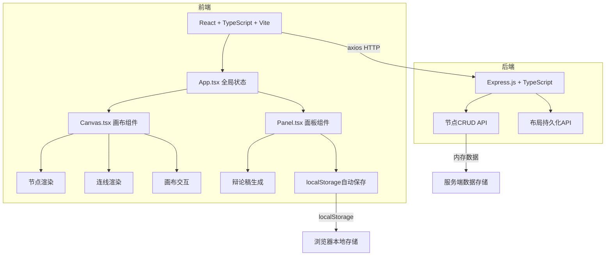
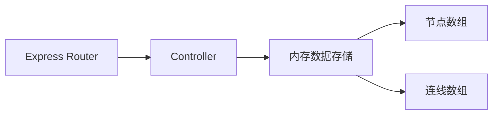
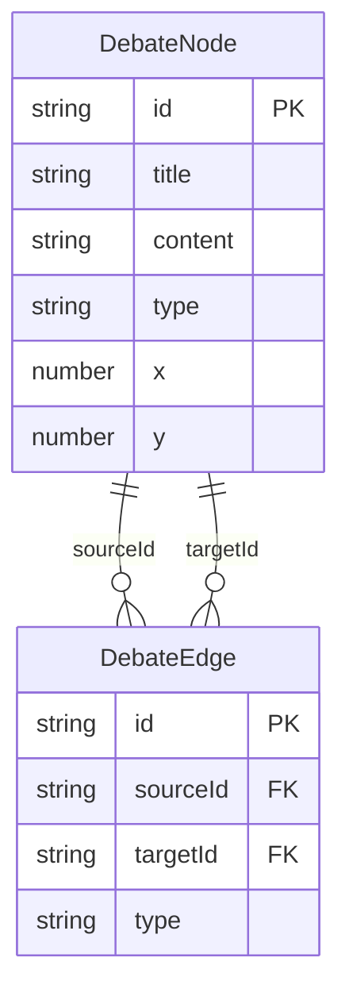

## 1. 架构设计



## 2. 技术说明

- 前端：React@18 + TypeScript + Vite
- 状态管理：Zustand
- 构建工具：Vite
- 后端：Express@4 + TypeScript + cors
- 数据持久化：服务端内存 + 客户端localStorage
- 初始化工具：vite-init (react-express-ts模板)

## 3. 路由定义

| 路由 | 用途 |
|------|------|
| / | 辩论地图主页面（画布+面板） |

## 4. API定义

### 4.1 节点API

```typescript
interface DebateNode {
  id: string;
  title: string;
  content: string;
  type: 'pro' | 'con' | 'free';
  x: number;
  y: number;
}

interface DebateEdge {
  id: string;
  sourceId: string;
  targetId: string;
  type: 'support' | 'refute';
}

// GET /api/nodes - 获取所有节点
// Response: DebateNode[]

// POST /api/nodes - 创建节点
// Body: Omit<DebateNode, 'id'>
// Response: DebateNode

// PUT /api/nodes/:id - 更新节点
// Body: Partial<DebateNode>
// Response: DebateNode

// DELETE /api/nodes/:id - 删除节点
// Response: { success: boolean }

// GET /api/edges - 获取所有连线
// Response: DebateEdge[]

// POST /api/edges - 创建连线
// Body: Omit<DebateEdge, 'id'>
// Response: DebateEdge

// DELETE /api/edges/:id - 删除连线
// Response: { success: boolean }

// POST /api/layout - 保存完整布局
// Body: { nodes: DebateNode[], edges: DebateEdge[] }
// Response: { success: boolean }
```

## 5. 服务端架构



## 6. 数据模型

### 6.1 数据模型定义



### 6.2 数据定义

服务端使用内存数组存储，无需数据库DDL。初始数据为空数组，用户通过API动态添加。
