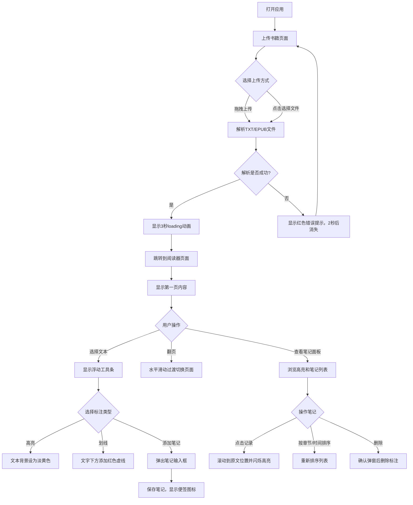

## 1. 产品概述

在线书籍阅读与笔记标注应用，让用户能够上传TXT和EPUB格式的电子书，在浏览器内直接阅读，并对书中段落进行高亮标注、下划线标记以及添加个人笔记。

- 核心功能：电子书解析与阅读、文本高亮与划线、笔记管理与持久化存储
- 目标用户：需要进行深度阅读并整理读书笔记的学习者、研究者、阅读爱好者
- 产品价值：提供沉浸式阅读体验，帮助用户高效管理和回顾阅读标注

## 2. 核心特性

### 2.1 功能模块

1. **首页（上传页）**：文件拖拽上传区域、书籍选择按钮
2. **阅读器页面**：书籍内容展示、分页导航、选中文本工具条、笔记面板

### 2.2 页面详情

| 页面名称 | 模块名称 | 功能描述 |
|---------|---------|---------|
| 首页 | 拖拽上传区 | 支持TXT/EPUB文件拖拽上传，拖入时边框变实线并放大 |
| 首页 | 点击上传按钮 | 点击选择本地文件进行上传 |
| 阅读器 | 章节标题区 | 左上方显示当前章节/页码标题 |
| 阅读器 | 内容展示区 | 显示书籍内容，支持文本选择 |
| 阅读器 | 浮动工具条 | 选择文本后显示，提供高亮、划线、添加笔记功能 |
| 阅读器 | 分页导航 | 底部页码指示器、上一页/下一页按钮 |
| 阅读器 | 笔记面板 | 右侧展示当前章节所有高亮和笔记列表 |

## 3. 核心流程

用户打开应用 → 拖拽或点击上传电子书（TXT/EPUB） → 解析文件并显示loading动画 → 跳转到阅读器页面 → 选择文本进行高亮/划线/添加笔记 → 在右侧面板查看和管理标注 → 点击标注跳转到对应位置

## 4. 用户界面设计

### 4.1 设计风格

- **主色调**：温暖米白色 #FFF8E7 作为页面背景，深蓝色 #1a365d 用于标题和按钮
- **高亮色**：淡黄色 #FFEDB3（透明度0.6）用于高亮，红色 #FF4D4F 用于下划线，橙色 #ff9800 用于笔记图标
- **按钮样式**：蓝色圆角按钮，悬停加深，点击有按下动画（scale 0.95），过渡0.2s
- **字体**：使用优雅的衬线字体用于阅读内容，无衬线字体用于界面元素
- **布局**：卡片式布局，所有按钮和卡片有轻微圆角（6px）和过渡动画（0.3s ease）
- **图标**：使用emoji图标，笔记使用便签emoji

### 4.2 页面设计概述

| 页面名称 | 模块名称 | UI元素 |
|---------|---------|--------|
| 首页 | 拖拽上传区 | 全屏紫色渐变（#667eea 到 #764ba2）背景，虚线边框，拖入时边框变实线并放大，居中显示提示文字 |
| 阅读器 | 章节标题区 | 左上方深蓝色文字，字体较大 |
| 阅读器 | 内容展示区 | 米白色背景，舒适行高，支持文本选择，页面切换有水平滑动动画 |
| 阅读器 | 浮动工具条 | 跟随选区上方，轻微阴影和圆角，包含高亮/划线/笔记三个图标按钮 |
| 阅读器 | 分页导航 | 底部居中，页码指示器（12px小字体），左右两侧上一页/下一页蓝色按钮 |
| 阅读器 | 笔记面板 | 右侧固定320px宽，#fafafa背景，左侧1px #e5e5e5分割线，列表展示高亮和笔记 |
| 阅读器 | 笔记输入弹窗 | 黑色半透明遮罩背景，白色弹窗居中，模糊效果，最多500字输入 |
| 阅读器 | 删除确认弹窗 | "确定删除此标注？"提示，确定/取消按钮 |

### 4.3 响应式设计

- **桌面端**：右侧笔记面板固定显示，宽度320px
- **移动端**（<768px）：笔记面板自动收起为底部浮动按钮（圆形蓝色+按钮），点击后从底部滑出面板，高度40vh，内容区域占满全宽
- **触控优化**：按钮尺寸适合触屏点击，滑动手势支持翻页

### 4.4 动效设计

- Loading动画：旋转书本icon，持续3秒
- 页面切换：水平滑动过渡，向左/向右滑出，时长300ms
- 高亮闪烁：点击笔记列表项后，原文高亮区域背景色变亮，2秒后恢复
- 悬停动效：所有交互元素有0.2-0.3s过渡动画
- 面板滑出：移动端笔记面板从底部平滑滑出
