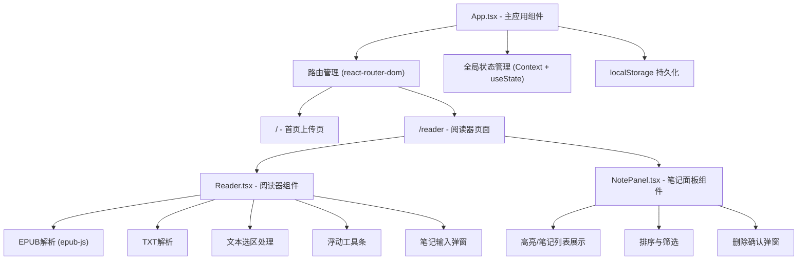

## 1. 架构设计



## 2. 技术说明

- **前端**：React 18 + TypeScript + Vite
- **路由**：react-router-dom
- **EPUB解析**：epub-js
- **ZIP处理**：jszip（epub-js依赖）
- **ID生成**：uuid
- **HTTP请求**：axios
- **状态管理**：React Context + useState + localStorage持久化
- **样式方案**：原生CSS（使用CSS变量管理主题色）
- **初始化工具**：Vite官方脚手架

## 3. 路由定义

| 路由 | 用途 |
|------|------|
| / | 首页 - 书籍上传页面 |
| /reader | 阅读器页面 - 显示书籍内容和笔记面板 |

## 4. 数据模型

### 4.1 数据结构定义

```typescript
// 高亮/笔记类型
type AnnotationType = 'highlight' | 'underline' | 'note';

// 单个标注数据
interface Annotation {
  id: string;
  bookId: string;
  chapterIndex: number;
  startOffset: number;
  endOffset: number;
  text: string;
  type: AnnotationType;
  note?: string;
  createdAt: number;
}

// 书籍数据
interface Book {
  id: string;
  title: string;
  type: 'txt' | 'epub';
  chapters: Chapter[];
  totalPages: number;
}

// 章节数据
interface Chapter {
  title: string;
  content: string;
  pageStart: number;
  pageEnd: number;
}

// 全局应用状态
interface AppState {
  currentBook: Book | null;
  currentChapter: number;
  currentPage: number;
  annotations: Annotation[];
}
```

### 4.2 localStorage存储结构

```
localStorage key: 'book-annotations-{bookId}'
存储内容: Annotation[] JSON序列化字符串

localStorage key: 'current-book'
存储内容: 当前打开的书籍信息（如需要恢复阅读进度）
```

## 5. 核心模块说明

### 5.1 文件解析模块

- **TXT解析**：读取文件内容，按每800字符分页，自动识别段落
- **EPUB解析**：使用epub-js库解析EPUB文件，按章节（section）分页，提取章节标题和内容

### 5.2 文本选区模块

- 监听mouseup事件获取选中文本
- 计算选区在当前章节中的位置偏移（startOffset, endOffset）
- 浮动工具条定位在选区上方

### 5.3 高亮渲染模块

- 使用CSS类名标记高亮文本
- 支持黄色背景高亮和红色虚线下划线两种样式
- 笔记类型在选区右侧显示便签emoji图标

### 5.4 分页与动画模块

- TXT按800字符分页
- EPUB按章节分页
- 页面切换使用CSS transform + transition实现水平滑动动画
- 切换响应时间控制在200ms以内
