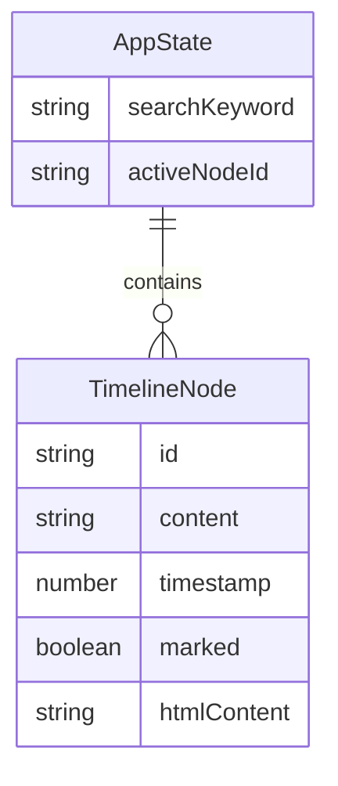

## 1. 架构设计

```mermaid
flowchart TD
    "前端应用层" --> "状态管理层 (Zustand)"
    "状态管理层 (Zustand)" --> "编辑器组件 (EditorPanel)"
    "状态管理层 (Zustand)" --> "时间线组件 (TimelinePanel)"
    "编辑器组件 (EditorPanel)" --> "contentEditable DOM"
    "时间线组件 (TimelinePanel)" --> "节点卡片列表"
    "编辑器组件 (EditorPanel)" --> "状态管理层 (Zustand)"
    "时间线组件 (TimelinePanel)" --> "状态管理层 (Zustand)"
```

纯前端应用，无后端服务。使用Zustand进行状态管理，所有数据保存在内存中。

## 2. 技术说明
- 前端：React@18 + TypeScript + Tailwind CSS@3 + Vite
- 初始化工具：vite-init (react-ts模板)
- 状态管理：Zustand
- 后端：无
- 数据库：无（纯内存状态）

## 3. 路由定义
| 路由 | 用途 |
|------|------|
| / | 主工作台页面，包含编辑器和时间线 |

## 4. API定义
无后端API，所有交互在前端完成。

## 5. 数据模型

### 5.1 数据模型定义



### 5.2 核心类型定义

```typescript
interface TimelineNode {
  id: string;
  content: string;
  timestamp: number;
  marked: boolean;
  htmlContent: string;
}

interface AppState {
  nodes: TimelineNode[];
  searchKeyword: string;
  activeNodeId: string | null;
  addNode: (content: string, htmlContent: string) => void;
  toggleMark: (id: string) => void;
  setSearchKeyword: (keyword: string) => void;
  setActiveNodeId: (id: string | null) => void;
}
```

## 6. 文件组织

```
├── package.json
├── index.html
├── vite.config.ts
├── tailwind.config.js
├── tsconfig.json
├── postcss.config.js
├── src/
│   ├── main.tsx
│   ├── App.tsx              # 主应用：分栏布局，状态协同
│   ├── types.ts             # TimelineNode, MarkedNode, AppState
│   ├── store.ts             # Zustand状态管理
│   ├── components/
│   │   ├── EditorPanel.tsx  # 富文本编辑器组件
│   │   ├── TimelinePanel.tsx # 时间线组件
│   │   ├── Toolbar.tsx      # 工具栏组件
│   │   └── TimelineNode.tsx # 时间线节点卡片组件
│   └── index.css            # Tailwind基础样式 + 自定义样式
```

## 7. 关键实现细节

### 7.1 编辑器实现
- 使用contentEditable实现富文本编辑
- 通过document.execCommand执行格式化命令（加粗、斜体、标题、列表）
- 使用MutationObserver监听DOM变化，防抖300ms后生成时间戳节点
- 暴露getContent()和applySnapshot()接口给父组件

### 7.2 时间线实现
- 使用虚拟列表优化200+节点渲染性能
- 点击节点触发scrollIntoView({ behavior: 'smooth' })定位编辑器内容
- 已标记节点使用CSS left-border黄色竖条标识
- 搜索过滤使用String.includes()匹配节点content文本

### 7.3 动画实现
- 编辑器滚动：scrollIntoView + CSS scroll-behavior: smooth
- 时间线居中：scrollIntoView({ block: 'center', behavior: 'smooth' })
- 高亮效果：CSS transition 300ms ease-in-out
- 节点卡片悬停：transform: scale(1.05) + box-shadow过渡

### 7.4 响应式实现
- 使用Tailwind断点 md: (768px) 控制布局
- < 768px时时间线面板切换为fixed底部抽屉
- 抽屉展开/折叠使用CSS transform translateY动画
