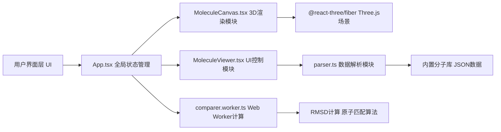

## 1. 架构设计



## 2. 技术说明

- 前端框架：React@18 + TypeScript@5 + Vite@5
- 3D渲染：Three.js + @react-three/fiber + @react-three/drei
- 构建工具：Vite + @vitejs/plugin-react
- 状态管理：React useState/useReducer（轻量级场景）
- 计算模块：Web Worker 后台计算分子比对
- UI样式：原生CSS + CSS Modules
- 辅助库：uuid、react-colorful

## 3. 数据模型

### 3.1 分子数据结构

```typescript
interface Atom {
  id: string;
  name: string;       // 原子名称，如 C, O, H, N
  element: string;  // 元素符号
  position: [number, number, number]; // xyz坐标
  vdwRadius: number; // 范德华半径比例
  color: string;     // CPK颜色
}

interface Bond {
  id: string;
  from: string; // 原子id
  to: string;   // 原子id
  order: number;  // 键级
}

interface Molecule {
  id: string;
  name: string;      // 分子名称
  formula: string;  // 分子式
  atoms: Atom[];
  bonds: Bond[];
}

interface ComparisonResult {
  rmsd: number;           // 均方根偏差
  similarity: number;        // 相似度评分 0-100
  matchedPairs: Array<{ atomA: string; atomB: string }>;
  unmatchedA: string[];      // 分子A未匹配原子id
  unmatchedB: string[]; // 分子B未匹配原子id
  matchedCount: number;
}
```

### 3.2 CPK配色和范德华半径
| 元素 | 颜色 | 半径比例 |
|------|------|---------|
| 碳 C | #909090 | 0.7 |
| 氧 O | #FF0D0D | 0.6 |
| 氢 H | #FFFFFF | 0.3 |
| 氮 N | #3050F8 | 0.65 |

## 4. 模块划分和数据流向

### 4.1 文件结构
```
src/
├── main.tsx              # 应用入口
├── components/
│   ├── App.tsx           # 主组件 状态管理
│   ├── MoleculeCanvas.tsx # 3D渲染
│   └── MoleculeViewer.tsx # UI控制
├── utils/
│   ├── parser.ts         # 数据解析
│   ├── comparer.ts      # 计算逻辑(Worker)
│   └── molecules.ts    # 内置分子库
├── workers/
│   └── comparer.worker.ts # Web Worker
├── styles/
│   └── App.css
│   └── MoleculeViewer.css
└── types/
    └── index.ts
```

### 4.2 数据流向
1. **分子加载**：`MoleculeViewer` 用户选择分子 → `App.tsx` 更新状态 → `MoleculeCanvas` 接收分子数据 → 调用 `parser.ts` 标准化 → 生成 Three.js 网格
2. **比对计算**：`App.tsx` 发送两个分子数据 → `comparer.worker.ts` 计算 RMSD → 返回 `ComparisonResult` → `App.tsx` 更新 → `MoleculeCanvas` 高亮差异 → `MoleculeViewer` 显示评分
3. **悬停交互**：Three.js raycaster 检测原子 → 获取原子信息 → 更新提示框位置和内容

## 5. 性能优化
- 分子比较计算在 Web Worker 中异步执行，不阻塞主线程
- 原子和化学键使用 Three.js InstancedMesh 批量渲染优化
- 星星背景使用 BufferGeometry 批量渲染
- 悬停检测使用 Raycaster，优化层级检测

## 6. 预设分子库
内置 6 种分子：水(H₂O)、二氧化碳(CO₂)、甲烷(CH₄)、乙醇(C₂H₅OH)、苯(C₆H₆)、葡萄糖(C₆H₁₂O₆)
