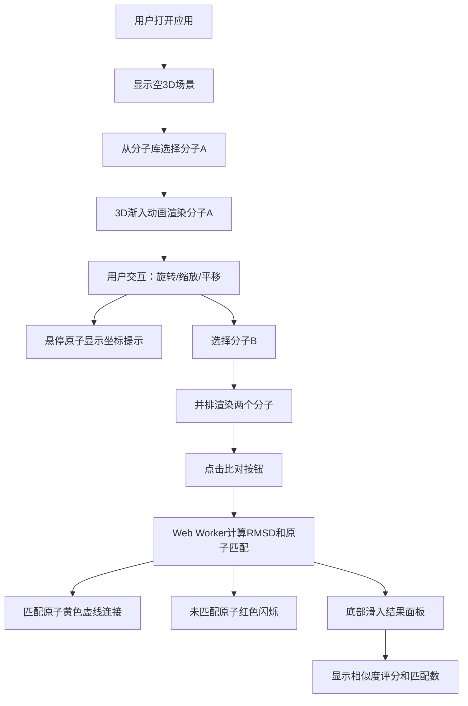

## 1. 产品概述

3D分子结构查看与比对教育平台，面向化学学习者和教育工作者，提供交互式分子结构浏览、3D操作和分子相似度自动比对功能。

- 核心价值：将抽象的分子结构转化为直观可交互的3D可视化，帮助用户理解化学分子空间结构，降低化学学习门槛
- 目标用户：化学专业学生、教师、科研人员

## 2. 核心功能

### 2.1 用户角色
| 角色 | 注册方式 | 核心权限 |
|------|----------|----------|
| 普通用户 | 无需注册，直接访问 | 浏览分子、3D交互、分子比对 |

### 2.2 功能模块
1. **主界面**：左侧分子库、中间3D场景、底部操作提示栏
2. **3D渲染模块**：分子模型加载、原子球体、化学键渲染、星空背景
3. **交互操作模块**：旋转、缩放、平移、悬停提示
4. **比对计算模块**：RMSD计算、原子匹配、差异高亮、相似度评分

### 2.3 页面详情
| 页面名称 | 模块名称 | 功能描述 |
|---------|---------|---------|
| 主页面 | 左侧边栏 | 分子列表（6种预设分子）、缩略图、比对按钮 |
| 主页面 | 3D主场景 | 分子3D渲染、星空背景、缩放动画、交互控制 |
| 主页面 | 底部控制栏 | 选中分子名称、操作提示文字 |
| 主页面 | 比对结果面板 | 相似度评分、匹配原子数、匹配连线、差异高亮 |
| 主页面 | 原子悬停提示 | 原子名称、精确坐标、跟随鼠标 |

## 3. 核心流程

用户打开应用 → 从左侧选择分子 → 3D场景渐入渲染 → 用户可旋转/缩放/平移查看 → 选择两个分子 → 点击比对按钮 → Web Worker计算RMSD → 显示匹配连线和差异高亮 → 底部滑入结果面板显示评分

## 4. 用户界面设计

### 4.1 设计风格
- 主色调：深蓝科技感（背景 #0f172a，深蓝灰 #1e293b）
- 强调色：青蓝色 #38bdf8
- 配色：碳灰 #909090、氧红 #FF0D0D、氢白 #FFFFFF、氮蓝 #3050F8
- 按钮：圆角，青蓝色背景白色文字，hover亮度提升10%
- 字体：现代无衬线字体，层级清晰
- 布局：左侧边栏固定240px + 中间3D主区域 + 底部控制栏固定60px高度
- 风格：深空科技感，平滑过渡动画

### 4.2 页面设计概览
| 页面名称 | 模块名称 | UI元素 |
|---------|---------|--------|
| 主页面 | 左侧分子库 | 深蓝灰卡片，选中青蓝边框，hover微动效 |
| 主页面 | 3D场景 | 渐变深空背景，100颗随机闪烁星星 |
| 主页面 | 比对按钮 | 青蓝色圆角按钮，hover亮度提升 |
| 主页面 | 比对结果面板 | 半透明深蓝灰，从底部滑入0.3秒ease-out |
| 主页面 | 原子提示框 | 半透明黑圆角，跟随鼠标偏移(10,10) |

### 4.3 响应式
- 桌面端优先，侧边栏固定240px，支持窗口缩放自适应

### 4.4 3D场景指南
- 环境：渐变深空背景（#0f172a到#1e1b4b），100颗闪烁星星
- 灯光：环境光 + 方向光 + 点光源，确保原子球体有立体感
- 相机：透视相机，OrbitControls控制
- 交互：旋转（拖拽）、缩放（滚轮0.5x-5x）、平移（Shift+拖拽）
- 动画：分子加载缩放0→1，1.2秒渐入
- 后期：抗锯齿，帧率≥30fps
