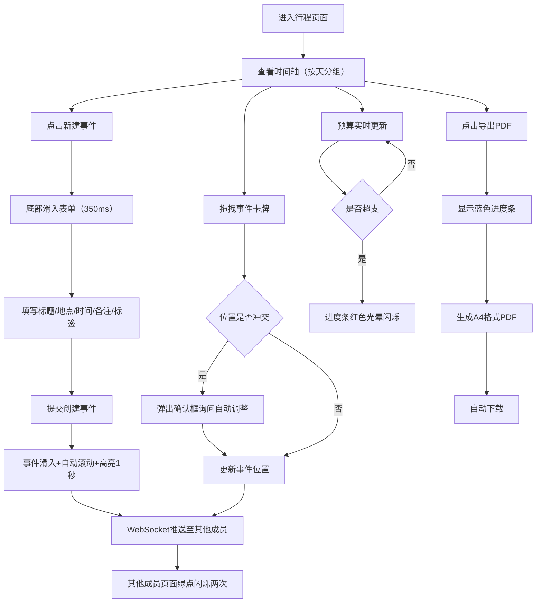

## 1. 产品概述

旅行规划协作应用，帮助旅行规划师和团队协作制定详细旅行行程并实时同步。

- 解决多人旅行规划时信息分散、行程难以动态调整、预算分摊混乱的核心痛点
- 面向旅行规划师、旅行团队、亲友出行群体，提供高效的协作式行程规划体验
- 目标价值：让旅行规划从"信息孤岛"变为"实时协同"，提升规划效率与团队体验

## 2. 核心功能

### 2.1 用户角色

| 角色 | 注册方式 | 核心权限 |
|------|----------|----------|
| 团队成员 | 默认加入 | 查看、添加、编辑、删除事件，拖拽调整，查看操作历史 |

### 2.2 功能模块

1. **行程时间轴主页面**：交互式按天分组时间轴、事件卡牌展示、折叠/展开、拖拽排序、预算进度、顶部导航
2. **事件新建/编辑面板**：底部滑入式表单、标题/地点/时间/备注/标签输入、地点自动补全
3. **预算监控组件**：圆形渐变进度条、超支预警动画、实时总花费统计
4. **多人协作同步模块**：WebSocket实时推送、事件更新指示点、操作历史回溯抽屉
5. **PDF导出模块**：加载进度条、A4排版导出、自动下载

### 2.3 页面详情

| 页面名称 | 模块名称 | 功能描述 |
|----------|----------|----------|
| 行程主页面 | 顶部导航栏 | 渐变背景（海洋蓝到深蓝），高度56px，显示应用名称、用户头像 |
| 行程主页面 | 预算进度条 | 直径100px圆形，绿到红渐变，超支时红色光晕闪烁3次（每次500ms） |
| 行程主页面 | 时间轴列表 | 按天分组，支持展开/折叠，折叠时显示日期和总花费摘要 |
| 行程主页面 | 事件卡牌 | 圆角12px、浅灰阴影、hover上移2px并加深阴影，显示缩略图、标签、地点、时间 |
| 行程主页面 | 新建事件按钮 | 触发底部滑入表单（slide-up，350ms，ease-out） |
| 行程主页面 | 历史操作抽屉 | 右侧宽度320px，半透明背景，显示操作者头像和操作时间，可滑动关闭 |
| 事件表单 | 地点输入 | 文本输入+自动补全建议 |
| 事件表单 | 时间选择 | 精确到15分钟的开始/结束时间 |
| 事件表单 | 标签选择 | 景点（蓝色）、美食（橙色）、交通（绿色），彩色圆点标识 |
| 事件表单 | 备注输入 | textarea，最多200字 |
| 导出弹窗 | 进度条 | 蓝色，宽度100%，导出完成自动下载PDF |

## 3. 核心流程

用户进入行程页面后，可查看按天分组的时间轴。点击新建按钮弹出底部表单，填写事件信息后提交，事件以slide-up动画滑入并自动滚动定位高亮。用户可拖拽事件调整顺序或时间，若产生冲突则弹出确认框。所有操作通过WebSocket实时同步给其他在线成员，事件卡牌左侧显示绿点闪烁提示。预算进度条实时更新，超支时触发闪烁警告。点击历史按钮可从右侧滑出操作历史面板。点击导出按钮触发PDF生成，显示加载进度，完成后自动下载。

## 4. 用户界面设计

### 4.1 设计风格

- **主色调**：海洋蓝（#0c4a6e）、暖橙色（#f97316）
- **文字颜色**：深灰（#1e293b）、白色（#ffffff）
- **背景色**：极浅灰（#f1f5f9）
- **标签色**：景点（#3b82f6）、美食（#f97316）、交通（#10b981）
- **卡片样式**：圆角12px，box-shadow: 0 2px 8px rgba(0,0,0,0.08)
- **按钮风格**：圆角8px，主色背景，hover过渡0.2s
- **字体**：展示字体选用具有旅行感的圆润现代字体，正文字体清晰易读
- **布局**：卡片式布局，顶部固定导航栏，桌面端四列（三列内容+一列侧栏），平板两列（768px断点），手机单列（480px断点）
- **图标风格**：使用lucide-react线性图标，简洁统一

### 4.2 页面设计概览

| 页面名称 | 模块名称 | UI元素 |
|----------|----------|--------|
| 行程主页面 | 顶部导航 | 渐变背景（#0c4a6e→#1e3a8a）、白色应用名、圆形用户头像、高度56px |
| 行程主页面 | 预算组件 | 100px圆形进度条、绿→红渐变色、超支光晕、总预算显示 |
| 行程主页面 | 时间轴日期头 | 日期文字加粗、花费摘要小字、展开/折叠箭头图标 |
| 行程主页面 | 事件卡牌 | 12px圆角、左侧缩略图/灰底图标、彩色圆点标签、地点图标+文字、时间、hover上移2px加深阴影（0.2s过渡） |
| 行程主页面 | 拖拽状态 | 阴影加深、透明度0.8 |
| 事件表单 | 底部滑入 | slide-up 350ms ease-out、顶部拖拽把手、表单分区 |
| 事件表单 | 输入元素 | 圆角8px、浅灰边框、focus时主色边框、15分钟间隔时间选择 |
| 历史抽屉 | 右侧面板 | 宽度320px、半透明背景、操作项含头像+时间+描述、左滑关闭 |
| 导出进度条 | 弹窗 | 宽度100%蓝色进度条、百分比显示、完成提示 |

### 4.3 响应式设计

- 桌面端（>768px）：四列网格布局（三列主内容+一列侧边栏），最大宽度约束1400px
- 平板端（480px-768px）：两列布局，侧栏折叠为图标抽屉
- 手机端（<480px）：单列堆叠，导航栏简化，所有交互元素支持触摸事件，触摸目标≥44px
- 所有布局使用CSS Grid/Flexbox响应式单位，触摸拖拽使用Pointer Events兼容鼠标和触屏

### 4.4 动效设计

- 新建事件：slide-up 350ms ease-out
- 事件高亮：背景色脉冲1秒
- 卡牌hover：translateY(-2px) + shadow加深，0.2s
- 拖拽中：阴影加深 + opacity:0.8
- 同步提示：左侧绿点blink两次
- 超支警告：红色box-shadow光晕，500ms * 3循环
- 抽屉滑入：右侧translateX过渡300ms
