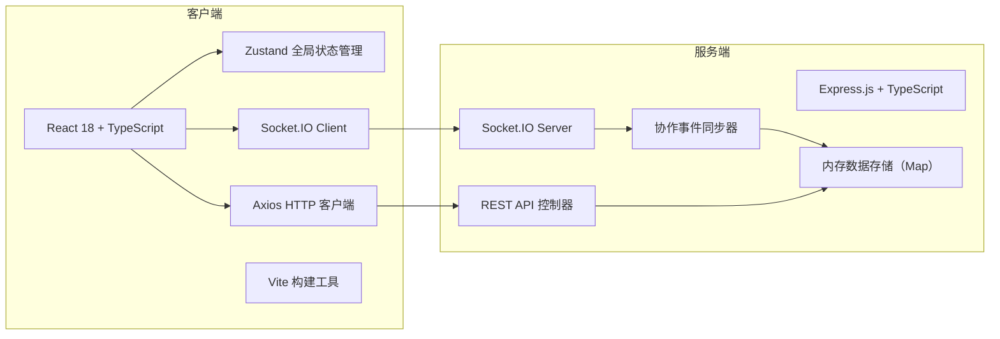
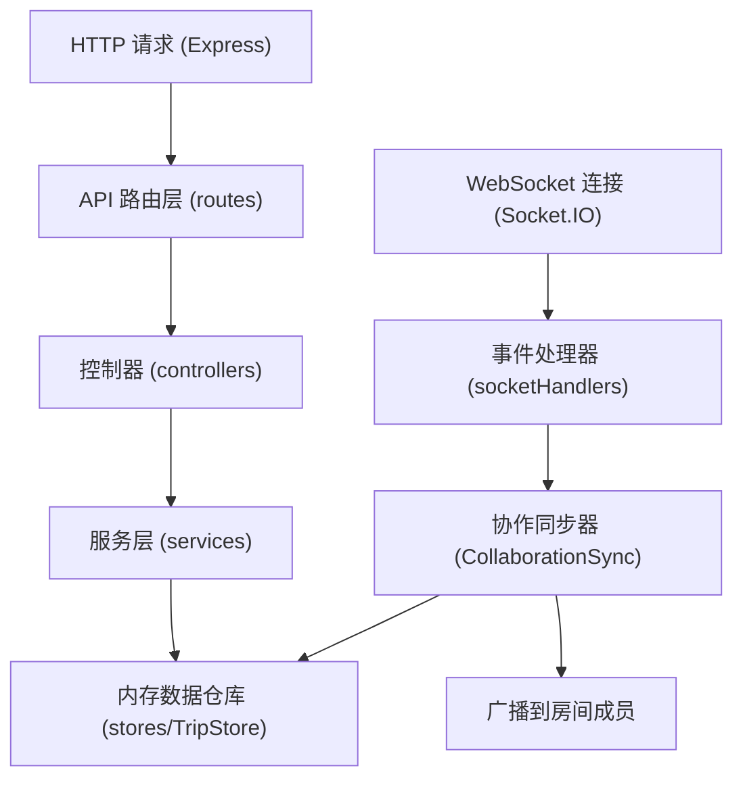
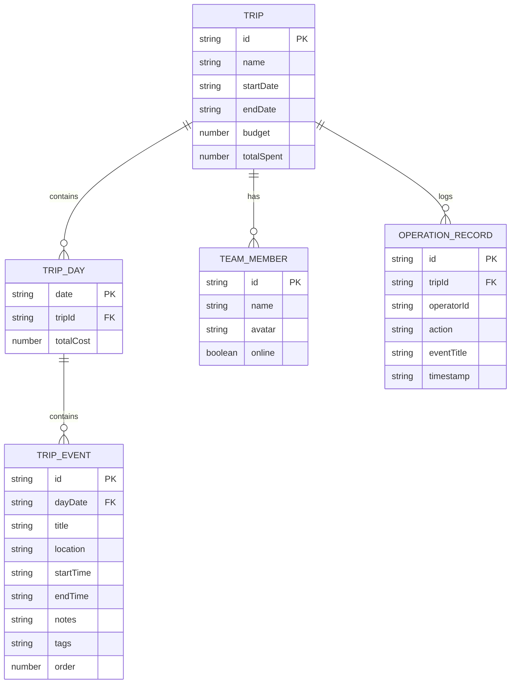

## 1. 架构设计



## 2. 技术说明

- **前端**：React@18 + TypeScript@5 + Vite@5 + Zustand@4 + lucide-react
- **后端**：Express@4 + TypeScript@5 + Socket.IO@4 + cors
- **实时通信**：Socket.IO（WebSocket + 轮询降级）
- **HTTP客户端**：Axios@1
- **唯一标识**：uuid@9
- **PDF导出**：jsPDF + html2canvas（客户端生成）
- **状态管理**：Zustand（轻量、极简API）
- **初始化工具**：vite-init react-express-ts 模板
- **数据存储**：内存 Map（演示用途，无数据库依赖）
- **样式方案**：原生CSS + CSS Variables（用户未指定Tailwind，按要求使用精确样式）

## 3. 路由定义

| 路由 | 用途 |
|------|------|
| / | 行程时间轴主页面 |
| /trips/:id | 指定行程页面（预留多行程支持） |

## 4. API 定义

```typescript
// 共享类型定义
interface TripEvent {
  id: string;
  title: string;
  location: string;
  locationThumbnail?: string;
  startTime: string; // ISO date string with 15-min precision
  endTime: string;
  notes: string; // max 200 chars
  tags: EventTag[];
  createdAt: string;
  updatedAt: string;
  order: number;
}

type EventTag = '景点' | '美食' | '交通';

interface TripDay {
  date: string; // YYYY-MM-DD
  events: TripEvent[];
  totalCost: number;
}

interface Trip {
  id: string;
  name: string;
  startDate: string;
  endDate: string;
  budget: number;
  totalSpent: number;
  days: TripDay[];
  members: TeamMember[];
  history: OperationRecord[];
}

interface TeamMember {
  id: string;
  name: string;
  avatar: string;
  online: boolean;
}

interface OperationRecord {
  id: string;
  operatorId: string;
  operatorName: string;
  operatorAvatar: string;
  action: 'add' | 'update' | 'delete' | 'reorder';
  eventTitle: string;
  timestamp: string;
}

// REST API 响应
interface ApiResponse<T> {
  success: boolean;
  data?: T;
  error?: string;
}

// GET /api/trips/:id
// Response: ApiResponse<Trip>

// POST /api/trips/:id/events
// Request Body: { date: string; event: Omit<TripEvent, 'id' | 'createdAt' | 'updatedAt' | 'order'> }
// Response: ApiResponse<{ event: TripEvent; day: TripDay }>

// PUT /api/trips/:id/events/:eventId
// Request Body: Partial<TripEvent> & { date?: string }
// Response: ApiResponse<{ event: TripEvent; day: TripDay }>

// DELETE /api/trips/:id/events/:eventId
// Response: ApiResponse<{ day: TripDay }>

// WebSocket Events
// Client -> Server: 'syncRequest' (join trip room)
// Server -> Client: 'eventAdded' | 'eventUpdated' | 'eventDeleted'
// Payload: { tripId: string; event?: TripEvent; day?: TripDay; operatorId: string; timestamp: string }
```

## 5. 服务端架构图



## 6. 数据模型

### 6.1 实体关系图



### 6.2 内存存储结构

使用 `Map<string, Trip>` 存储所有行程数据，以行程ID为键。服务启动时注入默认演示行程数据（3天行程、6-8个示例事件、3名团队成员），便于直接预览功能。

## 7. 前端组件结构

```
src/
├── App.tsx               # 根组件，路由+全局状态
├── main.tsx              # 入口
├── index.css             # 全局样式+CSS变量+动画
├── store/
│   └── tripStore.ts      # Zustand 状态管理
├── components/
│   ├── Navbar.tsx        # 顶部导航栏
│   ├── BudgetProgress.tsx# 预算圆形进度条
│   ├── Timeline.tsx      # 按天分组时间轴
│   ├── DaySection.tsx    # 单日分组（可折叠）
│   ├── EventCard.tsx     # 单个事件卡牌
│   ├── EventForm.tsx     # 新建/编辑事件底部表单
│   ├── HistoryDrawer.tsx # 右侧操作历史抽屉
│   ├── ExportModal.tsx   # PDF导出进度弹窗
│   └── TagDot.tsx        # 标签彩色圆点
├── hooks/
│   ├── useSocket.ts      # WebSocket连接Hook
│   └── useDragDrop.ts    # 拖拽逻辑Hook
├── types/
│   └── index.ts          # TypeScript类型定义
└── utils/
    ├── api.ts            # Axios实例封装
    ├── time.ts           # 时间格式化/计算工具
    ├── pdf.ts            # PDF导出工具
    └── locations.ts      # 地点自动补全数据
```
