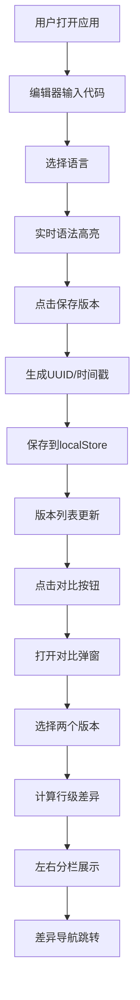

## 1. 产品概述

在线代码片段分享与实时对比应用，解决远程会议和在线教学中代码共享缺乏语法高亮和版本对比的痛点。用户可以编写或粘贴代码，选择语言进行语法高亮，保存多个版本，并进行行级差异对比。

- 核心目标：提升代码沟通效率，提供专业级代码编辑与对比体验
- 目标用户：开发者、教师、技术分享者
- 市场价值：轻量化、无需安装、即刻可用的代码协作工具

## 2. 核心功能

### 2.1 功能模块

1. **代码编辑模块**：代码编辑器、语法高亮、语言选择、行号显示
2. **版本管理模块**：保存版本、版本列表、版本加载
3. **差异对比模块**：左右分栏对比、行级差异计算、差异导航

### 2.2 页面详情

| 页面名称 | 模块名称 | 功能描述 |
|---------|---------|---------|
| 主页面 | 编辑器区域 | 代码输入、语法高亮、行号显示、语言切换 |
| 主页面 | 工具栏 | 语言选择下拉、保存版本按钮、对比按钮 |
| 主页面 | 版本列表面板 | 版本时间倒序展示、行数摘要、点击加载 |
| 对比弹窗 | 对比视图 | 左右分栏、行级差异高亮、同步滚动 |
| 对比弹窗 | 差异导航 | 上一处/下一处差异跳转、差异块闪烁 |

## 3. 核心流程

### 3.1 代码编辑与保存流程

用户打开应用 → 在编辑器中输入或粘贴代码 → 选择编程语言 → 实时语法高亮 → 点击保存版本 → 生成 UUID 和时间戳 → 保存到本地存储 → 版本列表更新

### 3.2 版本对比流程

用户点击对比按钮 → 打开对比弹窗 → 选择两个版本 → 计算行级差异 → 左右分栏展示高亮结果 → 使用导航按钮切换差异块 → 关闭弹窗

## 4. 用户界面设计

### 4.1 设计风格

- 主题风格：深色专业编辑器风格，类似 VS Code
- 主色调：深蓝色 #007acc（按钮主题色）
- 背景色：#1e1e1e（主背景）、#252526（面板背景）、#333333（工具栏背景）
- 文字颜色：#d4d4d4（主体文字）、#858585（次要文字/行号）
- 语法高亮：关键词蓝色 #569cd6、字符串橙色 #ce9178、注释绿色 #6a9955
- 差异颜色：新增浅绿色 rgba(0,255,0,0.1)、删除浅红色 rgba(255,0,0,0.1)、修改黄色 rgba(255,255,0,0.15)
- 按钮风格：圆角 4px，蓝色主题，hover 变暗
- 字体：等宽字体用于代码，系统字体用于界面
- 布局：中央编辑区 + 右侧版本列表面板
- 图标：使用 lucide-react 图标库

### 4.2 页面设计概览

| 页面名称 | 模块名称 | UI元素 |
|---------|---------|-------|
| 主页面 | 顶部工具栏 | 语言选择下拉(160px)、保存按钮、对比按钮、高度44px |
| 主页面 | 代码编辑器 | 深色背景、行号(40px宽、灰色)、语法高亮、textarea叠加 |
| 主页面 | 版本列表 | 右侧280px宽面板、时间倒序、每条目含时间和行数 |
| 对比弹窗 | 弹窗遮罩 | 半透明黑色 #00000080、弹窗缩放动画 |
| 对比弹窗 | 对比视图 | 左右分栏、中间2px分隔线、同步滚动、差异高亮 |
| 对比弹窗 | 导航按钮 | 圆形32px直径、白底灰边、hover浅蓝 |

### 4.3 响应式设计

- 桌面端（≥768px）：编辑器占中央约70%宽度，左右各15%边界，版本列表右侧280px
- 移动端（<768px）：编辑器全宽显示，版本列表变为底部抽屉（高度40%，从底部滑入），对比弹窗占满全屏

### 4.4 动效设计

- 按钮点击：波纹扩散动画（点击点向外扩散，半径0→30px，白色，透明度0.5→0，400ms）
- 弹窗显示：从中心缩放（scale 0.8→1.0，250ms，ease-out）
- 弹窗关闭：收缩消失
- 输入框聚焦：边框变蓝（#007acc），0.2s过渡
- 差异跳转：差异块闪烁（0.3s淡入淡出，亮黄色背景 rgba(255,255,0,0.3)）
