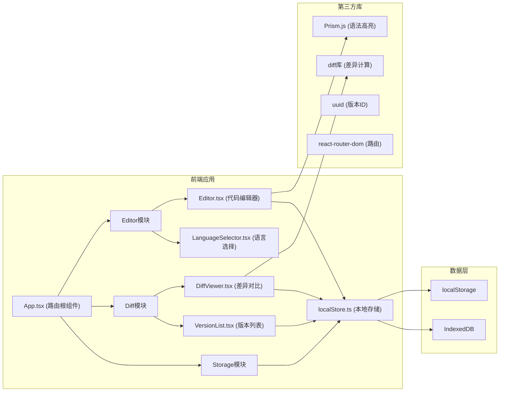

## 1. 架构设计



## 2. 技术说明

- 前端框架：React 18 + TypeScript
- 构建工具：Vite 5.x
- 状态管理：React useState + Context（轻量级，无需复杂状态管理）
- 路由：react-router-dom v6
- 语法高亮：prismjs
- 差异计算：diff
- 唯一ID：uuid
- 图标：lucide-react
- 样式方案：CSS Modules + 全局 CSS 变量
- 本地存储：localStorage + IndexedDB 混合存储

## 3. 目录结构

```
src/
├── App.tsx              # 应用根组件，路由管理
├── main.tsx             # 入口文件
├── index.css            # 全局样式
├── editor/              # 编辑模块
│   ├── Editor.tsx       # 代码编辑器组件
│   ├── LanguageSelector.tsx  # 语言选择组件
│   └── Editor.module.css     # 编辑器样式
├── diff/                # 对比模块
│   ├── DiffViewer.tsx   # 差异对比组件
│   ├── VersionList.tsx  # 版本列表组件
│   └── Diff.module.css  # 对比样式
├── storage/             # 存储模块
│   └── localStore.ts    # 本地存储模块
├── types/               # 类型定义
│   └── index.ts         # 全局类型
└── hooks/               # 自定义hooks
    └── useDebounce.ts   # 防抖hook（可选）
```

## 4. 数据流向

```
用户输入 → Editor.tsx (捕获输入) → 调用 localStore.saveVersion() → 持久化存储
                                 ↓
                             Prism.js高亮
                                 ↓
                            实时渲染显示

版本加载 → VersionList.tsx (点击版本) → 调用 localStore.loadVersion() → Editor/DiffViewer
                                                              ↓
                                                         DiffViewer
                                                              ↓
                                                        diff库计算差异
                                                              ↓
                                                         左右分栏渲染
```

## 5. 数据模型

### 5.1 版本数据结构

```typescript
interface CodeVersion {
  id: string;           // UUID
  code: string;         // 代码内容
  language: string;     // 编程语言: javascript | python | html | css
  timestamp: number;    // 保存时间戳（毫秒）
  lineCount: number;    // 代码行数
}
```

### 5.2 差异数据结构

```typescript
interface DiffLine {
  type: 'added' | 'removed' | 'modified' | 'unchanged';
  content: string;
  lineNumber: number;
}

interface DiffBlock {
  startLine: number;
  lines: DiffLine[];
}
```

## 6. 性能优化

- 语法高亮防抖：使用 requestAnimationFrame 或 setTimeout 优化输入响应
- 虚拟滚动：考虑长代码场景（2000行以上）
- IndexedDB 异步存储：避免阻塞主线程
- 版本列表分页/限制：最多显示100个版本
- CSS 硬件加速：使用 transform 和 opacity 动画

## 7. 关键技术点

1. **语法高亮实现**：使用 textarea + pre 叠加方案，textarea 透明覆盖在高亮代码上，实现编辑与高亮分离
2. **行号显示**：根据代码行数动态生成，左侧固定宽度40px
3. **同步滚动**：左右对比栏绑定 scroll 事件，保持滚动位置一致
4. **差异计算**：使用 diff 库的 diffLines 方法进行行级对比
5. **本地存储**：localStorage 存元数据（快速读取），IndexedDB 存代码内容（大容量）
6. **响应式布局**：使用 CSS Grid + Media Queries 实现移动端适配
