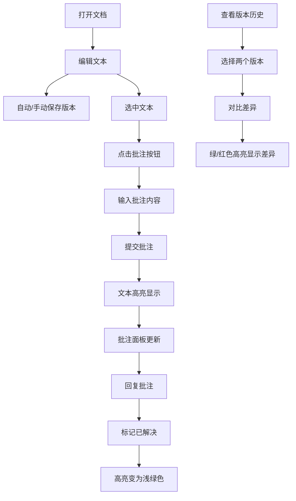

## 1. 产品概述

在线协同文档批注与版本回溯管理应用，支持团队成员在富文本文档上进行协作批注、回复讨论、标记解决，并可随时回溯任意历史版本进行差异对比。解决团队文档协作中沟通效率低、版本混乱、意见追踪难的问题。

- **主要目的**：提升团队文档协作效率，实现批注全生命周期管理和版本可追溯
- **目标用户**：产品团队、开发团队、内容创作团队等需要文档协作的群体
- **核心价值**：透明化文档审阅流程，保留完整历史轨迹，提升协作质量

## 2. 核心功能

### 2.1 用户角色
| 角色 | 注册方法 | 核心权限 |
|------|----------|----------|
| 普通用户 | 本地输入用户名 | 浏览文档、添加批注、回复批注、保存版本、查看历史 |
| 批注作者 | 本地输入用户名 | 标记自己的批注为"已解决" |
| 管理员 | 本地输入用户名（admin） | 标记任意批注为"已解决" |

### 2.2 功能模块
1. **富文本编辑器**：文本编辑、格式设置、批注插入
2. **批注管理**：批注列表、回复功能、状态标记、高亮显示
3. **版本管理**：自动保存、手动保存、版本列表、版本对比
4. **用户模拟**：多用户切换、操作记录追踪

### 2.3 页面详情
| 页面名称 | 模块名称 | 功能描述 |
|----------|----------|----------|
| 主页面 | 富文本编辑器 | 支持文本编辑、格式设置（加粗/斜体/下划线/标题/列表）、选中文本添加批注 |
| 主页面 | 批注面板 | 显示所有批注列表，支持回复批注、标记解决、点击定位到文档位置 |
| 主页面 | 版本历史面板 | 显示所有历史版本，支持选择两个版本进行差异对比 |
| 主页面 | 版本对比模态框 | 以绿/红高亮展示两个版本的文本差异 |
| 主页面 | 用户切换栏 | 输入当前用户名，模拟多用户操作 |

## 3. 核心流程

**批注添加流程**：
用户选中文本 → 点击批注按钮 → 弹出输入框 → 输入批注内容 → 提交 → 文本高亮显示 → 批注面板新增条目

**批注解决流程**：
用户查看批注 → 点击回复输入回复内容 → 提交回复 → 作者/管理员点击"标记已解决" → 高亮变为浅绿色

**版本对比流程**：
用户打开版本历史 → 选择第一个版本（基线）→ 选择第二个版本（对比）→ 弹出对比模态框 → 展示差异（绿色新增、红色删除）

## 4. 用户界面设计

### 4.1 设计风格
- **主色调**：蓝紫色 #6366f1，悬停深蓝 #4f46e5
- **辅助色**：批注未解决高亮 #fef08a，已解决高亮 #bbf7d0，差异新增 #22c55e，差异删除 #ef4444
- **背景**：浅蓝灰渐变（从 #e0f2fe 到 #f0f9ff）
- **毛玻璃效果**：右侧面板 rgba(255,255,255,0.6) + backdrop-filter: blur(8px)
- **按钮样式**：圆角8px，点击缩放动画 scale(0.95)，悬停阴影过渡
- **字体**：使用系统默认字体，层级清晰（标题/正文/批注/辅助文字）
- **布局风格**：左右分栏布局，编辑器75%居左，右侧面板25%，小屏切换为底部浮动标签
- **图标**：使用 lucide-react 图标库，保持线性风格

### 4.2 页面设计概述
| 页面名称 | 模块名称 | UI元素 |
|----------|----------|--------|
| 主页面 | 顶部工具栏 | 格式按钮（加粗/斜体/下划线/标题/列表）、批注按钮、保存按钮、用户名输入 |
| 主页面 | 富文本编辑器 | 白底圆角12px，浅灰色边框 #cbd5e1，柔和阴影，可滚动区域 |
| 主页面 | 批注面板 | 毛玻璃背景，宽300px，批注卡片列表，回复输入框，解决按钮 |
| 主页面 | 版本历史面板 | 毛玻璃背景，时间戳列表，复选框选择，对比按钮 |
| 主页面 | 版本对比模态框 | 半透明遮罩 rgba(0,0,0,0.4)，居中显示，宽80%高70%，可滚动内容区 |

### 4.3 响应式设计
- **桌面端 (>1024px)**：左右分栏布局，编辑器75%，右侧面板25%并列显示
- **笔记本 (768-1024px)**：比例调整为65%/35%，保持并列布局
- **移动端 (<768px)**：右侧面板折叠为底部浮动标签，点击展开为全屏抽屉
- **触控优化**：按钮最小尺寸44px，列表项间距增加，支持滑动操作

### 4.4 动画与交互
- **批注输入框**：淡入动画 fade-in 0.3s
- **按钮点击**：缩放动画 scale(0.95) 0.1s
- **面板展开/收起**：平滑过渡 0.3s ease-in-out
- **高亮显示**：淡入效果 0.2s
- **模态框**：缩放+淡入组合动画 0.3s
- **所有交互响应时间**：≤200ms
