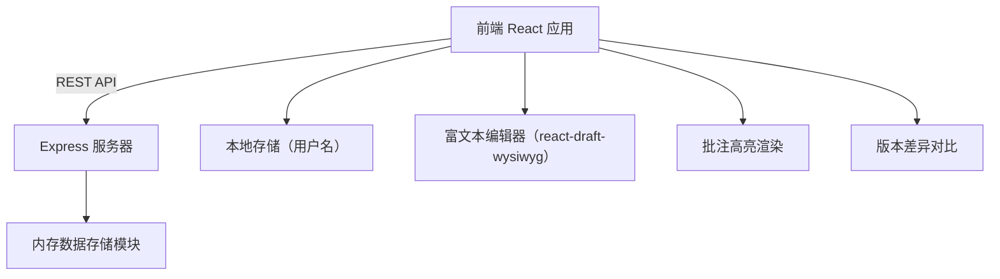
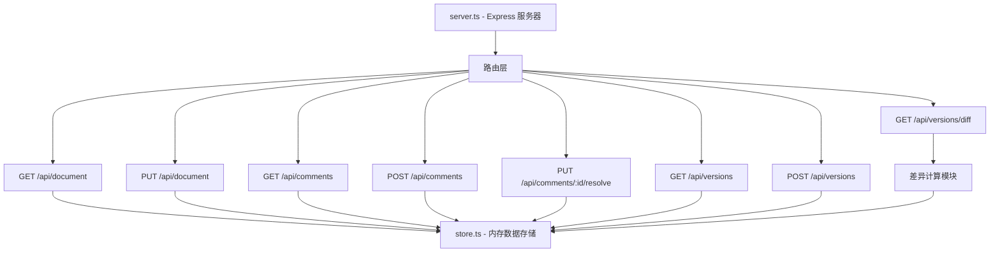
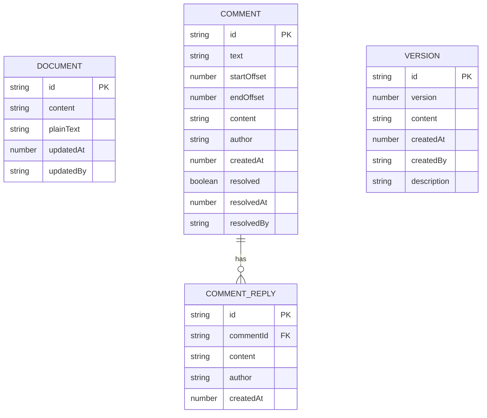

## 1. 架构设计

采用前后端分离架构，前端使用 React + TypeScript + Vite 构建富文本编辑器和交互界面，后端使用 Express.js + TypeScript 提供 RESTful API，数据持久化采用内存模拟存储。



## 2. 技术描述

### 2.1 前端技术栈
- **框架**：React@18 + TypeScript
- **构建工具**：Vite@5
- **路由**：react-router-dom@6
- **HTTP客户端**：axios@1
- **富文本编辑器**：react-draft-wysiwyg@1 + draft-js@0.11
- **ID生成**：uuid@9
- **图标**：lucide-react@0.400
- **状态管理**：React useState/useEffect（轻量级场景，无需复杂状态管理）

### 2.2 后端技术栈
- **框架**：Express@4
- **语言**：TypeScript
- **CORS**：cors@2
- **ID生成**：uuid@9

### 2.3 开发工具
- **包管理器**：npm
- **TypeScript配置**：严格模式，ES2020模块
- **Vite代理**：配置/api代理到后端服务器

## 3. 项目结构

```
auto58/
├── package.json              # 根目录依赖配置
├── vite.config.js            # Vite构建配置
├── tsconfig.json             # TypeScript配置
├── index.html                # 入口HTML
├── frontend/
│   └── src/
│       ├── components/
│       │   ├── Editor.tsx          # 富文本编辑器组件
│       │   ├── CommentPanel.tsx    # 批注面板组件
│       │   └── VersionHistory.tsx  # 版本历史组件
│       ├── App.tsx           # 主应用组件
│       ├── main.tsx          # 入口文件
│       ├── types.ts          # 类型定义
│       ├── api.ts            # API调用封装
│       └── utils/
│           └── diff.ts       # 差异计算工具
└── backend/
    └── src/
        ├── server.ts         # Express服务器
        ├── store.ts          # 内存数据存储
        └── types.ts          # 后端类型定义
```

## 4. 路由定义

| 路由 | 组件 | 功能描述 |
|------|------|----------|
| / | App.tsx | 主页面，包含编辑器、批注面板、版本历史 |

## 5. API 定义

### 5.1 文档相关 API

#### GET /api/document
获取当前文档内容

**响应：**
```typescript
{
  id: string;
  content: string;        // Draft.js 原始内容 JSON 字符串
  plainText: string;      // 纯文本内容（用于版本对比）
  updatedAt: number;
  updatedBy: string;
}
```

#### PUT /api/document
更新文档内容

**请求体：**
```typescript
{
  content: string;        // Draft.js 内容 JSON
  plainText: string;      // 纯文本内容
  operator: string;       // 操作者用户名
}
```

### 5.2 批注相关 API

#### GET /api/comments
获取所有批注列表

**响应：**
```typescript
Array<{
  id: string;
  text: string;           // 被批注的文本
  startOffset: number;    // 起始偏移量
  endOffset: number;      // 结束偏移量
  content: string;        // 批注内容
  author: string;         // 创建者
  createdAt: number;      // 创建时间戳
  resolved: boolean;      // 是否已解决
  resolvedAt?: number;    // 解决时间
  resolvedBy?: string;    // 解决者
  replies: Array<{        // 回复列表
    id: string;
    content: string;
    author: string;
    createdAt: number;
  }>;
}>
```

#### POST /api/comments
创建新批注

**请求体：**
```typescript
{
  text: string;
  startOffset: number;
  endOffset: number;
  content: string;
  author: string;
}
```

#### POST /api/comments/:id/replies
添加批注回复

**请求体：**
```typescript
{
  content: string;
  author: string;
}
```

#### PUT /api/comments/:id/resolve
标记批注为已解决

**请求体：**
```typescript
{
  operator: string;
}
```

### 5.3 版本相关 API

#### GET /api/versions
获取所有历史版本

**响应：**
```typescript
Array<{
  id: string;
  version: number;        // 版本号
  content: string;        // 纯文本内容
  createdAt: number;      // 保存时间
  createdBy: string;      // 创建者
  description?: string;   // 版本描述
}>
```

#### POST /api/versions
手动保存新版本

**请求体：**
```typescript
{
  content: string;
  createdBy: string;
  description?: string;
}
```

#### GET /api/versions/:id
获取指定版本详情

#### GET /api/versions/diff?baseId=xxx&targetId=xxx
对比两个版本差异

**响应：**
```typescript
{
  baseVersion: number;
  targetVersion: number;
  diffs: Array<{
    type: 'added' | 'removed' | 'unchanged';
    value: string;
  }>;
}
```

## 6. 服务器架构



### 6.1 核心模块职责
- **server.ts**：Express 服务器初始化、CORS 配置、路由注册、请求处理
- **store.ts**：内存数据结构管理（文档、批注、版本），提供 CRUD 操作接口

## 7. 数据模型

### 7.1 数据模型定义



### 7.2 类型定义（TypeScript）

```typescript
// 文档类型
interface Document {
  id: string;
  content: string;        // Draft.js 序列化内容
  plainText: string;      // 纯文本用于版本对比
  updatedAt: number;
  updatedBy: string;
}

// 批注类型
interface Comment {
  id: string;
  text: string;           // 被批注的文本
  startOffset: number;    // 在纯文本中的起始偏移
  endOffset: number;      // 在纯文本中的结束偏移
  content: string;        // 批注内容
  author: string;         // 批注作者
  createdAt: number;      // 创建时间戳
  resolved: boolean;      // 是否已解决
  resolvedAt?: number;    // 解决时间
  resolvedBy?: string;    // 解决者
  replies: CommentReply[];
}

// 批注回复类型
interface CommentReply {
  id: string;
  content: string;
  author: string;
  createdAt: number;
}

// 版本类型
interface Version {
  id: string;
  version: number;        // 递增版本号
  content: string;        // 纯文本内容快照
  createdAt: number;
  createdBy: string;
  description?: string;
}

// 差异对比结果
interface DiffSegment {
  type: 'added' | 'removed' | 'unchanged';
  value: string;
}
```

### 7.3 初始数据

```typescript
// 初始文档内容
const initialDocument: Document = {
  id: 'doc-001',
  content: '{"blocks":[{"key":"...","text":"欢迎使用协同文档编辑器...","type":"unstyled","depth":0,"inlineStyleRanges":[],"entityRanges":[],"data":{}}],"entityMap":{}}',
  plainText: '欢迎使用协同文档编辑器\n\n这是一篇示例文档，用于演示批注和版本管理功能。',
  updatedAt: Date.now(),
  updatedBy: 'system',
};

// 初始批注（空）
const initialComments: Comment[] = [];

// 初始版本
const initialVersions: Version[] = [
  {
    id: 'ver-001',
    version: 1,
    content: '欢迎使用协同文档编辑器\n\n这是一篇示例文档，用于演示批注和版本管理功能。',
    createdAt: Date.now(),
    createdBy: 'system',
    description: '初始版本',
  },
];
```

## 8. 性能优化策略

### 8.1 编辑器性能
- 使用 Draft.js 的 Immutable 数据结构，避免不必要的重渲染
- 实现防抖保存，避免频繁触发 API 请求
- 批注高亮使用 CSS 类而非内联样式，提升渲染性能

### 8.2 批注面板性能
- 虚拟滚动处理超过100条批注的场景
- 按需加载批注详情，避免一次性渲染所有内容
- 使用 React.memo 优化批注项组件

### 8.3 版本对比性能
- 实现高效的 diff 算法（基于 LCS 最长公共子序列）
- 限制单次对比的文本长度，超出时提示用户
- 差异计算在后端完成，减少前端计算压力

### 8.4 构建优化
- Vite 按需加载，冷启动时间 < 1s
- TypeScript 严格模式确保类型安全
- 生产构建开启代码压缩和 Tree Shaking
