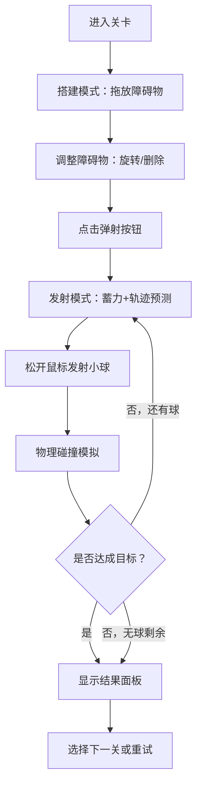

## 1. 产品概述

基于物理引擎的2D沙盒弹射游戏，玩家在场景中搭建障碍物和机关，弹射小球撞击目标，体验物理模拟的趣味性。目标用户为休闲游戏玩家和物理模拟爱好者。

## 2. 核心功能

### 2.1 功能模块

1. **搭建模式**：左侧工具面板选择障碍物，拖拽到Canvas画布放置，支持旋转和删除
2. **发射模式**：蓄力弹射小球，显示抛物线轨迹和力度条，松开发射
3. **物理模拟**：基于Matter.js的碰撞检测，障碍物有不同物理效果（碎裂、反弹、弹跳、火花粒子）
4. **关卡系统**：多关卡进度，3星评级机制，结果面板展示

### 2.2 页面详情

| 页面名称 | 模块名称 | 功能描述 |
|----------|----------|----------|
| 游戏主界面 | 左侧工具面板 | 5种障碍物选择（木箱、铁块、橡皮球、弹簧板、尖刺陷阱），网格布局每行3个，选中高亮 |
| 游戏主界面 | 中央Canvas画布 | 物理世界渲染区域，浅灰色网格线背景，物体放置/旋转/删除交互 |
| 游戏主界面 | 弹射按钮 | 右下角圆形按钮，点击进入发射模式 |
| 游戏主界面 | 力度条 | 底部显示蓄力程度，绿到红渐变 |
| 游戏主界面 | 抛物线轨迹 | 发射时虚线显示预测轨迹 |
| 游戏主界面 | 右键菜单 | 删除障碍物，半透明遮罩，高亮选项 |
| 游戏主界面 | 关卡结果面板 | 底部滑入，显示星级/得分/下一关按钮 |

## 3. 核心流程

1. 玩家进入关卡，在搭建模式下从工具面板拖拽障碍物到画布
2. 玩家可以旋转（滚轮）和删除（右键）已放置的障碍物
3. 点击弹射按钮进入发射模式
4. 按住鼠标拖拽蓄力，显示轨迹预测和力度条
5. 松开鼠标发射小球
6. 小球碰撞障碍物触发物理效果
7. 根据击倒目标数量和剩余球数评定星级
8. 显示结果面板，可选择下一关

## 4. 用户界面设计

### 4.1 设计风格

- **主色调**：深色科技感冷色调
- **背景色**：#1e293b（深蓝灰）
- **面板卡片背景**：#334155
- **文字色**：#f1f5f9
- **交互主色调**：#f97316（橙色）
- **选中边框**：#3b82f6（蓝色）
- **成功按钮**：#22c55e
- **画布网格**：间距50px，线宽0.5px，颜色#475569
- **字体**：等宽字体用于数值显示，无衬线字体用于UI文字
- **布局**：左侧工具面板 + 中央Canvas + 底部状态栏

### 4.2 页面设计详情

| 页面名称 | 模块名称 | UI元素 |
|----------|----------|--------|
| 游戏主界面 | 工具面板 | 固定左侧200px宽，卡片背景#334155，图标48x48px，网格3列，选中蓝色边框+上浮2px过渡0.2s |
| 游戏主界面 | Canvas画布 | 占满剩余空间，网格背景，物体放置淡入0.3s |
| 游戏主界面 | 弹射按钮 | 圆形60px直径，渐变#f97316→#ea580c，3px白色内阴影 |
| 游戏主界面 | 力度条 | 底部居中，宽300px高16px，绿→红渐变 |
| 游戏主界面 | 旋转角度 | 物体上方，12px白色文字，黑色描边 |
| 游戏主界面 | 右键菜单 | 半透明遮罩背景，选项高亮#e5e7eb |
| 游戏主界面 | 结果面板 | 底部滑入400ms，backdrop-filter: blur(4px)，星级+得分+下一关按钮(#22c55e,圆角8px) |

### 4.3 障碍物物理效果

| 障碍物类型 | 碰撞效果 | 物理属性 |
|------------|----------|----------|
| 木箱 | 碎裂为4片小木块 | 中等密度，低恢复系数 |
| 铁块 | 反弹并产生火花粒子 | 高密度，高恢复系数 |
| 橡皮球 | 弹跳10次后静止 | 低密度，极高恢复系数 |
| 弹簧板 | 弹射小球改变方向 | 中等密度，极高恢复系数 |
| 尖刺陷阱 | 破坏接触的小球 | 静态物体，无恢复系数 |

### 4.4 性能要求

- 物理模拟帧率不低于30fps
- 30个以上物体时帧率不低于25fps
- 内存占用控制在200MB以内
