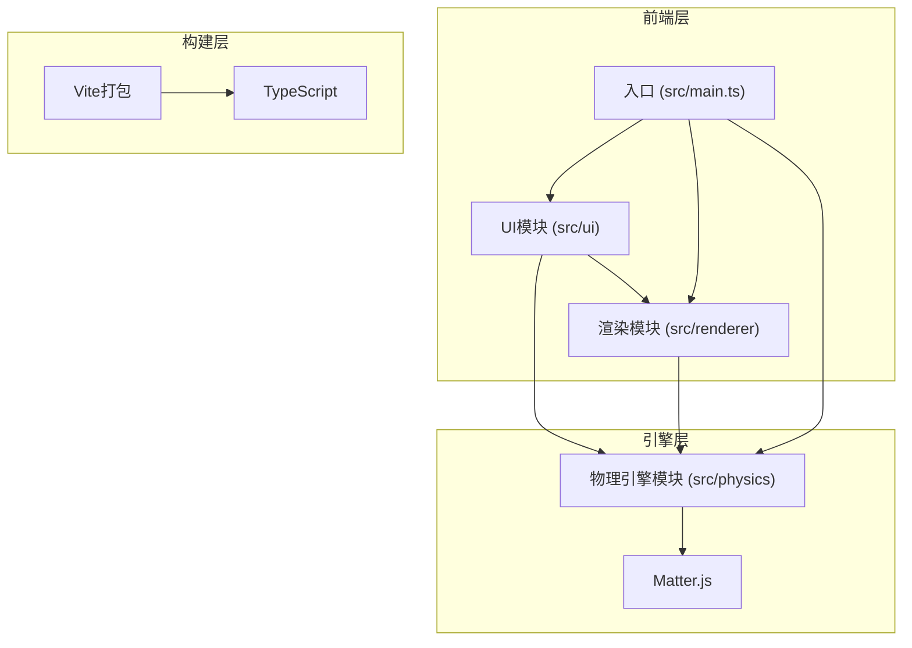

## 1. 架构设计



## 2. 技术说明

- **前端语言**：TypeScript (target ES2020, strict mode)
- **构建工具**：Vite
- **物理引擎**：Matter.js
- **渲染**：HTML5 Canvas 2D
- **依赖**：typescript, vite, matter-js, uuid
- **无后端**：纯前端项目，关卡数据内嵌

## 3. 文件结构

```
project/
├── package.json
├── vite.config.js
├── tsconfig.json
├── index.html
└── src/
    ├── main.ts                    # 入口：初始化引擎、渲染器、启动游戏循环
    ├── physics/
    │   ├── engine.ts              # Matter.js初始化、物理世界管理、碰撞检测回调
    │   └── bodies.ts              # 障碍物物理体配置（密度、摩擦、恢复系数）
    ├── renderer/
    │   └── canvas.ts              # Canvas绘制：背景、网格、物体渲染、粒子特效
    └── ui/
        ├── panels.ts              # 左侧工具面板、底部力度条、关卡弹窗等UI逻辑
        └── levels.ts              # 关卡数据定义、星级评定逻辑、关卡进度管理
```

## 4. 模块接口定义

### 4.1 PhysicsEngine (src/physics/engine.ts)

```typescript
interface PhysicsEngine {
  init(width: number, height: number): void
  addBody(config: BodyConfig): Matter.Body
  removeBody(id: number): void
  update(delta: number): void
  onCollision(callback: (event: CollisionEvent) => void): void
  getBodies(): Matter.Body[]
  launchBall(position: Vector, velocity: Vector): Matter.Body
}
```

### 4.2 BodyConfig (src/physics/bodies.ts)

```typescript
type ObstacleType = 'woodbox' | 'ironblock' | 'rubberball' | 'springboard' | 'spiketrap'

interface BodyConfig {
  type: ObstacleType
  x: number
  y: number
  width: number
  height: number
  angle: number
  isStatic: boolean
  density: number
  friction: number
  restitution: number
}
```

### 4.3 Renderer (src/renderer/canvas.ts)

```typescript
interface Renderer {
  init(canvas: HTMLCanvasElement): void
  render(bodies: RenderableBody[], particles: Particle[]): void
  drawGrid(): void
  drawTrajectory(points: Vector[]): void
  drawPowerBar(power: number): void
  drawAngleText(x: number, y: number, angle: number): void
  addParticle(particle: Particle): void
  updateParticles(delta: number): void
}

interface RenderableBody {
  id: number
  type: ObstacleType
  x: number
  y: number
  width: number
  height: number
  angle: number
  opacity: number
  isBroken: boolean
}

interface Particle {
  x: number
  y: number
  vx: number
  vy: number
  life: number
  maxLife: number
  color: string
  size: number
}
```

### 4.4 UIPanels (src/ui/panels.ts)

```typescript
interface UIPanels {
  init(container: HTMLElement): void
  getSelectedType(): ObstacleType | null
  onPlace(callback: (type: ObstacleType, x: number, y: number) => void): void
  onRotate(callback: (id: number, angle: number) => void): void
  onDelete(callback: (id: number) => void): void
  showPowerBar(): void
  hidePowerBar(): void
  updatePowerBar(power: number): void
  showResultPanel(stars: number, score: number, hasNext: boolean): void
  hideResultPanel(): void
  onNextLevel(callback: () => void): void
  showContextMenu(x: number, y: number, onDelete: () => void): void
}
```

### 4.5 LevelManager (src/ui/levels.ts)

```typescript
interface LevelData {
  id: number
  name: string
  targets: TargetConfig[]
  availableBalls: number
  presetObstacles: BodyConfig[]
}

interface LevelManager {
  getCurrentLevel(): LevelData
  calculateStars(targetsHit: number, totalTargets: number, remainingBalls: number): number
  calculateScore(targetsHit: number, remainingBalls: number): number
  nextLevel(): LevelData | null
  resetLevel(): void
  isCompleted(): boolean
}
```

## 5. 碰撞处理策略

| 碰撞类型 | 处理方式 |
|----------|----------|
| 小球 vs 木箱 | 移除木箱body，生成4个小型木块body，继承原速度的分散方向 |
| 小球 vs 铁块 | 应用反弹力，生成8-12个橙色/黄色火花粒子 |
| 小球 vs 橡皮球 | 增加恢复系数使小球弹跳，计数器到10后设为static |
| 小球 vs 弹簧板 | 根据弹簧板角度计算反射向量，放大速度1.5倍 |
| 小球 vs 尖刺陷阱 | 销毁小球，生成碎片粒子效果 |
| 小球 vs 目标 | 标记目标为已击倒，播放击倒动画 |

## 6. 渲染管线

1. 清空画布
2. 绘制网格背景
3. 绘制所有物理体（根据类型绘制不同形状和颜色）
4. 绘制粒子特效
5. 绘制UI叠加层（轨迹预测、力度条、角度文本）
6. requestAnimationFrame循环，30fps以上目标
