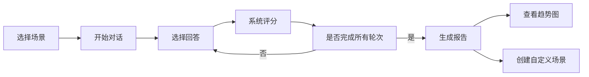

## 1. 产品概述

智能销售话术训练工具是一款面向销售团队的Web端训练平台，通过模拟真实销售场景帮助销售人员提升沟通技巧。系统基于预设对话树自动评估用户回答并给出专业改进建议。

- 核心价值：帮助销售团队低成本、高效率地进行话术训练，快速提升销售能力
- 目标用户：企业销售团队、销售培训师、销售人员个人
- 市场差异化：支持自定义场景拖拽构建、实时智能评分、可视化训练报告

## 2. 核心功能

### 2.1 用户角色
| 角色 | 注册方式 | 核心权限 |
|------|----------|----------|
| 普通用户 | 无需注册（本地存储） | 使用预置场景训练、创建自定义场景、查看训练报告 |

### 2.2 功能模块
1. **场景列表模块**：展示预置场景和自定义场景，支持场景切换
2. **对话训练模块**：多轮对话交互，选择回答后实时评分
3. **评分反馈模块**：实时显示评分、关键词匹配分析、改进建议
4. **自定义场景编辑器**：拖拽节点构建对话树，保存加载自定义场景
5. **训练报告模块**：平均评分、薄弱环节分析、历史趋势折线图

### 2.3 页面详情
| 页面名称 | 模块名称 | 功能描述 |
|----------|----------|----------|
| 主页面 | 场景列表 | 毛玻璃效果卡片，显示场景名称、描述、难度，点击切换 |
| 主页面 | 对话面板 | 圆角16px卡片，对话气泡弹出动画，300ms时长 |
| 主页面 | 评分面板 | 实时更新评分，数字变化缩放动画，显示关键词匹配度 |
| 主页面 | 报告面板 | Canvas绘制折线图，渐变填充，1秒动画绘制 |
| 主页面 | 场景编辑器 | 拖拽节点连线，最多10个节点，保存加载功能 |

## 3. 核心流程

用户选择训练场景 → 开始多轮对话 → 每轮选择回答 → 系统实时评分并给出反馈 → 完成所有对话 → 生成完整训练报告 → 可选择查看历史趋势或创建自定义场景

## 4. 用户界面设计

### 4.1 设计风格
- **主色调**：#1a365d（深蓝）
- **辅助色**：#3182ce（亮蓝）
- **强调色**：#fbbf24（金色）
- **背景色**：#f8fafc，毛玻璃效果 rgba(255,255,255,0.8)
- **字体**：Inter 系统字体，标题600，正文400
- **按钮风格**：圆角8px，hover状态阴影提升，transition 200ms
- **布局**：桌面端左中右三栏，移动端上下滚动布局

### 4.2 页面设计概述
| 页面名称 | 模块名称 | UI元素 |
|----------|----------|--------|
| 主页面 | 场景列表 | 毛玻璃卡片、图标、hover动效、选中高亮 |
| 主页面 | 对话面板 | 圆角16px容器、阴影xl、对话气泡弹出动画300ms、选项按钮 |
| 主页面 | 评分面板 | 大数字评分、缩放动画、进度条、关键词标签、反馈文案 |
| 主页面 | 报告面板 | Canvas折线图、渐变填充、1秒绘制动画、统计卡片 |
| 主页面 | 场景编辑器 | 拖拽节点、连线画布、属性编辑面板、保存按钮 |

### 4.3 响应式设计
- **桌面端（≥768px）**：左中右三栏布局，左侧场景列表25%，中间对话面板50%，右侧评分面板25%
- **移动端（<768px）**：上下滚动布局，场景列表→对话面板→评分面板依次排列，操作按钮底部悬浮固定
- **触摸优化**：按钮最小高度44px，间距8px以上

### 4.4 性能指标
- 场景切换时间：≤500ms（状态缓存实现）
- 对话树加载时间：≤1秒（懒加载+缓存）
- 动画流畅度：60fps，无卡顿
