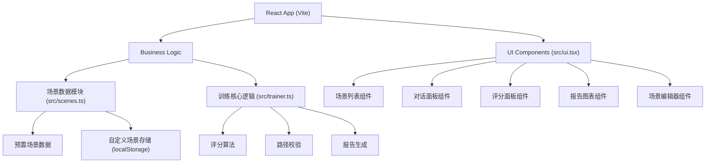

## 1. 架构设计



## 2. 技术栈

- **前端框架**：React 18 + TypeScript
- **构建工具**：Vite 5
- **样式方案**：Tailwind CSS 3
- **拖拽库**：@dnd-kit/core
- **状态管理**：React useState + useMemo（轻量级状态缓存
- **图标库**：lucide-react
- **数据存储**：localStorage（自定义场景持久化）

## 3. 目录结构

```
├── package.json
├── index.html
├── vite.config.js
├── tsconfig.json
├── tailwind.config.js
├── postcss.config.js
└── src/
    ├── main.tsx          # 应用入口
    ├── scenes.ts          # 场景数据模块
    ├── trainer.ts         # 训练核心逻辑
    ├── ui.tsx           # UI组件集合
    ├── App.tsx           # 根组件
    ├── index.css         # 全局样式
    ├── components/       # 拆分的子组件
    │   ├── SceneList.tsx
    │   ├── DialoguePanel.tsx
    │   ├── ScorePanel.tsx
    │   ├── ReportChart.tsx
    │   └── SceneEditor.tsx
    ├── hooks/              # 自定义Hooks
    │   ├── useSceneCache.ts
    │   └── useResponsive.ts
    │   └── useTraining.ts
    └── types/              # 类型定义
        └── index.ts
```

## 4. 核心数据模型

### 4.1 场景数据模型

```typescript
interface DialogueOption {
  id: string;
  text: string;
  keywords: string[];
  score: number;
  feedback: string;
  nextNodeId?: string;
}

interface DialogueNode {
  id: string;
  type: 'system' | 'user';
  text: string;
  options?: DialogueOption[];
  requiredKeywords?: string[];
}

interface Scene {
  id: string;
  name: string;
  description: string;
  type: 'initial' | 'objection' | 'negotiation' | 'closing' | 'followup';
  difficulty: number;
  startNodeId: string;
  nodes: Record<string, DialogueNode>;
  edges: { from: string; to: string }[];
}

interface TrainingResult {
  sceneId: string;
  totalScore: number;
  roundScores: number[];
  keywordMatch: number;
  pathComplete: boolean;
  feedback: string[];
  timestamp: number;
}

interface TrainingReport {
  averageScore: number;
  weaknessAnalysis: Record<string, number>;
  history: { date: string; score: number }[];
}
```

## 5. 核心算法

### 5.1 评分算法
- 关键词匹配（60%权重）：匹配用户回答中的预设关键词，按匹配度计算
- 路径完整性（30%权重）：是否按照最优对话路径完成对话
- 响应质量（10%权重）：回答的完整性和逻辑性

### 5.2 评分映射函数
```typescript
function calculateScore(keywordMatch: number, pathComplete: boolean, responseQuality: number): number {
  const baseScore = keywordMatch * 0.6 + (pathComplete ? 30 : 15) + responseQuality * 0.1;
  return Math.min(100, Math.max(0, Math.round(baseScore)));
}
```

## 6. 性能优化方案

### 6.1 场景缓存机制
- 使用 useMemo 缓存场景列表，避免重复计算
- 场景切换时使用 React.memo 优化重渲染
- localStorage 缓存自定义场景数据

### 6.2 懒加载策略
- 对话树节点按需加载，当前节点只加载子节点
- 图表组件使用 useCallback 优化事件处理

### 6.3 状态管理优化
- 使用 React.memo 包裹纯组件
- 合理拆分 useState，避免大范围重渲染
- 使用 useTransition 实现非紧急更新
```

