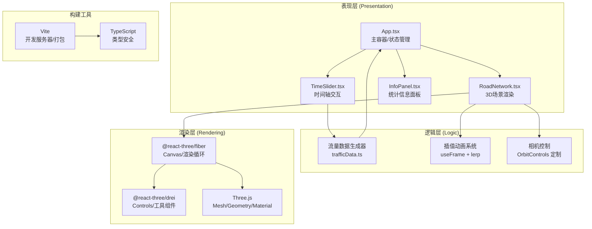

## 1. 架构设计



## 2. 技术描述

- **前端框架**：React@18 + TypeScript@5
- **3D渲染**：Three.js@0.160 + @react-three/fiber@8 + @react-three/drei@9
- **后处理效果**：@react-three/postprocessing + postprocessing（Bloom发光）
- **构建工具**：Vite@5 + @vitejs/plugin-react@4
- **UI辅助**：leva（调试面板，可选）、uuid（唯一ID生成）
- **状态管理**：React Hooks (useState/useRef/useMemo) + zustand 轻量状态
- **无后端**：纯前端模拟数据，所有流量数据本地生成

## 3. 核心文件组织

| 文件路径 | 职责 |
|---------|------|
| `package.json` | 项目依赖与脚本配置（npm run dev启动） |
| `vite.config.js` | Vite基础配置，集成React插件 |
| `tsconfig.json` | TypeScript严格模式，ES2020模块 |
| `index.html` | 入口页面，根div + viewport meta |
| `src/main.tsx` | React入口，渲染App组件 |
| `src/App.tsx` | 主容器：路网数据状态、时间轴状态、全局协调 |
| `src/components/RoadNetwork.tsx` | 3D场景：Canvas、道路带状网格、交叉路口、动画 |
| `src/components/TimeSlider.tsx` | 时间滑块：刻度、拖动、悬浮流量显示 |
| `src/components/InfoPanel.tsx` | 信息面板：时间、流量、统计、FPS |
| `src/utils/trafficData.ts` | 流量生成：24小时采样、getSnapshot(time)接口 |
| `src/types/index.ts` | 类型定义：Road、Intersection、TrafficSnapshot等 |

## 4. 数据模型

### 4.1 核心类型定义

```typescript
// 道路定义
interface Road {
  id: string;
  name: string;
  start: [number, number, number];  // xyz起点坐标
  end: [number, number, number];    // xyz终点坐标
  baseFlow: number;                 // 基础流量0-100
  peakHours: number[];              // 高峰时段(0-23)
}

// 交叉路口定义
interface Intersection {
  id: string;
  position: [number, number, number];
  connectedRoads: string[];
}

// 单条道路流量快照
interface RoadTraffic {
  roadId: string;
  flow: number;       // 0-100
  width: number;      // 1-6（由flow映射）
  color: string;      // 渐变颜色hex
}

// 全局流量快照
interface TrafficSnapshot {
  timestamp: number;  // 小时数(0-24)
  averageFlow: number;// 全城平均0-100
  roads: RoadTraffic[];
}

// 路网数据集
interface RoadNetworkData {
  roads: Road[];
  intersections: Intersection[];
}
```

## 5. 核心算法说明

### 5.1 流量→视觉映射
- 宽度映射：`width = 1 + (flow / 100) * 5` → 范围[1, 6]
- 颜色渐变（三段线性插值）：
  - flow∈[0,50]: 绿#22c55e → 黄#eab308，进度 t=flow/50
  - flow∈[50,100]: 黄#eab308 → 红#ef4444，进度 t=(flow-50)/50
  - 三通道分别线性插值RGB

### 5.2 流量数据生成策略
- 24小时 × 每小时5个采样点 = 120个采样点
- 每条道路使用：基础流量 + 高峰时段高斯波峰 + 随机噪声
- 早高峰7-9时、晚高峰17-19时叠加较高波峰
- 其余时间使用基础流量 + 小幅度随机波动

### 5.3 平滑过渡动画
- 使用 @react-three/fiber 的 `useFrame` 钩子每帧执行
- 保存上一帧 target 值，当前值使用 `lerp(current, target, 1 - Math.pow(0.001, delta))` 实现ease-in-out
- 500ms(0.5s)过渡时间，通过调整插值系数控制

### 5.4 时间轴插值
- 用户拖出的时刻(小时数)在预生成的120个采样点之间插值
- 使用线性插值获取相邻采样点的中间值，响应延迟<200ms

### 5.5 相机动画缓动
- drei OrbitControls 配置 `enableDamping={true}` + `dampingFactor={0.08}`
- 该阻尼系数约对应0.3秒(300ms)ease-out缓动效果
- minDistance=10, maxDistance=500, minPolarAngle=0, maxPolarAngle=Math.PI/2(90°)
- rotateSpeed=0.005（弧度/像素），zoomSpeed=0.005

## 6. 性能优化策略

| 优化点 | 策略 |
|-------|------|
| 网格数量 | 道路尽量合并，10条路×2面+20路口=约40个Mesh |
| 几何体 | 使用BoxGeometry预创建实例，不动态重建geometry，仅scale |
| 材质 | 复用MeshStandardMaterial实例，动态修改color属性而非创建新材质 |
| 渲染帧率 | requestAnimationFrame驱动，使用Stats/FPS计数器监控 |
| 后处理 | Bloom效果只作用于发光物体(emissive材质)，降低强度 |
| 状态更新 | 流量更新每2秒一次，useRef存储避免不必要重渲染 |
