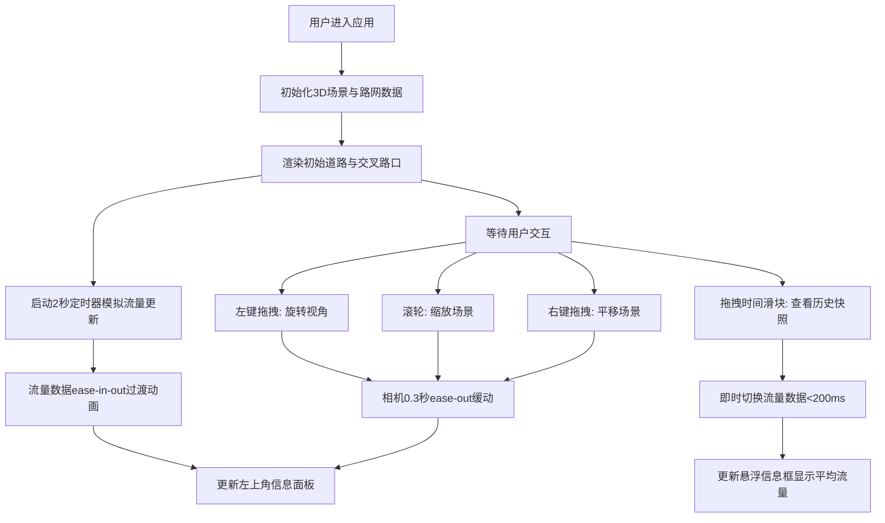

## 1. 产品概述

城市实时交通流量3D交互式可视化工具，为城市规划者和交通管理者提供直观的路网流量动态变化理解。通过三维场景展示道路带宽随流量变化、时间轴回放、自由视角漫游等功能，帮助决策者快速洞察交通模式。

- 核心用途：城市交通流量可视化分析与决策辅助
- 目标用户：城市规划师、交通管理者、智慧城市研究员
- 产品价值：将抽象的流量数据转化为直观可交互的3D视觉体验，降低理解门槛，提升决策效率

## 2. 核心功能

### 2.1 功能模块

1. **3D路网可视化模块**：主干道与交叉路口的3D渲染、动态流量视觉表现
2. **实时流量模拟模块**：流量数据模拟生成、定时更新、平滑过渡动画
3. **时间轴回放模块**：24小时时间滑块、时刻流量快照、平均流量指数显示
4. **相机交互模块**：视角旋转、缩放、平移、缓动效果
5. **信息面板模块**：模拟时间、流量指数、道路统计、FPS计数

### 2.2 页面详情

| 页面名称 | 模块名称 | 功能描述 |
|---------|---------|---------|
| 主界面 | 3D路网可视化 | 渲染10+主干道、20+交叉路口，道路宽度随流量动态变化(1-6单位)，颜色绿→黄→红渐变 |
| 主界面 | 实时流量更新 | 每2秒模拟流量数据更新，0.5秒ease-in-out动画过渡，无突变闪烁 |
| 主界面 | 时间轴滑块 | 底部水平滑块，范围0-24小时，步长15分钟，带刻度标签，即时响应<200ms |
| 主界面 | 流量悬浮信息框 | 滑块上方半透明深灰浮窗，显示当前时刻全城平均流量指数(0-100) |
| 主界面 | 相机漫游 | 左键旋转(0.005rad/px，x轴0-90°)、滚轮缩放(10-500单位，0.005速度)、右键平移，0.3秒ease-out缓动 |
| 主界面 | 信息面板 | 左上角半透明深灰面板(240px宽)，显示模拟时间、平均流量、道路总数、更新计数、FPS |
| 主界面 | 交叉路口标记 | 直径4单位白色光点，2秒周期脉动动画 |

## 3. 核心流程

用户打开应用 → 3D场景加载路网与初始流量 → 自动每2秒更新流量数据并平滑动画 → 用户可通过左键旋转/滚轮缩放/右键平移自由探索 → 用户拖拽底部时间滑块查看任意时刻流量快照 → 左上角面板实时显示统计信息与帧率

## 4. 用户界面设计

### 4.1 设计风格
- **主题色调**：深色主题，背景 `#0f172a`（深蓝灰）
- **道路颜色渐变**：绿色 `#22c55e` → 黄色 `#eab308` → 红色 `#ef4444`
- **面板样式**：半透明深灰背景 `rgba(30,41,59,0.9)`，圆角 8-12px，白色文字
- **发光效果**：道路带半透明发光阴影，增强立体感
- **字体选择**：现代无衬线字体（Geist/Space Grotesk 变体），等宽数字显示统计值

### 4.2 页面设计概述

| 模块名称 | UI元素 | 描述 |
|---------|-------|------|
| 3D场景背景 | 纯色背景、氛围光 | `#0f172a` 深色背景，环境光+方向光烘托场景 |
| 道路带状 | BoxGeometry网格、渐变材质、发光效果 | 宽度1-6单位动态变化，颜色随流量从绿到红，带发光 |
| 交叉路口 | 白色光点、脉动动画 | 直径4单位球体，2秒周期正弦脉动缩放 |
| 左上角信息面板 | 固定定位、半透明卡片 | 圆角12px，宽240px，5项统计指标，等宽数字 |
| 底部时间轴 | 水平滑块、刻度标签、悬浮窗 | 步长15分钟，共96个刻度点，滑块上方浮窗 |
| 时间悬浮框 | 绝对定位浮窗 | 半透明深灰，圆角8px，显示平均流量指数 |
| FPS计数器 | 左上角面板内 | requestAnimationFrame统计，实时更新 |

### 4.3 响应式
- 桌面端优先设计，适配 1280×720 及以上分辨率
- 信息面板与时间滑块使用固定像素定位，确保在不同分辨率下布局一致
- 3D Canvas自适应全屏，自动响应窗口resize事件

### 4.4 3D场景指导
- **环境与氛围**：深蓝黑背景 (`#0f172a`)，无HDRI，使用环境光+两盏方向光营造对比
- **光照设置**：AmbientLight强度0.4，主DirectionalLight强度0.8(45°角)，辅光强度0.3(-45°)
- **相机设置**：初始位置 [0, 80, 120]，lookAt [0,0,0]，PerspectiveCamera fov=50
- **相机动画**：OrbitControls定制，旋转速度0.005rad/px，zoom范围10-500，enableDamping=true，dampingFactor=0.08（对应0.3秒缓动）
- **构图布局**：路网居中，采用正交网格布局，主干道形成"五横五纵"结构，总尺寸约100×100单位
- **交互动画**：道路width/color使用lerp线性插值0.5秒过渡，路口光点使用sin函数脉动
- **后处理效果**：使用EffectComposer添加Bloom发光，强度0.6，阈值0.2，增强道路发光质感
- **性能预算**：约30个Mesh(10道路×2+20路口)，面数<5k，目标30fps稳定
