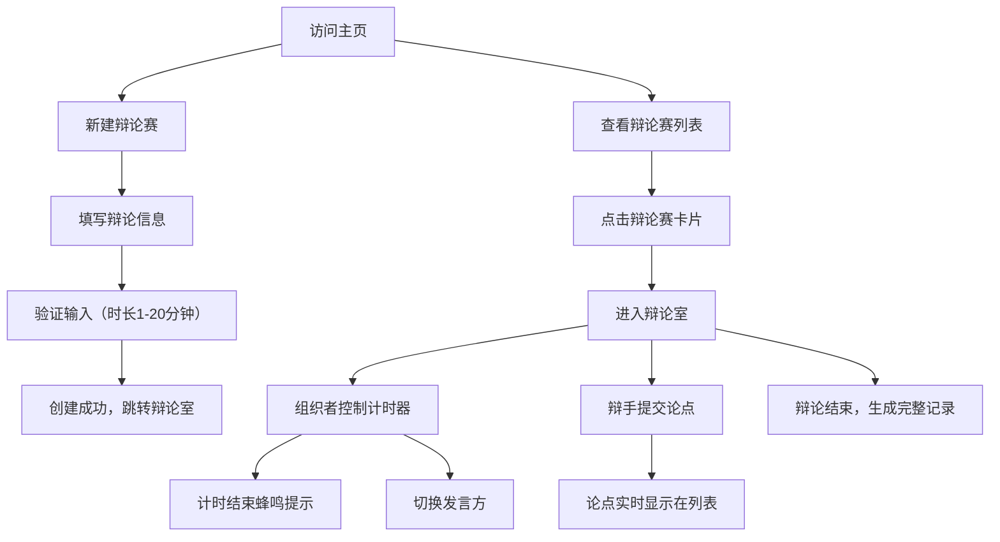

## 1. 产品概述

在线辩论赛实时计时与论点管理应用，帮助辩论赛组织者管理赛程、计时，辩手实时提交和查看论点。

- 主要用途：为辩论赛提供专业的计时工具和论点管理平台，提升辩论比赛的组织效率和参与体验
- 目标用户：辩论赛组织者、参赛辩手、评委及观众
- 产品价值：提供精准计时、实时论点交互、完整辩论记录，打造沉浸式辩论体验

## 2. 核心功能

### 2.1 用户角色

| 角色 | 参与方式 | 核心权限 |
|------|----------|----------|
| 组织者 | 创建辩论赛 | 管理辩论赛、控制计时器、切换发言方、重置计时 |
| 辩手 | 加入辩论室 | 提交论点、查看实时计时、浏览论点列表 |
| 观众 | 加入辩论室 | 观看辩论、查看计时、浏览论点和辩论记录 |

### 2.2 功能模块

1. **主页**：辩论赛列表展示、新建辩论赛、加入辩论赛
2. **辩论室**：实时计时器、论点面板、发言顺序管理、辩论记录

### 2.3 页面详情

| 页面名称 | 模块名称 | 功能描述 |
|-----------|-------------|---------------------|
| 主页 | 辩论赛列表 | 卡片布局展示所有辩论赛，显示名称、正反方辩手、状态、创建时间 |
| 主页 | 新建辩论赛 | 表单输入辩论赛名称、正反方辩手昵称、发言时长（1-20分钟），验证后创建 |
| 辩论室 | 计时器 | 居中显示，精确到毫秒，支持开始/暂停、切换发言方、重置 |
| 辩论室 | 论点面板 | 左侧固定，支持提交论点（最多150字），按时间倒序列出论点 |
| 辩论室 | 辩论记录 | 底部可滚动区域，展示完整辩论过程记录 |

## 3. 核心流程

用户从主页开始，可以浏览现有辩论赛列表，点击卡片进入辩论室，或创建新的辩论赛。在辩论室中，组织者控制计时器，辩手提交论点，系统自动记录所有交互并生成辩论记录。

## 4. 用户界面设计

### 4.1 设计风格

- **主色调**：深蓝色 #1e3a8a（专业、权威），橙红色系点缀（紧张、活力）
- **背景色**：暖白 #fff7ed（温暖、专注）
- **强调色**：
  - 正方：绿色 #16a34a
  - 反方：红色 #dc2626
  - 按钮蓝色：#2563eb
- **按钮风格**：圆形按钮（44x44px），圆角卡片（8px/12px），hover缩放效果
- **字体**：数字使用 monospace，正文使用现代无衬线字体
- **布局风格**：卡片式布局，左侧论点面板固定（320px），计时器居中，辩论记录在底部
- **动效**：过渡动画0.2s ease，计时器启动时背景呼吸灯效果（#fff7ed ↔ #ffedd5，周期2s）

### 4.2 页面设计概述

| 页面名称 | 模块名称 | UI元素 |
|-----------|-------------|-------------|
| 主页 | 辩论赛卡片 | 背景#f9fafb，圆角12px，hover上移5px+阴影，显示名称、辩手、状态、时间 |
| 主页 | 新建表单 | 数字输入框（时长1-20分钟），超出报警，提交按钮 |
| 辩论室 | 计时器 | 深蓝色背景#1e3a8a，白色字体，64px字号，monospace，显示分:秒:毫秒（两位） |
| 辩论室 | 发言方指示 | 绿色#16a34a/红色#dc2626高亮，显示剩余发言时长 |
| 辩论室 | 控制按钮 | 圆形44x44px，绿/蓝/红背景，SVG图标，hover缩放1.1倍，0.2s过渡 |
| 辩论室 | 论点面板 | 左侧固定320px，输入框（最多150字），提交按钮#2563eb，disabled状态#9ca3af |
| 辩论室 | 论点列表 | 背景交替#f1f5f9和白色，圆角8px，间距8px，可展开全文 |
| 辩论室 | 辩论记录 | 底部可滚动，14px字体，行距1.5，正/反方文字颜色区分 |

### 4.3 响应式设计

- **桌面端（≥768px）**：左侧论点面板固定320px，计时器居中，底部记录自适应
- **移动端（<768px）**：论点面板折叠到顶部汉堡菜单，计时器居中，底部记录宽度自适应
- **触摸优化**：按钮最小44x44px，确保可点击区域充足

### 4.4 特殊效果

- **计时结束**：Web Audio API生成440Hz/0.5秒蜂鸣声，页面顶部红色边框闪烁1秒
- **呼吸灯效果**：计时器启动时，背景在#fff7ed到#ffedd5间缓慢切换，周期2秒
- **hover/focus状态**：所有交互元素均有状态反馈，过渡0.2s ease
