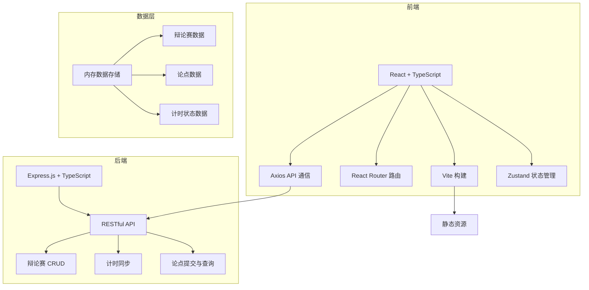
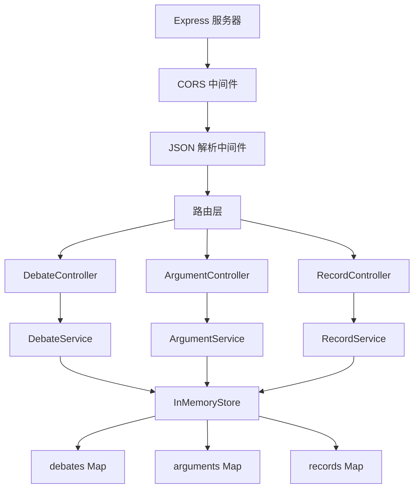
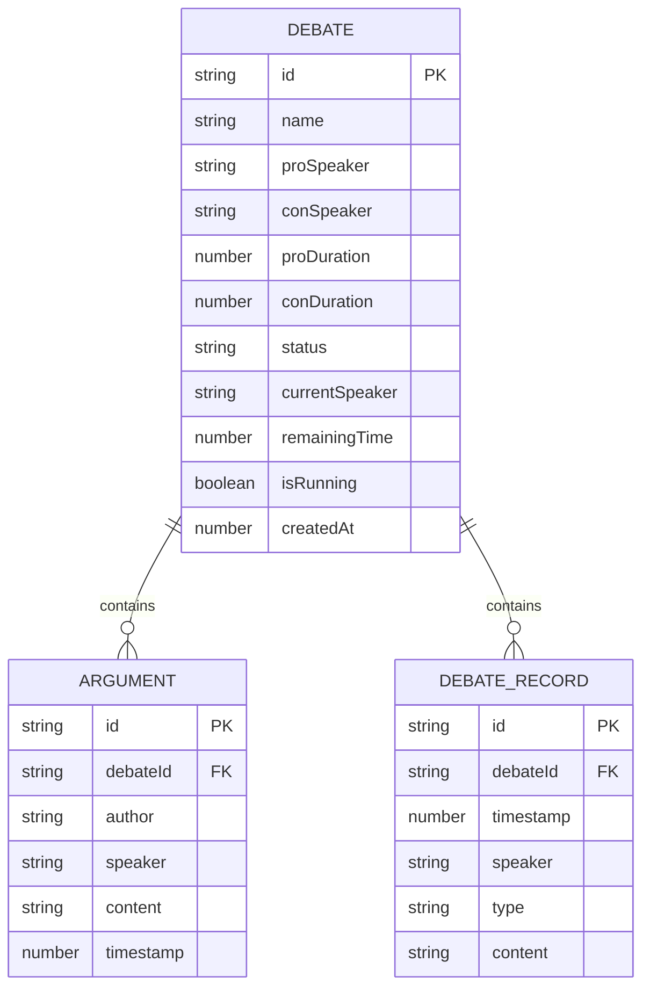

## 1. 架构设计



## 2. 技术描述

- **前端**：React@18 + TypeScript + Vite@5 + React Router@6 + Axios + Zustand
- **后端**：Express.js@4 + TypeScript + CORS
- **构建工具**：Vite@5
- **数据持久化**：内存模拟（Map 存储）
- **包管理器**：npm

**核心依赖版本：**
- react: ^18.2.0
- react-dom: ^18.2.0
- react-router-dom: ^6.20.0
- axios: ^1.6.0
- uuid: ^9.0.0
- express: ^4.18.2
- cors: ^2.8.5
- typescript: ^5.3.0
- vite: ^5.0.0
- @vitejs/plugin-react: ^4.2.0
- zustand: ^4.4.0

## 3. 路由定义

| 路由 | 页面 | 用途 |
|-------|------|---------|
| `/` | HomePage | 主页，展示辩论赛列表，新建和加入辩论赛 |
| `/debate/:id` | DebateRoom | 辩论室页面，计时器、论点面板、发言管理 |

## 4. API 定义

### 4.1 TypeScript 类型定义

```typescript
// 辩论赛状态
type DebateStatus = 'waiting' | 'in_progress' | 'completed';

// 发言方
type Speaker = 'pro' | 'con';

// 辩论赛
interface Debate {
  id: string;
  name: string;
  proSpeaker: string;
  conSpeaker: string;
  proDuration: number; // 分钟
  conDuration: number; // 分钟
  status: DebateStatus;
  currentSpeaker: Speaker;
  remainingTime: number; // 毫秒
  isRunning: boolean;
  createdAt: number;
}

// 论点
interface Argument {
  id: string;
  debateId: string;
  author: string;
  speaker: Speaker;
  content: string;
  timestamp: number;
}

// 辩论记录
interface DebateRecord {
  id: string;
  debateId: string;
  timestamp: number;
  speaker: Speaker;
  type: 'argument' | 'timer_start' | 'timer_pause' | 'timer_reset' | 'switch_speaker' | 'time_up';
  content?: string;
}
```

### 4.2 API 接口

| 方法 | 路径 | 描述 | 请求体 | 响应 |
|------|------|------|--------|------|
| `GET` | `/api/debates` | 获取所有辩论赛列表 | - | `Debate[]` |
| `GET` | `/api/debates/:id` | 获取单个辩论赛详情 | - | `Debate` |
| `POST` | `/api/debates` | 创建新辩论赛 | `{ name, proSpeaker, conSpeaker, proDuration, conDuration }` | `Debate` |
| `PUT` | `/api/debates/:id/timer` | 更新计时器状态 | `{ isRunning, remainingTime, currentSpeaker }` | `Debate` |
| `POST` | `/api/debates/:id/switch` | 切换发言方 | - | `Debate` |
| `POST` | `/api/debates/:id/reset` | 重置计时器 | - | `Debate` |
| `GET` | `/api/debates/:id/arguments` | 获取辩论赛论点列表 | - | `Argument[]` |
| `POST` | `/api/debates/:id/arguments` | 提交论点 | `{ author, speaker, content }` | `Argument` |
| `GET` | `/api/debates/:id/records` | 获取辩论记录 | - | `DebateRecord[]` |

## 5. 服务器架构图



## 6. 数据模型

### 6.1 数据模型定义



### 6.2 内存数据结构

```typescript
// 内存存储结构
const store = {
  debates: new Map<string, Debate>(),
  arguments: new Map<string, Argument>(),
  records: new Map<string, DebateRecord[]>(),
};

// 初始化示例数据
const sampleDebates: Debate[] = [
  {
    id: '1',
    name: '人工智能是否会取代人类工作',
    proSpeaker: '张三',
    conSpeaker: '李四',
    proDuration: 5,
    conDuration: 5,
    status: 'waiting',
    currentSpeaker: 'pro',
    remainingTime: 5 * 60 * 1000,
    isRunning: false,
    createdAt: Date.now() - 3600000,
  },
  {
    id: '2',
    name: '大学生是否应该创业',
    proSpeaker: '王五',
    conSpeaker: '赵六',
    proDuration: 3,
    conDuration: 3,
    status: 'in_progress',
    currentSpeaker: 'con',
    remainingTime: 2 * 60 * 1000 + 30 * 1000,
    isRunning: true,
    createdAt: Date.now() - 7200000,
  },
];
```

## 7. 性能优化

### 7.1 计时器性能

- 使用 `requestAnimationFrame` 实现 60fps 更新频率
- 基于系统时间戳计算剩余时间，避免累积误差
- 误差控制在 10ms 以内

### 7.2 前端性能

- 使用 Zustand 进行状态管理，避免不必要的重渲染
- 论点列表使用虚拟滚动（如需要）
- 静态资源 gzip 压缩，确保首次加载 < 500KB
- 页面加载时间 < 2 秒

### 7.3 API 性能

- 论点提交后 1 秒内显示在列表中
- 使用内存存储，响应时间 < 50ms
- RESTful API 设计，资源定位清晰
