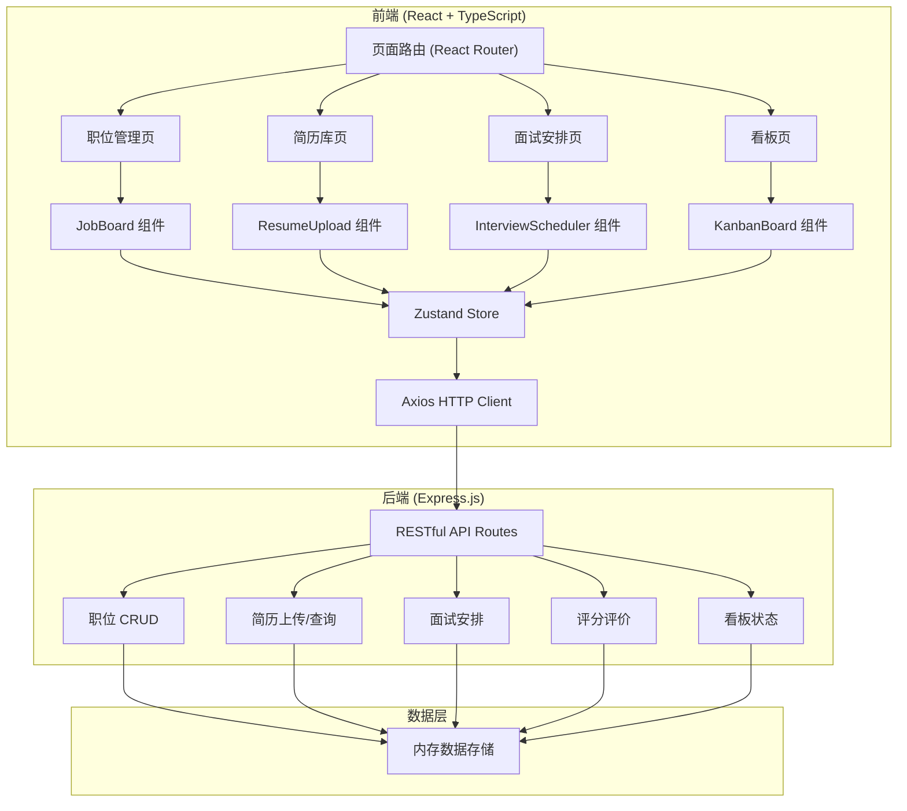
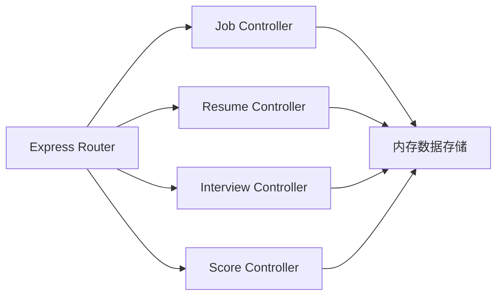
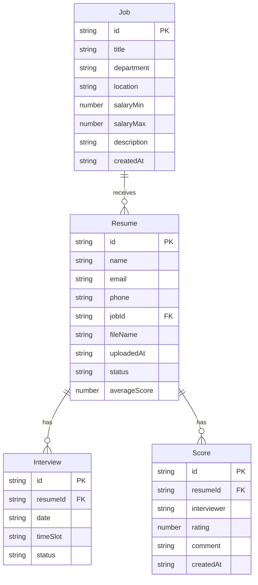

## 1. 架构设计



## 2. 技术说明

- 前端：React@18 + TypeScript + Tailwind CSS + Vite
- 初始化工具：vite-init (react-express-ts 模板)
- 后端：Express@4 + TypeScript (ESM格式)
- 数据库：内存数据存储（Mock数据），使用uuid生成唯一ID
- 状态管理：Zustand
- HTTP客户端：Axios
- 路由：React Router DOM

## 3. 路由定义

| 路由 | 用途 |
|------|------|
| / | 重定向到 /jobs |
| /jobs | 职位管理页 - 展示职位列表和创建职位 |
| /resumes | 简历库页 - 简历上传和列表展示 |
| /interviews | 面试安排页 - 日历视图和面试管理 |
| /kanban | 看板页 - 候选人状态看板 |

## 4. API定义

### 4.1 职位相关

```typescript
interface Job {
  id: string;
  title: string;
  department: string;
  location: string;
  salaryMin: number;
  salaryMax: number;
  description: string;
  createdAt: string;
}

// GET /api/jobs - 获取所有职位
// POST /api/jobs - 创建职位
// GET /api/jobs/:id - 获取职位详情
```

### 4.2 简历相关

```typescript
interface Resume {
  id: string;
  name: string;
  email: string;
  phone: string;
  jobId: string;
  jobTitle: string;
  fileName: string;
  uploadedAt: string;
  status: "pending" | "interviewed" | "hired" | "rejected";
  scores: Score[];
  averageScore: number;
}

// GET /api/resumes - 获取所有简历
// POST /api/resumes - 上传简历
// GET /api/resumes/:id - 获取简历详情
```

### 4.3 面试相关

```typescript
interface Interview {
  id: string;
  resumeId: string;
  date: string;
  timeSlot: string;
  status: "scheduled" | "completed" | "cancelled";
}

interface Score {
  id: string;
  resumeId: string;
  interviewer: string;
  rating: number;
  comment: string;
  createdAt: string;
}

// GET /api/interviews - 获取所有面试
// POST /api/interviews - 创建面试安排
// GET /api/interviews/slots?date=YYYY-MM-DD - 获取某日可用时段
```

### 4.4 评分相关

```typescript
// POST /api/scores - 提交评分评价
// GET /api/resumes/:id/scores - 获取候选人评分
```

### 4.5 看板相关

```typescript
// PATCH /api/resumes/:id/status - 更新候选人状态
```

## 5. 服务端架构图



## 6. 数据模型

### 6.1 数据模型定义



### 6.2 初始数据

服务端启动时将预置3个示例职位和5个示例简历，用于演示招聘流程。
