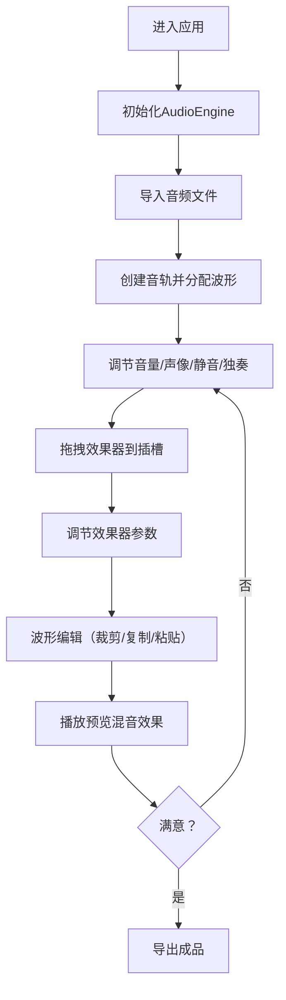

## 1. 产品概述

多轨音频混音协作平台，帮助音乐制作人和混音工程师在浏览器中完成多轨音频混合与效果调节，解决远程协作中实时听觉反馈缺失、效果参数无法统一调整、导出格式混乱的问题。

- **目标用户**：音乐制作人、混音工程师、音频创作者
- **核心价值**：浏览器端实时多轨混音、效果器链处理、远程协作工作流
- **定位**：专业级轻量在线DAW（数字音频工作站）

## 2. 核心功能

### 2.1 用户角色

| 角色 | 注册方式 | 核心权限 |
|------|----------|----------|
| 普通用户 | 模拟登录 | 创建项目、导入音频、混音编辑、效果处理、导出作品 |

### 2.2 功能模块

1. **轨道面板**：多音轨管理、音量控制、声像调节、静音/独奏、波形可视化
2. **效果器系统**：效果器插槽、拖拽挂载、参数调节、旁路控制
3. **音频编辑**：文件导入、波形选取、裁剪复制粘贴
4. **播放控制**：播放暂停、进度拖拽、BPM设置、时间显示
5. **效果器暂存区**：效果器卡片库、拖拽交互
6. **菜单栏**：文件操作、编辑操作、视图切换

### 2.3 页面详情

| 页面名称 | 模块名称 | 功能描述 |
|----------|----------|----------|
| 混音工作台 | 顶部菜单栏 | 文件菜单（新建/导入/导出）、编辑菜单（撤销/重做/裁剪/复制）、视图菜单（缩放/主题） |
| 混音工作台 | 左侧轨道面板 | 轨道列表、音量滑块、声像旋钮、静音按钮、独奏按钮、波形预览、效果器插槽 |
| 混音工作台 | 右侧效果器暂存区 | 效果器卡片库、拖拽添加、效果类型展示 |
| 混音工作台 | 底部播放控制条 | 播放/暂停按钮、进度条、BPM输入、时间显示 |
| 混音工作台 | 效果器参数面板 | 弹出式参数调节、旁路按钮、实时效果处理 |

## 3. 核心流程

### 3.1 用户混音工作流

1. 用户登录/进入应用
2. 点击上传按钮导入音频文件（WAV/MP3）
3. 系统自动创建新轨道并分配音频
4. 用户调节各轨道音量、声像、静音/独奏
5. 用户从效果器暂存区拖拽效果器到轨道插槽
6. 用户打开效果器面板调节参数
7. 用户选取波形片段进行裁剪/复制/粘贴
8. 用户点击播放实时监听混音效果
9. 用户导出最终混音文件

### 3.2 流程图

## 4. 用户界面设计

### 4.1 设计风格

**深色主题专业音频工作站风格**
- **主背景色**：#0f172a（深蓝灰色背景）
- **卡片/面板背景**：#1e293b（深灰蓝色面板）
- **边框颜色**：#334155（中性灰边框）
- **主色调**：紫色 #a855f7 + 蓝色 #3b82f6（品牌双主色）
- **辅助色**：绿色 #22c55e（播放指示）、红色 #dc2626（激活/警告）
- **文字颜色**：#e2e8f0（浅灰文字）
- **波形颜色**：#6366f1（靛蓝色波形）
- **波形背景**：#1e1b4b（深紫蓝波形区）

**按钮风格**：
- 圆角设计（6-8px）
- 悬停时颜色加深10%
- 点击水波纹扩散动画（300ms）
- 激活状态高亮（红色/绿色）

**字体与字号**：
- 现代无衬线字体（专业感）
- 主标题：18px 600
- 轨道名称：14px 500
- 参数标签：12px 400
- 辅助文字：11px 400

**布局风格**：
- 经典DAW三栏布局（左轨道+中工作区+右效果器）
- 顶部菜单栏 + 底部控制条的上下结构
- 卡片式组件，清晰的视觉层次
- 充足的间距营造专业感

**动画与交互**：
- 面板滑入动画（slide-in-right 250ms ease-out）
- 按钮水波纹点击效果
- 旋钮调节振动反馈（150ms）
- 波形流畅滚动更新
- 悬停微交互（上浮2px、边框高亮）

### 4.2 页面设计概览

| 页面名称 | 模块名称 | UI元素 |
|----------|----------|--------|
| 混音工作台 | 顶部菜单栏 | 48px高度、深色背景、文件/编辑/视图菜单、上传按钮（蓝色圆角8px+向上箭头SVG） |
| 混音工作台 | 左侧轨道面板 | 320px宽度、可滚动、轨道卡片交替背景（#f9fafb/#f3f4f6）、音量滑块（蓝色#2563eb 滑块头16px）、声像旋钮（36px带刻度）、静音/独奏按钮（激活红#dc2626 未激活灰#d1d5db）、Canvas波形图（每100ms刷新） |
| 混音工作台 | 右侧效果器暂存区 | 280px宽度、效果器卡片（120x40px 圆角6px 深灰#334155）、悬停上浮+浅蓝色边框#60a5fa、拖拽交互 |
| 混音工作台 | 底部控制条 | 64px高度、背景#1e293b、播放/暂停按钮（蓝色#3b82f6/白色#ffffff）、进度条（8px高 已播放# a855f7 未播放#475569 滑块头16px白色）、BPM输入框（60px宽 20-300）、时间显示（MM:SS.ms 14px #94a3b8） |
| 混音工作台 | 效果器面板 | 弹出式360px宽、半透明遮罩、参数滑块、旁路按钮（bypass 灰色半透明0.5） |

### 4.3 响应式设计

**桌面优先（Desktop-first）**
- 默认布局：完整三栏布局（>1024px）
- 中等屏幕（768px-1024px）：效果器暂存区折叠为工具栏图标，点击展开滑入面板
- 小屏幕（<768px）：轨道面板可折叠，控制条自适应

**触控优化**：
- 触控目标最小44x44px
- 滑块旋钮支持触控操作
- 滚动区域流畅惯性滚动

### 4.4 性能指标

- **音频播放**：同时4条立体声音轨（44100Hz 16bit 3分钟内）无卡顿丢帧
- **总延迟**：≤150ms
- **效果器处理延迟**：≤50ms
- **波形刷新**：每100ms更新，视觉流畅
- **UI响应**：交互反馈≤16ms
