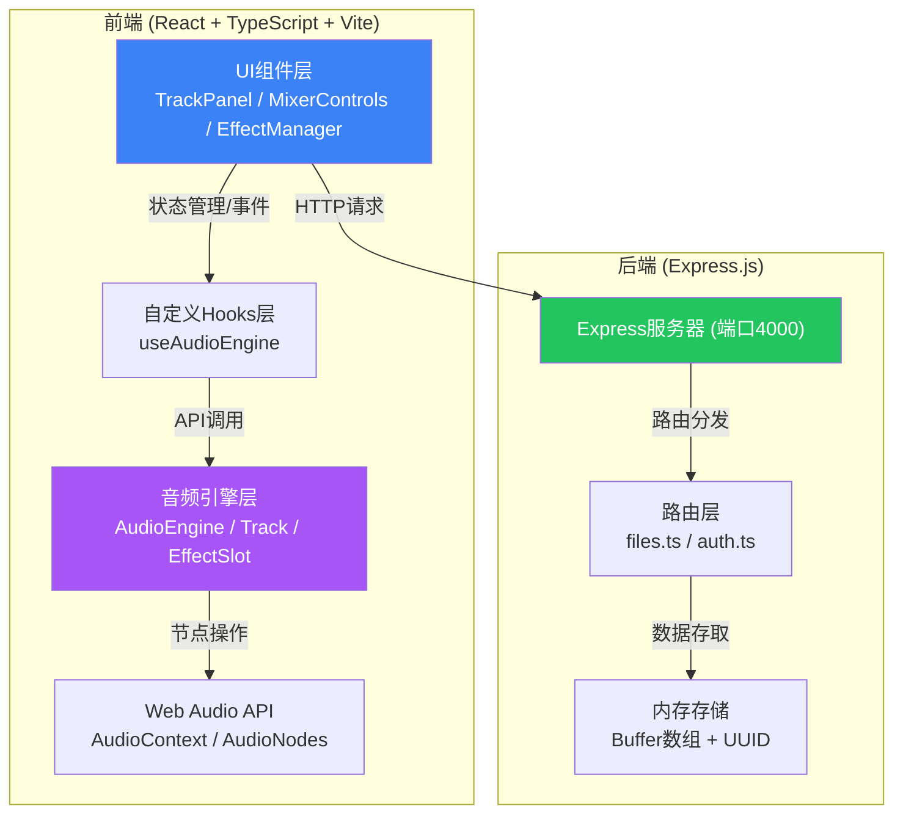
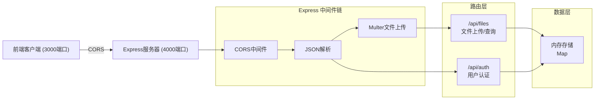
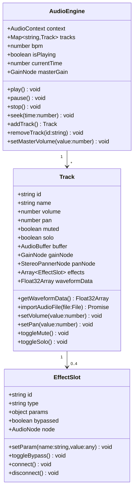

## 1. 架构设计



## 2. 技术栈说明

### 2.1 前端技术栈

| 技术 | 版本 | 用途 |
|------|------|------|
| React | ^18.2.0 | UI框架 |
| React DOM | ^18.2.0 | DOM渲染 |
| React Router DOM | ^6.x | 路由管理 |
| TypeScript | ^5.x | 类型安全 |
| Vite | ^5.x | 构建工具 |
| @vitejs/plugin-react | ^4.x | React插件 |
| Zustand | ^4.x | 状态管理 |
| Axios | ^1.x | HTTP请求 |
| UUID | ^9.x | 唯一ID生成 |
| Web Audio API | - | 原生音频处理（浏览器内置） |

### 2.2 后端技术栈

| 技术 | 版本 | 用途 |
|------|------|------|
| Express | ^4.x | Web框架 |
| CORS | ^2.x | 跨域支持 |
| UUID | ^9.x | 文件ID生成 |
| TypeScript | ^5.x | 类型安全 |
| Multer | ^1.x | 文件上传处理 |

### 2.3 构建与开发

- **构建工具**：Vite（端口3000）
- **后端运行**：ts-node / tsx（端口4000）
- **代码规范**：TypeScript严格模式
- **模块解析**：paths别名映射（@audio/* → src/audio/*）

## 3. 路由定义

| 路由 | 页面/组件 | 用途 |
|------|-----------|------|
| / | MixerPage | 混音工作台主页面 |
| * | NotFound | 404页面 |

## 4. API 定义

### 4.1 文件上传

```typescript
// 请求
POST /api/upload
Content-Type: multipart/form-data
Body: { file: File } // WAV/MP3, 单文件≤50MB

// 响应
interface UploadResponse {
  id: string;        // UUID
  name: string;      // 文件名
  size: number;      // 文件大小（字节）
  type: string;      // MIME类型
  url: string;       // 文件访问URL
  duration?: number; // 时长（秒）
}
```

### 4.2 文件列表查询

```typescript
// 请求
GET /api/tracks

// 响应
interface TrackListResponse {
  tracks: Array<{
    id: string;
    name: string;
    size: number;
    type: string;
    url: string;
    uploadedAt: string;
  }>;
}
```

### 4.3 用户登录（模拟）

```typescript
// 请求
POST /api/login
Body: { username: string; password: string }

// 响应
interface LoginResponse {
  success: boolean;
  token: string;
  user: {
    id: string;
    username: string;
  };
}
```

## 5. 服务器架构图



## 6. 核心数据模型

### 6.1 音频引擎数据模型



### 6.2 效果器类型与参数

| 效果器类型 | 核心参数 | 默认值 | 范围 |
|-----------|----------|--------|------|
| EQ (均衡器) | lowGain | 0 | -12 ~ 12 dB |
| | midGain | 0 | -12 ~ 12 dB |
| | highGain | 0 | -12 ~ 12 dB |
| Compressor (压缩器) | threshold | -24 | -100 ~ 0 dB |
| | ratio | 4 | 1 ~ 20 |
| | attack | 0.003 | 0 ~ 1 s |
| | release | 0.25 | 0 ~ 1 s |
| Reverb (混响) | decay | 2 | 0.1 ~ 10 s |
| | wet | 0.3 | 0 ~ 1 |
| Delay (延迟) | delayTime | 0.3 | 0 ~ 2 s |
| | feedback | 0.3 | 0 ~ 0.9 |
| | wet | 0.3 | 0 ~ 1 |
| Distortion (失真) | amount | 0.5 | 0 ~ 1 |
| | wet | 0.5 | 0 ~ 1 |

## 7. 项目目录结构

```
auto63/
├── .trae/documents/
│   ├── PRD.md
│   └── TECHNICAL_ARCHITECTURE.md
├── index.html
├── package.json
├── vite.config.ts
├── tsconfig.json
├── src/
│   ├── main.tsx              # 应用入口
│   ├── App.tsx               # 根组件
│   ├── audio/                # 音频引擎模块
│   │   ├── AudioEngine.ts    # 音频引擎核心
│   │   ├── Track.ts          # 单轨对象
│   │   └── EffectSlot.ts     # 效果器插槽
│   ├── components/           # UI组件
│   │   ├── TrackPanel.tsx    # 轨道面板
│   │   ├── TrackItem.tsx     # 单轨道组件
│   │   ├── MixerControls.tsx # 播放控制条
│   │   ├── EffectManager.tsx # 效果器管理
│   │   ├── EffectCard.tsx    # 效果器卡片
│   │   ├── EffectPanel.tsx   # 效果器参数面板
│   │   ├── WaveformCanvas.tsx # 波形Canvas
│   │   └── MenuBar.tsx       # 顶部菜单栏
│   ├── hooks/
│   │   └── useAudioEngine.ts # 音频引擎Hook
│   ├── store/
│   │   └── useStore.ts       # Zustand状态管理
│   ├── pages/
│   │   └── MixerPage.tsx     # 混音工作台页面
│   ├── types/
│   │   └── index.ts          # 类型定义
│   ├── utils/
│   │   └── audioUtils.ts     # 音频工具函数
│   └── styles/
│       └── index.css         # 全局样式
├── server/
│   ├── package.json
│   ├── tsconfig.json
│   └── src/
│       ├── server.ts         # 服务器入口
│       └── routes/
│           ├── files.ts      # 文件路由
│           └── auth.ts       # 认证路由
```
