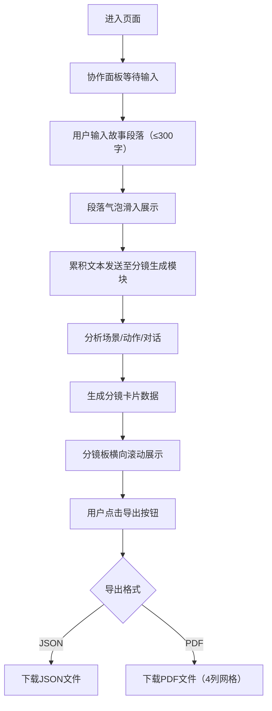

## 1. 产品概述
本产品是一个在线故事接龙与分镜脚本生成平台，让写作者像玩桌游一样轮流添加故事段落，系统自动生成漫画分镜脚本，帮助独立漫画作者快速从文字故事中获得画面灵感。
- 目标用户：独立漫画作者、故事创作团队、创意写作爱好者
- 核心价值：降低分镜创作门槛，加速文字到画面的转换，支持协作式故事创作

## 2. 核心功能

### 2.1 功能模块
1. **主页面（故事协作工作台）**：协作面板 + 分镜板 + 导出工具栏
2. **故事协作面板**：段落输入、气泡渲染、轮次控制、字数限制
3. **自动分镜生成模块**：场景分析、镜头类型判断、画面描述、对白提取
4. **分镜板展示模块**：横向滚动卡片、滚动进度条、悬停交互
5. **导出模块**：JSON导出、PDF导出（网格布局）

### 2.2 页面详情
| 页面名称 | 模块名称 | 功能描述 |
|-----------|-------------|---------------------|
| 主页面 | 协作面板 | 聊天式气泡展示故事段落，支持轮流输入，字数统计与限制，滑入动画，虚线分隔 |
| 主页面 | 分镜板 | 横向滚动卡片展示分镜脚本，含场景编号、镜头类型、画面描述、对白文本，悬停交互效果，滚动进度条 |
| 主页面 | 导出工具栏 | 右上角固定区域，提供JSON和PDF导出按钮，含悬停和按压动画 |

## 3. 核心流程
用户进入主页面后，可以轮流在协作面板中输入故事段落，每段不超过300字。系统自动将累积的文本发送到分镜生成模块，分析生成对应分镜卡片并实时展示在下方分镜板中。用户可随时通过右上角导出按钮将完整分镜脚本导出为JSON或PDF格式。

## 4. 用户界面设计

### 4.1 设计风格
- **配色主题**：深蓝+浅灰主色调，紫色高亮操作按钮
  - 主背景：#f1f5f9（协作面板）
  - 左对齐气泡：#e2e8f0 背景，#1e293b 文字
  - 右对齐气泡：#3b82f6 背景，#ffffff 文字
  - 分镜卡片描边：#94a3b8，悬停变为 #8b5cf6
  - 主按钮背景：#8b5cf6，悬停 #7c3aed
  - 滚动进度条：#3b82f6
- **按钮风格**：圆角8px，悬停背景加深，点击按压动画0.1s
- **字体**：现代无衬线字体，清晰层次
- **布局风格**：桌面端左右布局（协作面板+分镜板），平板端上下布局，手机端单列
- **动效**：所有过渡0.2-0.3s，段落滑入slide-up 300ms ease-out，卡片悬停上浮4px

### 4.2 页面设计概览
| 页面名称 | 模块名称 | UI元素 |
|-----------|-------------|-------------|
| 主页面 | 协作面板 | 浅灰背景，气泡宽70%最大600px，左右对齐区分，2px虚线分隔，字数超限红色提示，底部输入区 |
| 主页面 | 分镜板 | 卡片200×280px，圆角12px，白色背景深灰描边，1px垂直虚线分隔卡片，底部4px蓝色进度条 |
| 主页面 | 导出工具栏 | 右上角固定，紫色按钮组，白色文字，圆角8px |

### 4.3 响应式
- **桌面端（≥1024px）**：协作面板与分镜板左右并列布局
- **平板端（768-1023px）**：协作面板在上，分镜板在下，垂直排列
- **手机端（<768px）**：单列布局，分镜卡片纵向单列显示，协作面板全宽

### 4.4 性能要求
- 分镜生成模块处理时间：≤3秒（基于模拟数据）
- 协作面板输入响应延迟：<100ms
