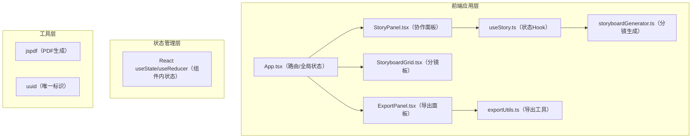

## 1. 架构设计



## 2. 技术说明
- **前端框架**：React 18 + TypeScript
- **构建工具**：Vite（端口5173）
- **路由**：react-router-dom
- **样式**：原生CSS + CSS Modules（inline style），不使用Tailwind
- **HTTP客户端**：axios（预留）
- **PDF生成**：jspdf
- **唯一ID**：uuid
- **后端**：无，分镜生成使用模拟数据（前端mock）

## 3. 路由定义
| 路由 | 用途 |
|-------|---------|
| / | 主页面，包含协作面板、分镜板、导出工具栏 |

## 4. 数据模型定义

### 4.1 故事段落（StoryParagraph）
```typescript
interface StoryParagraph {
  id: string;
  content: string;
  authorIndex: number; // 0或1，表示左右对齐
  timestamp: number;
}
```

### 4.2 分镜条目（StoryboardPanel）
```typescript
interface StoryboardPanel {
  id: string;
  sceneNumber: number;
  shotType: '远景' | '中景' | '特写' | '近景' | '全景';
  description: string;
  dialogue: string;
  sourceParagraphIndex: number;
}
```

### 4.3 分镜导出元数据（ExportMetadata）
```typescript
interface ExportMetadata {
  title: string;
  createdAt: string;
  participants: string[];
  panels: StoryboardPanel[];
}
```

## 5. 文件结构
```
auto66/
├── package.json
├── vite.config.js
├── tsconfig.json
├── index.html
└── src/
    ├── App.tsx
    └── modules/
        ├── cooperation/
        │   ├── StoryPanel.tsx
        │   └── useStory.ts
        ├── storyboard/
        │   ├── StoryboardGrid.tsx
        │   └── storyboardGenerator.ts
        └── export/
            ├── ExportPanel.tsx
            └── exportUtils.ts
```

## 6. 模块职责
- **App.tsx**：主应用容器，管理全局故事标题、参与者信息，协调StoryPanel输出与StoryboardGrid输入，挂载ExportPanel
- **useStory.ts**：管理段落数组状态，提供addParagraph方法，触发分镜生成API调用
- **StoryPanel.tsx**：渲染聊天气泡列表，输入框控制，字数统计，轮次切换，slide-up动画
- **storyboardGenerator.ts**：模拟3秒内返回的异步API，根据文本数组分析场景、动作、对话，生成分镜数据
- **StoryboardGrid.tsx**：横向滚动容器，卡片渲染（编号/镜头/描述/对白），滚动进度条计算与渲染，悬停效果
- **exportUtils.ts**：buildExportData构造元数据，exportJson触发JSON下载，exportPdf使用jspdf绘制4列网格+页眉页脚
- **ExportPanel.tsx**：固定定位导出按钮组，调用exportUtils对应方法，加载状态反馈
