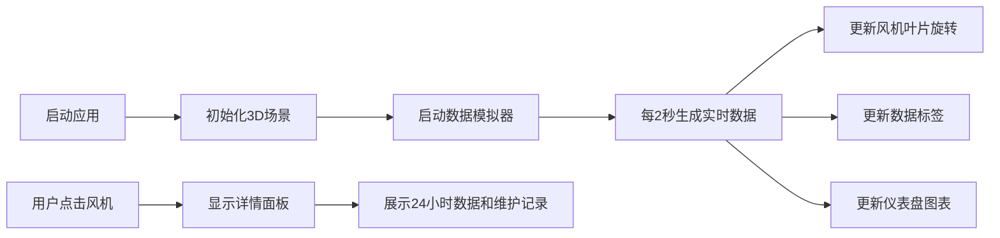

## 1. 产品概述

风力发电场3D可视化应用是一个面向风电场运维人员的实时监控工具，通过3D场景直观展示20台风机的运行状态、发电数据和健康状态，解决运维人员难以快速掌握全场运行情况的问题。

- 主要目的：提供沉浸式3D可视化界面，帮助运维人员实时监控每台风机的发电量、风向变化和设备健康状态
- 目标用户：风电场运维人员、监控中心值班人员、设备管理人员
- 市场价值：提升运维效率，降低巡检成本，提前预警设备故障

## 2. 核心功能

### 2.2 功能模块
1. **3D风电场场景**：20台风机的3D渲染，叶片旋转动画，数据标签显示
2. **全局数据仪表盘**：风向玫瑰图、风速折线图、总发电量数字显示
3. **风机详情面板**：单台风机详细信息、24小时发电量柱状图、维护记录
4. **实时数据模拟**：风速、风向、发电量、健康状态的实时数据流

### 2.3 页面详情
| 页面名称 | 模块名称 | 功能描述 |
|-----------|-------------|---------------------|
| 主场景 | 3D风机渲染 | 三叶片风机模型，叶片转速与风速成正比（3-25m/s），选中时环形发光光晕 |
| 主场景 | 数据标签 | 半透明标签显示风机ID、发电量（kW，1位小数）、健康状态（绿/黄/红），背景色0.5s过渡动画 |
| 仪表盘 | 风向玫瑰图 | 极坐标扇形图，每30度一个扇区，颜色从浅蓝#60a5fa到深蓝#1e3a8a渐变 |
| 仪表盘 | 风速折线图 | 过去60秒平均风速，1秒刷新，平滑曲线，节点圆点4px |
| 仪表盘 | 总发电量 | 24px字体，数字滚动动画，1秒更新 |
| 详情面板 | 风机信息 | 型号、安装时间、24小时发电量柱状图、维护记录列表 |
| 详情面板 | 柱状图 | 每小时一个柱子，颜色根据发电量比例从绿到红渐变 |

## 3. 核心流程

用户进入应用后，3D场景自动加载20台风机并开始实时数据模拟。用户可以：
- 浏览全景查看所有风机运行状态
- 点击任意风机查看详细信息
- 通过仪表盘监控全场风向、风速和总发电量
- 数据每2秒自动更新，UI同步刷新

## 4. 用户界面设计

### 4.1 设计风格
- **主色调**：深色主题，背景#0f172a，场景渐变#1e293b到#0f172a
- **状态色**：正常#22c55e（绿）、警告#eab308（黄）、故障#ef4444（红）
- **强调色**：#3b82f6（选中光晕）、#f59e0b（折线图）、#60a5fa-#1e3a8a（风向图渐变）
- **字体**：sans-serif系统默认，数字使用等宽风格
- **毛玻璃效果**：所有UI面板使用backdrop-filter: blur(6px)
- **交互效果**：hover放大1.05倍，背景色加深10%

### 4.2 页面设计概述
| 页面名称 | 模块名称 | UI元素 |
|-----------|-------------|-------------|
| 主场景 | 3D场景 | 深色渐变背景，半透明网格地面（#334155，透明度0.2），20台风机均匀分布 |
| 主场景 | 数据标签 | 2:1长宽比，背景#1e293b透明度0.6，圆角6px，颜色过渡动画0.5s |
| 仪表盘 | 悬浮面板 | 右下角，背景#0f172a透明度0.85，圆角12px，宽度340px，可拖拽 |
| 详情面板 | 侧边面板 | 左侧滑入，宽度300px，最大高度500px，背景#1e293b，2px边框#334155，圆角10px，动画300ms ease-out |

### 4.3 响应式
- 桌面优先设计，画布区域全屏
- 屏幕宽度<768px时，UI面板宽度缩至70%，字体减小2px
- 移动端触摸操作支持

### 4.4 3D场景设计
- **环境**：渐变天空#1e293b→#0f172a，半透明网格地面
- **光照**：环境光+方向光，确保风机模型清晰可见
- **相机**：透视相机，支持轨道控制，可自由浏览场景
- **动画**：叶片旋转（与风速关联，lerp插值平滑过渡），选中光晕脉动（1.5s周期）
- **交互**：射线检测选中风机，点击弹出详情面板
- **性能**：帧率稳定30fps以上，使用instanced mesh优化20台风机渲染
