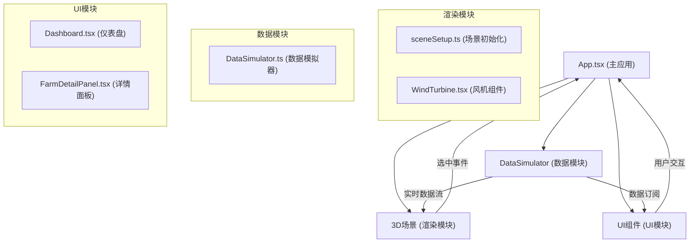

## 1. 架构设计



## 2. 技术描述

- **前端**：React 18 + TypeScript + Vite
- **3D渲染**：Three.js + @react-three/fiber + @react-three/drei
- **UI控制**：leva（调试面板）
- **唯一标识**：uuid
- **数据处理**：Canvas 2D API绘制图表，无需额外图表库

### 2.1 依赖版本
- react: ^18.x
- react-dom: ^18.x  
- three: ^0.160.x
- @react-three/fiber: ^8.15.x
- @react-three/drei: ^9.92.x
- leva: ^0.9.x
- uuid: ^9.0.x
- typescript: ^5.3.x
- vite: ^5.0.x
- @vitejs/plugin-react: ^4.2.x
- @types/react: ^18.x
- @types/react-dom: ^18.x
- @types/three: ^0.160.x

## 3. 数据模型

### 3.1 风机数据类型定义
```typescript
interface WindTurbineData {
  id: string;
  index: number;
  position: [number, number, number];
  windSpeed: number;      // 3-25 m/s
  windDirection: number;  // 0-360度
  powerOutput: number;    // kW
  healthStatus: 'normal' | 'warning' | 'fault';
  model: string;
  installationDate: string;
  hourlyOutput: number[]; // 24小时发电量
  maintenanceRecords: MaintenanceRecord[];
}

interface MaintenanceRecord {
  date: string;
  type: string;
  description: string;
}

interface WindFarmData {
  turbines: WindTurbineData[];
  totalPower: number;
  averageWindSpeed: number;
  windDirectionDistribution: number[]; // 12个方向的频率
  windSpeedHistory: number[]; // 60秒历史
}
```

### 3.2 数据流转
1. DataSimulator每2秒生成所有风机的新数据
2. 使用订阅模式通知所有订阅者
3. 渲染模块更新风机旋转速度和数据标签
4. UI模块更新仪表盘图表和数字
5. 选中风机时传递ID给详情面板

## 4. 项目文件结构

```
├── package.json
├── vite.config.js
├── tsconfig.json
├── index.html
└── src/
    ├── App.tsx
    ├── main.tsx
    ├── index.css
    └── modules/
        ├── render/
        │   ├── sceneSetup.ts
        │   └── WindTurbine.tsx
        ├── data/
        │   └── DataSimulator.ts
        └── ui/
            ├── Dashboard.tsx
            └── FarmDetailPanel.tsx
```

## 5. 核心技术实现要点

### 5.1 3D渲染模块
- **sceneSetup.ts**：初始化Three.js场景、透视相机、环境光+方向光、半透明网格地面、渐变天空背景
- **WindTurbine.tsx**：三叶片风机模型（底座+机舱+轮毂+3叶片），使用useFrame控制叶片旋转，lerp插值平滑转速，选中状态显示环形光晕

### 5.2 数据模块
- **DataSimulator.ts**：单例模式，管理20台风机数据，每2秒更新，风速范围3-25m/s，健康状态概率分布（正常95%、警告4%、故障1%），支持订阅/取消订阅

### 5.3 UI模块
- **Dashboard.tsx**：Canvas 2D绘制风向玫瑰图（极坐标扇形）和风速折线图（平滑曲线），数字滚动动画，可拖拽移动
- **FarmDetailPanel.tsx**：左侧滑入动画，显示风机基本信息，Canvas 2D绘制24小时柱状图，维护记录列表

### 5.4 性能优化
- 风机使用InstancedMesh减少draw call
- 数据更新使用requestAnimationFrame同步
- lerp插值0.1确保平滑过渡
- Canvas图表按需重绘，避免过度渲染
