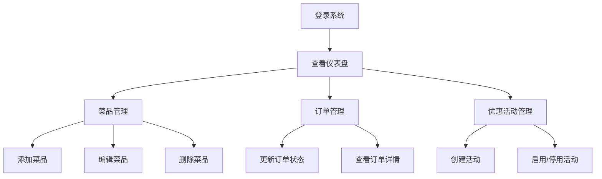

## 1. 产品概述
在线订餐与菜品推荐系统的后台管理应用，为餐厅管理员提供菜品、订单和优惠活动的集中管理功能。
- 主要解决餐厅运营管理问题，目标用户为餐厅管理员，提供高效的订单处理、菜品维护和营销活动管理能力。
- 提升餐厅运营效率，数字化管理流程，降低人工处理错误率。

## 2. 核心功能

### 2.1 用户角色
| 角色 | 注册方式 | 核心权限 |
|------|----------|----------|
| 餐厅管理员 | 后台登录 | 菜品CRUD、订单状态管理、优惠活动管理、数据统计查看 |

### 2.2 功能模块
1. **仪表盘**：今日订单总数、总销售额、热门菜品点击率、未完成订单数量
2. **菜品管理**：菜品列表展示、添加、编辑、删除、推荐设置
3. **订单管理**：订单列表、状态更新、详情查看
4. **优惠活动管理**：活动创建、启用/停用、过期状态展示

### 2.3 页面详情
| 页面名称 | 模块名称 | 功能描述 |
|---------|----------|----------|
| 仪表盘 | 统计卡片 | 4个关键指标卡片，数字跳动动画，0.5秒动画时长 |
| 菜品管理 | 卡片列表 | 网格布局每行4列，卡片固定200px×300px，悬停动画 |
| 菜品管理 | 添加/编辑表单 | 名称、类别、价格、描述、推荐开关 |
| 订单管理 | 订单表格 | 交替行背景色，状态竖条div元素4px宽，颜色随状态变化 |
| 订单管理 | 详情模态框 | 500px宽，最大高度70vh，圆角12px |
| 优惠活动管理 | 活动卡片 | 过期活动背景色#f1f5f9，文字透明度0.5 |
| 优惠活动管理 | 创建表单 | 名称、折扣类型、折扣值、日期范围、适用范围 |
| 导航栏 | 左侧导航 | 选中项3px白色左框线，图标文字间距10px |

## 3. 核心流程
管理员登录系统 → 查看仪表盘统计 → 根据需求进入对应模块 → 进行菜品/订单/活动管理操作 → 操作完成后数据实时更新

## 4. 用户界面设计

### 4.1 设计风格
- 主背景色#f8fafc，辅色#e2e8f0
- 左侧导航栏背景色#1e293b，选中项背景色#334155
- 主要按钮#3b82f6，删除按钮#ef4444，次要按钮#e2e8f0
- 按钮圆角8px，字体14px
- 状态颜色：待确认#9ca3af、制作中#3b82f6、配送中#06b6d4、已完成#22c55e、已取消#ef4444
- 指标卡片左边框颜色：订单总数#a855f7、销售额#22c55e、热门菜品#f97316、未完成订单#ef4444

### 4.2 页面设计概述
| 页面名称 | 模块名称 | UI元素 |
|---------|----------|--------|
| 仪表盘 | 统计卡片 | 浅蓝背景#eff6ff，圆角10px，左边框4px彩色条纹，数字动画0.5s |
| 菜品管理 | 菜品卡片 | 白底圆角12px，1px#e2e8f0描边，悬停变蓝#3b82f6上浮3px，过渡0.2s |
| 订单管理 | 表格行 | 交替背景色#ffffff/#f8fafc，左侧4px状态竖条div |
| 优惠活动 | 活动卡片 | 过期卡片背景#f1f5f9，透明度0.5，红色倒计时 |
| 导航栏 | 导航项 | 240px宽，选中项3px白色左框线，图标16px间距10px |

### 4.3 响应性
- 桌面端优先，保证1280px以上分辨率最佳体验

### 4.4 动画与交互
- 卡片加载淡入动画0.3s
- 按钮悬停亮度变化5%
- 数字跳动动画0.5s
- 开关滑块动画0.3s
- 页面切换过渡效果
