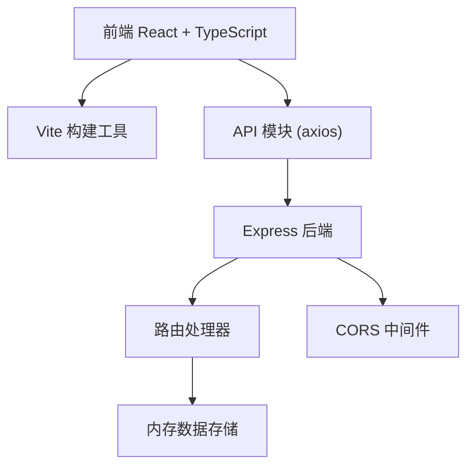
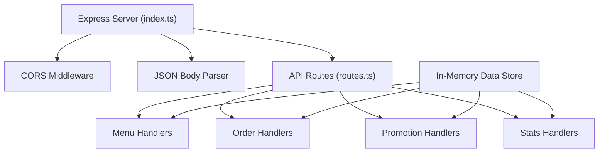
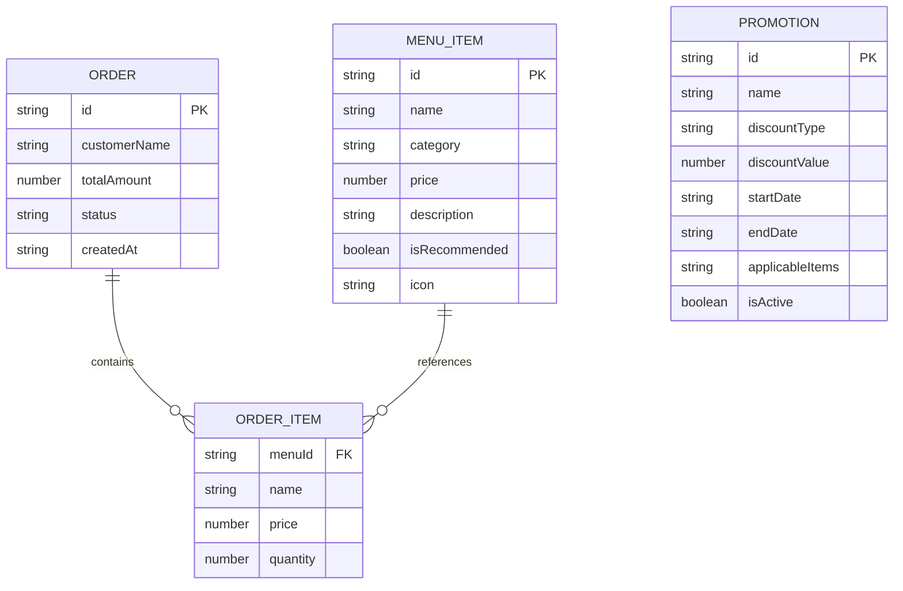

## 1. 架构设计



## 2. 技术描述

- 前端：React 18 + TypeScript + Vite + react-router-dom + axios
- 构建工具：Vite 5
- 后端：Express 4 + TypeScript
- 状态管理：React useState/useEffect
- 样式：CSS-in-JS 内联样式
- 数据存储：内存模拟数据（uuid生成ID）
- HTTP客户端：axios
- 图标：lucide-react

## 3. 路由定义

| 前端路由 | 页面组件 | 功能描述 |
|---------|----------|----------|
| / | Dashboard | 统计概览仪表盘 |
| /menu | MenuManager | 菜品管理 |
| /orders | OrderManager | 订单管理 |
| /promotions | PromotionManager | 优惠活动管理 |

## 4. API 定义

```typescript
// 数据类型定义
interface MenuItem {
  id: string;
  name: string;
  category: '主菜' | '小食' | '甜品' | '饮品';
  price: number;
  description: string;
  isRecommended: boolean;
  icon: string;
}

interface OrderItem {
  menuId: string;
  name: string;
  price: number;
  quantity: number;
}

interface Order {
  id: string;
  customerName: string;
  items: OrderItem[];
  totalAmount: number;
  status: '待确认' | '制作中' | '配送中' | '已完成' | '已取消';
  createdAt: string;
}

interface Promotion {
  id: string;
  name: string;
  discountType: 'fixed' | 'percentage';
  discountValue: number;
  startDate: string;
  endDate: string;
  applicableItems: string[];
  isActive: boolean;
}

// API 端点
GET    /api/menu              // 获取所有菜品
POST   /api/menu              // 添加菜品
PUT    /api/menu/:id          // 更新菜品
DELETE /api/menu/:id          // 删除菜品
GET    /api/orders            // 获取所有订单
PUT    /api/orders/:id/status // 更新订单状态
GET    /api/promotions        // 获取所有优惠活动
POST   /api/promotions        // 创建优惠活动
PUT    /api/promotions/:id/toggle // 切换活动状态
GET    /api/stats             // 获取统计数据
```

## 5. 服务器架构图



## 6. 数据模型

### 6.1 数据模型定义



### 6.2 关键实现要点

1. **菜品卡片布局**：使用CSS Grid `grid-template-columns: repeat(4, 200px)` 确保每行4列，卡片固定尺寸200px×300px
2. **订单状态竖条**：使用独立div元素，`width: 4px; height: 100%; position: absolute; left: 0; top: 0;`
3. **数字跳动动画**：使用requestAnimationFrame实现逐帧变化，持续0.5秒，缓动函数easeOutQuad
4. **优惠活动过期判断**：`new Date(promotion.endDate) < new Date()` 动态判断
5. **导航栏选中样式**：`border-left: 3px solid #ffffff; padding-left: calc(10px - 3px)`
6. **DELETE接口统一**：后端路由改为 `app.delete('/api/menu/:id', handler)`
7. **状态更新重渲染**：更新订单状态后重新调用 `fetchOrders()` 触发重渲染
