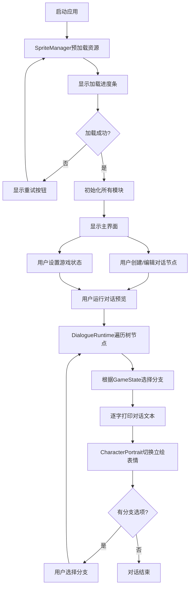

## 1. 产品概述
像素风格RPG游戏的NPC动态对话系统与立绘管理应用，为独立游戏工作室提供对话树编辑、运行时分支逻辑、立绘表情切换等核心功能。
- 主要用途：设计多分支NPC对话，根据玩家状态（好感度、时间、剧情进度）动态选择对话分支，配合角色立绘表情实时切换
- 目标用户：独立游戏开发者、剧情设计师
- 产品价值：降低对话系统开发成本，提供可视化编辑和即时预览能力

## 2. 核心功能

### 2.1 用户角色
| 角色 | 注册方式 | 核心权限 |
|------|----------|----------|
| 游戏开发者 | 本地应用启动 | 完整的对话编辑、预览、状态模拟权限 |

### 2.2 功能模块
1. **对话树编辑器**：节点创建/删除/连接、节点属性编辑（说话人、文本、分支条件）、贝塞尔曲线连线、条件类型颜色区分
2. **对话运行时引擎**：基于游戏状态的分支选择、逐字打印效果、打印速度控制、跳过功能
3. **立绘渲染模块**：Canvas绘制立绘、5种表情（默认/开心/悲伤/愤怒/惊讶）、交叉淡入淡出切换动画
4. **精灵资源管理器**：Spritesheet预加载、进度条显示、加载失败重试、帧缓存管理
5. **游戏状态管理器**：单例模式管理好感度/时间/剧情进度、状态查询接口、分支条件判断

### 2.3 页面详情
| 页面名称 | 模块名称 | 功能描述 |
|----------|----------|----------|
| 主界面 | 左侧编辑区 | 对话树节点画布，支持节点拖拽、连线、属性编辑 |
| 主界面 | 右侧预览区 | Canvas立绘展示、对话文本框、分支选项按钮 |
| 主界面 | 底部控制区 | 打印速度滑块、游戏状态模拟面板 |
| 加载界面 | 资源加载 | Spritesheet加载进度条、失败重试按钮 |

## 3. 核心流程

用户创建对话节点 → 配置节点属性（说话人、文本、分支条件）→ 连接节点形成对话树 → 模拟游戏状态（调整好感度/时间/剧情进度）→ 运行对话预览 → 引擎根据状态选择分支 → 逐字打印文本 → 立绘表情切换 → 选择分支选项继续对话

## 4. 用户界面设计

### 4.1 设计风格
- **主色调**：深色背景 #0f172a，面板背景 #1e293b，强调色蓝色 #3b82f6
- **节点卡片**：白底、圆角12px、2px #94a3b8描边、悬停/选中时金色 #f59e0b描边、上浮4px
- **连线颜色**：好感度条件蓝色 #3b82f6，时间条件绿色 #22c55e，剧情条件橙色 #f97316
- **按钮样式**：圆角8px、背景 #334155、悬停 #3b82f6、点击弹性动画（0.95→1）
- **输入框**：背景 #334155、圆角8px、聚焦时 #3b82f6 内发光
- **字体**：14px字号，1.5行高，等宽/像素风格字体用于游戏感
- **图标风格**：简约线性图标，使用lucide-react

### 4.2 页面设计概述
| 页面名称 | 模块名称 | UI元素 |
|----------|----------|--------|
| 主界面 | 左侧编辑区 | 节点画布、节点卡片（200x180px）、贝塞尔曲线、浮动编辑面板 |
| 主界面 | 右侧预览区 | Canvas（1:1比例，渐变背景）、对话文本框、分支选项按钮 |
| 主界面 | 底部控制区 | 速度滑块（60-500ms/字）、好感度/时间/剧情进度状态控制面板 |
| 加载界面 | 资源加载 | 居中进度条（高度6px、圆角6px）、重试按钮（红色#ef4444） |

### 4.3 响应式
- **桌面端（≥768px）**：左右布局，左侧编辑区600px（最小400px），右侧立绘区320px（最小280px），按0.6:0.4比例缩放
- **移动端（<768px）**：编辑区折叠为顶部标签栏，立绘区下方显示对话文本，垂直布局
- **立绘Canvas**：始终保持1:1比例，居中显示，外框2px白色描边圆角12px

### 4.4 动画与性能
- 立绘切换：交叉淡入淡出400ms，CSS动画驱动，无闪白
- 节点选中：0.2s ease-out上浮+金色描边
- 按钮点击：0.15s弹性缩放
- 加载进度：0.8s ease-in-out进度动画
- 性能要求：50+节点时拖拽≥45fps，立绘切换≥55fps
