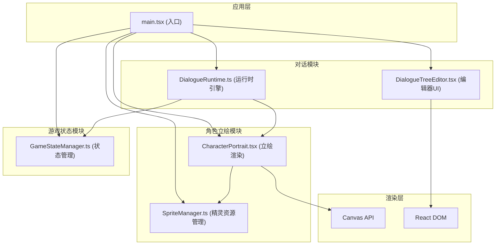

## 1. 架构设计



**数据流向说明：**
1. `SpriteManager` → 预加载Spritesheet → `CharacterPortrait` → Canvas渲染立绘
2. `GameStateManager` → 提供状态查询 → `DialogueRuntime` → 选择对话分支
3. `DialogueTreeEditor` → 用户操作 → 更新对话树数据 → `DialogueRuntime`
4. `DialogueRuntime` → 输出对话片段 → `CharacterPortrait` 切换表情
5. `main.tsx` → 初始化所有模块 → 挂载到页面

## 2. 技术描述
- **前端框架**：React 18 + TypeScript
- **构建工具**：Vite 5 + @vitejs/plugin-react
- **样式方案**：纯CSS（CSS Modules风格内联），使用CSS变量统一主题
- **渲染技术**：Canvas 2D API（立绘渲染、连线绘制）
- **状态管理**：单例模式（GameStateManager）+ React useState（UI状态）
- **动画方案**：CSS transitions/animations + requestAnimationFrame
- **第三方库**：lucide-react（图标）

## 3. 核心模块职责与调用关系

### 3.1 模块清单
| 模块路径 | 职责 | 依赖模块 |
|----------|------|----------|
| `src/dialogue/DialogueTreeEditor.tsx` | 对话树可视化编辑器，节点增删改与连线 | React, 类型定义 |
| `src/dialogue/DialogueRuntime.ts` | 对话运行时引擎，分支逻辑，逐字打印 | GameStateManager |
| `src/character/CharacterPortrait.tsx` | Canvas立绘渲染，表情切换动画 | SpriteManager |
| `src/character/SpriteManager.ts` | Spritesheet加载与缓存，帧数据管理 | 无 |
| `src/game/GameStateManager.ts` | 游戏状态单例，好感度/时间/剧情进度 | 无 |
| `src/types/index.ts` | 全局类型定义 | 无 |
| `src/main.tsx` | 应用入口，模块初始化与挂载 | 所有模块 |

### 3.2 类型定义
```typescript
// 说话人类型
type Speaker = 'player' | 'npc';

// 表情类型
type ExpressionType = 'default' | 'happy' | 'sad' | 'angry' | 'surprised';

// 条件类型
type ConditionType = 'affection' | 'time' | 'story';

// 分支条件
interface DialogueCondition {
  type: ConditionType;
  operator: 'gt' | 'lt' | 'eq' | 'gte' | 'lte';
  value: number | string;
  minValue?: number;
  maxValue?: number;
}

// 对话节点
interface DialogueNode {
  id: string;
  speaker: Speaker;
  text: string;
  expression?: ExpressionType;
  position: { x: number; y: number };
  branches: DialogueBranch[];
}

// 对话分支
interface DialogueBranch {
  id: string;
  targetNodeId: string;
  condition?: DialogueCondition;
  label: string;
}

// 对话树
interface DialogueTree {
  nodes: DialogueNode[];
  startNodeId: string;
}

// 游戏状态
interface GameState {
  affection: number;
  time: number; // 0-24 小时制
  storyFlags: string[]; // 已触发的剧情标记
}

// 精灵帧数据
interface SpriteFrame {
  x: number;
  y: number;
  width: number;
  height: number;
}

// 角色精灵表
interface CharacterSprite {
  characterId: string;
  image: HTMLImageElement;
  frames: Record<ExpressionType, SpriteFrame[]>;
  frameWidth: number;
  frameHeight: number;
}
```

## 4. 关键实现策略

### 4.1 对话树编辑器
- **节点渲染**：DOM节点（绝对定位），200px×180px，白底圆角12px，2px描边
- **连线绘制**：Canvas绘制贝塞尔曲线，按条件类型着色
- **拖拽交互**：mousedown/mousemove/mouseup事件，requestAnimationFrame优化
- **节点选中**：金色描边 + translateY(-4px)，0.2s ease-out过渡

### 4.2 立绘渲染与动画
- **双Canvas叠加**：两层Canvas实现交叉淡入淡出，避免闪白
- **requestAnimationFrame**：驱动表情切换动画，保证≥55fps
- **交叉淡入**：旧表情opacity 1→0，新表情opacity 0→1，时长400ms
- **Spritesheet解析**：等帧宽高，帧间距2px，按表情类型分组

### 4.3 逐字打印
- **setInterval**：按设定速度逐字追加显示
- **跳过机制**：点击文本框立即显示全文
- **速度控制**：range input滑块，60-500ms/字范围

### 4.4 响应式布局
- **Flexbox布局**：左右两栏，flex: 0.6 / flex: 0.4
- **断点768px**：移动端编辑区折叠为顶部标签栏
- **Canvas比例**：1:1宽高比，contain适配

### 4.5 性能优化
- **节点拖拽**：使用transform而非top/left，触发GPU加速
- **Canvas重绘**：只在必要时重绘，使用脏矩形区域优化
- **精灵缓存**：Image对象缓存，避免重复加载解码
- **节流防抖**：窗口resize事件防抖处理

## 5. 文件结构

```
src/
├── dialogue/
│   ├── DialogueTreeEditor.tsx    # 对话树编辑器组件
│   └── DialogueRuntime.ts        # 对话运行时引擎
├── character/
│   ├── CharacterPortrait.tsx     # 立绘渲染组件
│   └── SpriteManager.ts          # 精灵资源管理器
├── game/
│   └── GameStateManager.ts       # 游戏状态管理器
├── types/
│   └── index.ts                  # 类型定义
├── App.tsx                       # 主应用组件
├── main.tsx                      # 入口文件
└── index.css                     # 全局样式
```
