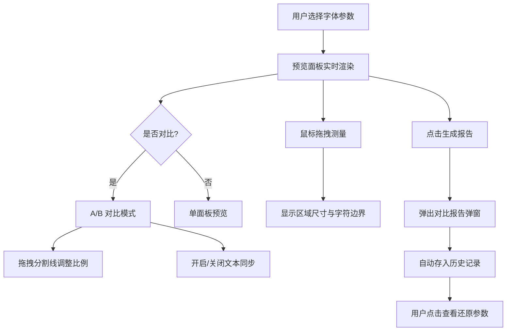

## 1. 产品概述

字体渲染测量仪是一款面向前端开发者的浏览器端工具，用于精确测量和对比 Web 字体在不同参数组合下的渲染效果。它解决了开发者在选择字体族、调整字号和行高时，汉字与字母视觉对齐难以精确判断的痛点。

- 目标用户：前端开发者、UI 设计师、字体工程师
- 核心价值：提供像素级字体渲染对比能力，减少因字体选择不当导致的视觉不一致问题

## 2. 核心功能

### 2.1 功能模块

1. **主界面**：左右两栏布局，左侧为控制面板，右侧为 A/B 对比预览区，顶部导航栏
2. **控制面板**：字体族选择、字号滑块、行高滑块、历史记录管理
3. **A/B 对比视图**：两个并排预览面板 + 可拖拽分割线 + 同步开关
4. **精确测量**：鼠标拖拽绘制测量矩形，显示宽高和字符边界框信息
5. **报告生成**：参数对比表格、视觉差异评分、Canvas 截图导出
6. **历史记录**：自动存储报告记录，支持参数还原

### 2.2 页面详情

| 页面名称 | 模块名称 | 功能描述 |
|----------|----------|----------|
| 主界面 | 导航栏 | 深灰色顶栏，居中标题"字体渲染测量仪"，右上角"生成报告"按钮 |
| 主界面 | 控制面板 | 字体下拉列表(8+字体)、字号滑块(12-72px)、行高滑块(1.0-2.0)、历史记录折叠区 |
| 主界面 | A/B 对比视图 | 两个独立预览面板并排显示，拖拽分割线调整比例，同步开关控制文本同步 |
| 主界面 | 精确测量 | 鼠标拖拽绘制半透明红色矩形，松开后显示宽高和字符边界框标签 |
| 主界面 | 报告弹窗 | 半透明遮罩 + 白色弹窗，参数对比表格、视觉差异评分、Canvas 截图 |
| 主界面 | 历史记录 | 折叠/展开列表，最多20条记录，每条显示时间和评分，支持参数还原 |

## 3. 核心流程

1. 用户在左侧面板选择字体参数（字体族、字号、行高）
2. 右侧 A/B 预览面板实时渲染文字，文字更新带 0.2s 过渡动画
3. 用户可拖拽分割线调整两个面板的宽度比例
4. 开启同步开关后，在一个面板输入文本会同步到另一个面板
5. 用户在预览区域拖拽鼠标进行测量，获取区域尺寸和字符边界框
6. 点击"生成报告"按钮，弹出对比报告（参数表格 + 评分 + 截图）
7. 报告自动存入历史记录，用户可随时还原历史参数

## 4. 用户界面设计

### 4.1 设计风格

- 主色调：蓝色 #3b82f6，强调色：琥珀色 #f59e0b
- 主背景色：#f1f5f9，卡片白色：#ffffff
- 导航栏：深灰色 #1e293b，白色文字
- 按钮：圆角6px，蓝色背景，白色文字，悬停变深
- 字体：系统默认无衬线字体
- 布局：左右两栏，左侧320px固定，右侧自适应

### 4.2 页面设计概览

| 页面名称 | 模块名称 | UI 元素 |
|----------|----------|---------|
| 主界面 | 导航栏 | 深灰背景，居中标题18px字重600，右侧生成报告按钮120x36px |
| 主界面 | 控制面板 | 宽300px背景#f8fafc，1px #e2e8f0分隔线，字体下拉列表，字号滑块18px蓝色圆形头，行高滑块 |
| 主界面 | A/B对比 | 两个面板各占一半，4px #94a3b8分割线(悬停#3b82f6)，32x32同步开关按钮 |
| 主界面 | 测量选框 | 2px红色实线边框#ef4444，0.15透明度填充，白色标签6px圆角阴影 |
| 主界面 | 报告弹窗 | 宽700px白色12px圆角，表格 + 评分 + 截图，X关闭按钮 |
| 主界面 | 历史记录 | 2px #e2e8f0分隔线，可折叠，48px高度行，悬停#eff6ff背景 |

### 4.3 响应式

- 桌面优先设计（≥1024px）：左侧面板固定320px，右侧自适应
- 窄屏（<1024px）：左侧面板变为可折叠侧边栏，默认隐藏，通过36x36汉堡菜单按钮切换，覆盖显示，带半透明遮罩
- 所有按钮和交互元素0.2s ease-out过渡动画

### 4.4 动效

- 文字参数变化：0.2s 过渡动画平滑更新
- 弹窗打开：scale 从 0.95 到 1.0，250ms ease-out
- 遮罩层：opacity 0→0.4，200ms
- 汉堡菜单按钮：点击旋转90度，200ms
- 历史记录行悬停：背景色 0.15s 过渡
