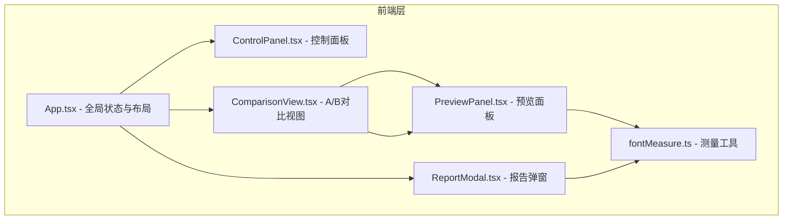

## 1. 架构设计



## 2. 技术说明

- 前端：React@18 + TypeScript + Vite
- 样式：CSS Modules + CSS 变量（不使用 Tailwind，以精确控制像素级样式）
- 状态管理：React useState/useReducer（项目规模适中，无需 Zustand）
- 初始化工具：vite-init (react-ts template)
- 后端：无
- 数据库：无（历史记录存储在 localStorage）

## 3. 路由定义

| 路由 | 用途 |
|------|------|
| / | 主页面，包含所有功能 |

## 4. 数据模型

### 4.1 核心类型定义

```typescript
interface FontConfig {
  fontFamily: string;
  fontSize: number;
  lineHeight: number;
}

interface MeasureData {
  width: number;
  height: number;
  charBounds: DOMRect | null;
}

interface HistoryRecord {
  id: string;
  timestamp: string;
  configA: FontConfig;
  configB: FontConfig;
  measureA: MeasureData | null;
  measureB: MeasureData | null;
  score: number;
}

interface ComparisonState {
  configA: FontConfig;
  configB: FontConfig;
  syncText: boolean;
  text: string;
  splitRatio: number;
}
```

### 4.2 本地存储

- Key: `font-measure-history`
- Value: HistoryRecord[] (JSON 序列化，最多20条)

## 5. 性能策略

- 字体参数调整：使用 requestAnimationFrame 确保重绘响应 ≤50ms
- 分割线拖拽：使用 requestAnimationFrame 保持 60fps
- 报告 Canvas 导出：使用 setTimeout 分段执行，主线程阻塞 ≤100ms
- 滑块操作：使用防抖（debounce 16ms）优化频繁更新

## 6. 文件组织

```
├── package.json
├── vite.config.js
├── tsconfig.json
├── index.html
├── src/
│   ├── main.tsx
│   ├── App.tsx
│   ├── App.css
│   ├── components/
│   │   ├── ControlPanel.tsx
│   │   ├── ControlPanel.css
│   │   ├── PreviewPanel.tsx
│   │   ├── PreviewPanel.css
│   │   ├── ComparisonView.tsx
│   │   ├── ComparisonView.css
│   │   ├── ReportModal.tsx
│   │   └── ReportModal.css
│   └── utils/
│       └── fontMeasure.ts
```
