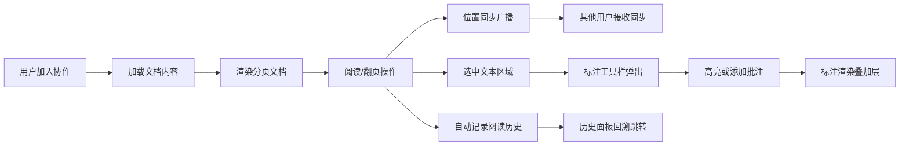

## 1. 产品概述

在线协作文档同步阅读与标注应用，解决远程协作中团队成员共同浏览和讨论长篇文档时沟通效率低下的问题。支持多用户同步阅读、实时标注、批注讨论和阅读历史回溯。

- 目标用户：远程协作团队、在线教育课堂、学术研讨小组
- 核心价值：将分散的文档阅读讨论转化为同步、可视化、可追溯的协作体验

## 2. 核心功能

### 2.1 用户角色
| 角色 | 加入方式 | 核心权限 |
|------|----------|----------|
| 协作用户 | 输入昵称加入 | 浏览文档、同步阅读、添加高亮和批注、查看历史记录 |

### 2.2 功能模块
1. **主文档阅读页**：文档渲染模块、同步模块、标注模块、用户面板、历史面板
2. **用户管理模块**：在线用户列表、邀请新用户、用户阅读位置指示器
3. **标注工具模块**：文本选区、高亮标记、批注输入、标注渲染
4. **历史回溯模块**：阅读历史记录、时间线、快速跳转

### 2.3 页面详情
| 页面名称 | 模块名称 | 功能描述 |
|----------|----------|----------|
| 主文档阅读页 | 文档渲染模块 | 分页渲染Markdown文档（每页10段），页码导航，平滑翻页动画 |
| 主文档阅读页 | 同步模块 | 维护阅读位置（百分比/段落索引），监听滚动事件广播位置，接收同步信号更新本地位置 |
| 主文档阅读页 | 标注模块 | Canvas叠加层，拖拽选区，高亮/批注工具，标注渲染叠加 |
| 主文档阅读页 | 用户面板 | 在线用户列表（头像首字母圆形占位），邀请用户输入框，用户位置彩色指示器 |
| 主文档阅读页 | 历史面板 | 侧边栏历史记录（最多20条），按时间倒序，点击跳转 |

## 3. 核心流程

用户打开应用 → 输入昵称加入协作 → 加载文档 → 浏览/翻页（位置同步至其他用户）→ 选中文本 → 使用高亮/批注工具 → 标注渲染到文档 → 阅读历史自动记录 → 可通过历史面板回溯

## 4. 用户界面设计

### 4.1 设计风格
- 主色调：淡蓝色 #eff6ff 页面背景，白色 #ffffff 文档卡片
- 强调色：蓝色 #3b82f6（主要按钮、高亮、批注气泡）
- 辅助色：红色 #ef4444、绿色 #22c55e、橙色 #f97316、紫色 #a855f7（用户指示器循环色）
- 顶部导航：深灰色 #1e293b 背景白色文字，高度60px
- 文档卡片：圆角12px，阴影 rgba(0,0,0,0.08) 5px
- 按钮：圆角6px，点击时颜色变深20%，禁用状态灰色
- 字体：系统默认无衬线字体，正文16px，移动端14px

### 4.2 页面设计概述
| 页面名称 | 模块名称 | UI元素 |
|----------|----------|---------|
| 主文档阅读页 | 顶部导航栏 | 标题、用户信息、响应式汉堡菜单按钮 |
| 主文档阅读页 | 左侧用户面板 | 宽度280px，在线用户列表、邀请输入框、用户位置彩色圆点 |
| 主文档阅读页 | 历史侧边栏 | 宽度260px，背景 #f1f5f9，历史记录时间线，从底部滑入动画 |
| 主文档阅读页 | 主文档区域 | 自适应剩余宽度，分页段落，页码按钮36x36px，当前页蓝色背景白色文字 |
| 主文档阅读页 | 标注工具栏 | 选中文本后从底部弹出，宽70%居中（移动端100%），圆角顶部16px，包含高亮/批注/取消按钮 |
| 主文档阅读页 | 批注弹窗 | 300x150px，圆角8px，文本输入框，提交按钮 |

### 4.3 响应式
- Desktop-first设计
- <768px：左侧面板折叠为汉堡菜单
- <480px：文档段落字号14px，标注工具栏宽度100%
- 翻页动画：slide-left/slide-right 250ms ease-in-out
- 工具栏动画：smooth-up 300ms
- 加载状态：旋转圆环动画 spin 1s线性无限
- 用户加入动画：从底部滑入

### 4.4 性能与交互
- Canvas标注层使用requestAnimationFrame更新，保持30FPS+
- 同步消息防抖50ms，减少消息频率
- 所有按钮点击有视觉反馈
- 选中文本背景浅黄色 #fef9c3，高亮背景黄色 #fde047 半透明0.5
- 批注图标蓝色气泡 #3b82f6，悬停显示内容
