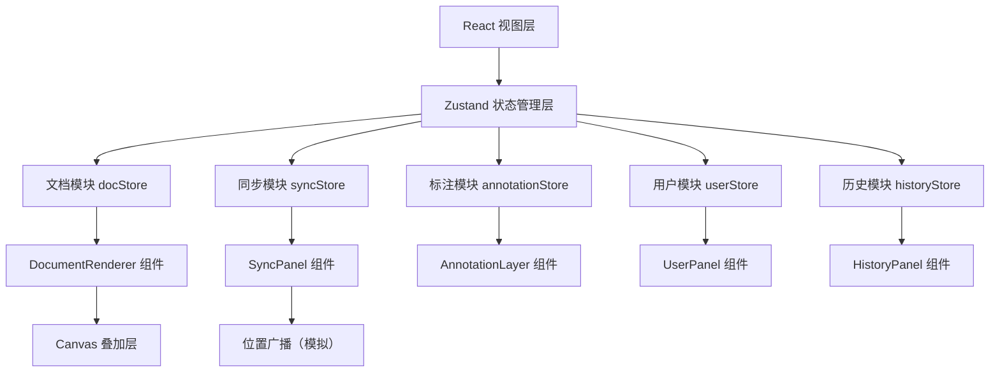
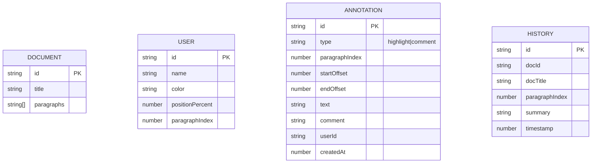

## 1. 架构设计



## 2. 技术描述
- 前端：React 18 + TypeScript + Vite 5 + Zustand 4
- 构建工具：Vite，端口5173
- 状态管理：Zustand（集中管理文档、同步、标注、用户、历史）
- 工具库：uuid（唯一标识）
- 无后端，所有数据使用前端mock模拟，同步通过本地事件总线模拟

## 3. 路由定义
| 路由 | 用途 |
|------|------|
| / | 主文档阅读页 |

单页应用，无路由切换。

## 4. 文件结构与调用关系

```
src/
├── main.tsx                    # 应用入口，初始化store，挂载根组件
├── App.tsx                     # 根组件，布局整合
├── store/
│   └── docStore.ts             # Zustand store：统一管理所有状态
├── components/
│   ├── DocumentRenderer.tsx    # 文档渲染模块（读取currentDoc，触发scroll同步）
│   ├── SyncPanel.tsx           # 同步模块（监听位置，广播/接收同步）
│   ├── AnnotationLayer.tsx     # 标注模块（Canvas叠加层，选区/高亮/批注）
│   ├── UserPanel.tsx           # 用户面板（在线用户列表，邀请用户）
│   ├── HistoryPanel.tsx        # 历史面板（阅读历史回溯）
│   ├── AnnotationToolbar.tsx   # 标注工具栏（高亮/批注/取消按钮）
│   ├── CommentModal.tsx        # 批注输入弹窗
│   └── Navbar.tsx              # 顶部导航栏
├── hooks/
│   └── useDebounce.ts          # 防抖Hook（同步位置用）
├── utils/
│   └── mockData.ts             # Mock文档与用户数据
└── styles/
    └── animations.css          # 全局动画样式
```

数据流向：
- DocumentRenderer → scroll事件 → docStore.updatePosition() → 广播 → 其他用户
- AnnotationLayer → 选区事件 → docStore.addAnnotation() → 重新渲染Canvas
- UserPanel → 邀请 → docStore.addUser() → 列表更新+滑入动画
- HistoryPanel → 点击记录 → docStore.jumpToHistory() → 更新阅读位置

## 5. 数据模型

### 5.1 数据模型定义


### 5.2 Store状态定义
```typescript
interface DocStore {
  // Document
  currentDoc: { id: string; title: string; paragraphs: string[] };
  currentPage: number;
  paragraphsPerPage: number;

  // Position
  positionPercent: number;
  currentParagraphIndex: number;

  // Users
  users: User[];
  currentUserId: string;

  // Annotations
  annotations: Annotation[];
  selectedRange: { paragraphIndex: number; startOffset: number; endOffset: number; text: string } | null;
  showAnnotationToolbar: boolean;

  // History
  history: HistoryItem[];
  showHistoryPanel: boolean;

  // Actions
  setCurrentPage: (page: number) => void;
  updatePosition: (percent: number, paragraphIndex: number) => void;
  addUser: (name: string) => void;
  broadcastPosition: () => void;
  receiveRemotePosition: (userId: string, percent: number, paragraphIndex: number) => void;
  setSelectedRange: (range: SelectedRange | null) => void;
  addHighlight: () => void;
  addComment: (comment: string) => void;
  addHistoryRecord: () => void;
  jumpToHistory: (historyId: string) => void;
  toggleHistoryPanel: () => void;
}
```

## 6. 性能约束实现方案

1. **Canvas标注层**：使用 requestAnimationFrame 驱动渲染循环，标注变化时标记dirty，在下一帧统一重绘，避免频繁重绘
2. **同步防抖**：使用自定义 useDebounce Hook，位置更新后延迟50ms才广播，期间新更新会重置计时器
3. **段落虚拟化**：每页仅渲染10个段落，减少DOM节点
4. **动画**：所有过渡动画使用CSS transform/opacity，避免触发重排
