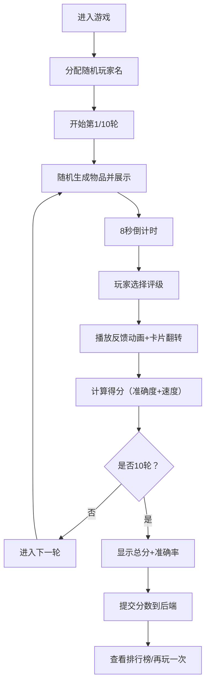

## 1. 产品概述

物品鉴定与即时排行应用是一款多人派对游戏工具，玩家在限定时间内对随机出现的物品进行稀有度评级（普通/稀有/史诗/传说），系统根据玩家评级准确度和速度实时更新全球排行榜。

- 解决玩家缺乏直观的物品稀有度视觉化分类和动态排行机制的问题
- 目标用户：派对游戏爱好者，追求快速反应和策略判断的玩家群体

## 2. 核心功能

### 2.1 功能模块

1. **物品鉴定模块**：随机生成物品、Canvas渲染展示、倒计时、评级选择、得分计算
2. **即时反馈特效模块**：评级结果动画、卡片翻转动画、得分变化动画
3. **排行榜模块**：全球排行数据展示、自动刷新、名次高亮
4. **游戏状态管理模块**：回合控制、游戏结束界面、重玩功能

### 2.2 页面详情

| 页面名称 | 模块名称 | 功能描述 |
|---------|---------|---------|
| 游戏主页 | Canvas鉴定区域 | 400x300px画布，显示物品卡片、倒计时、即时反馈特效 |
| 游戏主页 | 评级面板 | 展示物品名称、3个随机属性、4个评级按钮（普通/稀有/史诗/传说） |
| 游戏主页 | 游戏状态栏 | 当前得分、回合数（第X/10轮）、得分变化动画 |
| 游戏主页 | 游戏结束界面 | 总分、准确率、再玩一次、查看排行榜 |
| 排行榜页 | 排行榜表格 | 前100名玩家数据，前3名金银铜高亮，5秒自动刷新，手动刷新 |

## 3. 核心流程

用户进入应用 → 自动分配玩家名 → 开始游戏（第1/10轮）→ 随机物品展示 → 8秒倒计时 → 玩家选择评级 → 即时反馈动画 → 得分计算 → 进入下一轮 → 10轮结束 → 显示成绩 → 提交分数 → 查看排行榜

## 4. 用户界面设计

### 4.1 设计风格

- 主背景色：#0f172a（暗蓝黑）
- 二级面板背景色：#1e293b（深灰蓝）
- 文字主色：#f1f5f9（亮白灰）
- 强调色：#3b82f6（亮蓝）
- 危险色：#ef4444（红）
- 成功色：#22c55e（绿）
- 金色：#FFD700，银色：#C0C0C0，铜色：#CD7F32
- 按钮：圆角8px，内阴影（inset 0 2px 4px rgba(0,0,0,0.3)），点击缩放0.95动画
- 所有交互0.2-0.4秒ease-out过渡

### 4.2 页面布局

| 页面 | 模块 | 布局描述 |
|-----|-----|---------|
| 主页 | 左右两栏 | 左栏600px Canvas区域（2px发光边框渐变#3b82f6到#1d4ed8），右栏排行榜（2px #334155分隔线） |
| 移动端 | 上下布局 | 鉴定区居上，排行榜居下，Canvas尺寸为屏幕宽度90% |

### 4.3 响应式

桌面优先，屏幕宽度小于768px时切换为上下布局，Canvas等比缩小。

### 4.4 动画效果

- 正确反馈：绿色"完美！"从底部上浮缩小消失（800ms，透明度渐变）
- 错误反馈：红色"判断失误"斜向飞出（600ms）
- 卡片翻转：Y轴旋转180度（400ms）
- 得分变化：缩放弹性动画（200ms）
- 游戏结束：渐暗过渡（1000ms）
- 排行榜行更新：黄色高亮（800ms）
