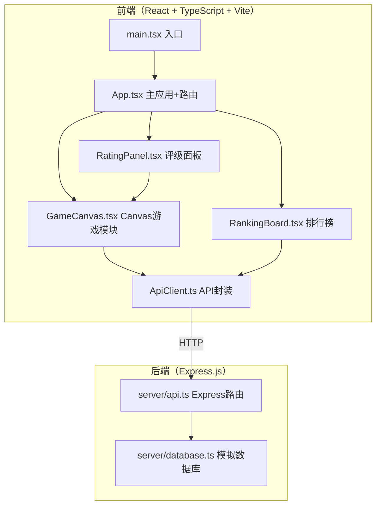

## 1. 架构设计



## 2. 技术描述

- **前端**：React 18 + TypeScript + Vite
- **后端**：Express.js 4 + TypeScript
- **状态管理**：React Context + useState/useReducer
- **路由**：react-router-dom
- **数据库**：内存模拟数据库（无需外部DB）
- **UI渲染**：Canvas API + React DOM
- **构建工具**：Vite

## 3. 文件结构与调用关系

```
.
├── package.json
├── vite.config.js          # 端口5173，代理到4000
├── tsconfig.json           # 严格模式，ES2020
├── index.html              # Canvas + React挂载点
├── server/
│   ├── database.ts         # 模拟数据库 → 被api.ts调用
│   └── api.ts              # Express路由 → 接收前端请求
└── src/
    ├── main.tsx            # React入口 → 挂载App
    ├── App.tsx             # 主应用 + 路由
    ├── api/
    │   └── ApiClient.ts    # fetch封装 → 被GameCanvas/RankingBoard调用
    ├── game/
    │   ├── GameCanvas.tsx  # Canvas渲染 → 调用ApiClient
    │   └── RatingPanel.tsx # 评级面板 → 传递给GameCanvas
    └── ranking/
        └── RankingBoard.tsx # 排行榜 → 调用ApiClient
```

## 4. 数据流向

```
数据生成：server/database.ts → server/api.ts → src/api/ApiClient.ts → 前端组件
用户操作：RatingPanel.tsx → GameCanvas.tsx → ApiClient.ts → server/api.ts → server/database.ts
排行查询：RankingBoard.tsx → ApiClient.ts → server/api.ts → server/database.ts → 返回数据
```

## 5. 路由定义

| 路由 | 用途 |
|-----|------|
| / | 游戏主页（鉴定+排行榜） |
| /ranking | 独立排行榜页面 |

## 6. API定义

```typescript
// 物品数据类型
interface Item {
  id: string;
  name: string;
  description: string;
  rarity: 'common' | 'rare' | 'epic' | 'legendary';
  attributes: { name: string; value: number }[];
}

// 排行榜条目
interface RankingEntry {
  rank: number;
  playerName: string;
  score: number;
  accuracy: number;
  duration: number; // 秒
}

// 提交分数请求
interface SubmitScoreRequest {
  playerName: string;
  score: number;
  accuracy: number;
  duration: number;
}

// 接口
GET  /item       → Item
POST /score      → { success: boolean, rank: number }
GET  /ranking    → RankingEntry[]
```

## 7. 得分计算逻辑

```
准确度得分：
- 完全准确：+100分
- 差一级：+30分
- 差两级：+10分
- 差三级：+0分

速度加分：剩余秒数 × 5

稀有度等级映射：
common = 0, rare = 1, epic = 2, legendary = 3
等级差 = abs(玩家评级等级 - 真实等级)
```

## 8. 性能约束

- Canvas动画：requestAnimationFrame，目标60fps
- API响应：≤200ms
- 排行榜刷新：setInterval 5秒，避免重排闪烁
