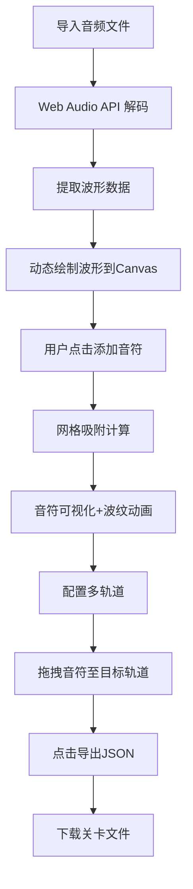

## 1. 产品概述
音游关卡编辑器是一款面向音乐爱好者的 Web 应用，允许用户导入喜爱的歌曲，通过在波形图上点击时间点生成下落音符，最终导出 JSON 格式的自定义关卡文件供音游使用。
- 目标用户：音乐游戏爱好者、独立音乐人、关卡创作者
- 市场价值：降低音游关卡创作门槛，让普通用户也能为自己喜爱的歌曲制作专属关卡

## 2. 核心功能

### 2.1 功能模块
1. **主编辑区**：波形显示、音符可视化、节拍网格、拖拽交互
2. **轨道控制面板**：多轨道配置、轨道启用切换、轨道添加/删除
3. **文件操作**：音频导入（拖拽/选择器）、关卡 JSON 导出
4. **数据管理**：音符增删改查、节拍吸附、BPM 配置

### 2.2 页面详情
| 页面名称 | 模块名称 | 功能描述 |
|-----------|-------------|---------------------|
| 编辑器主页 | 波形显示区 | 动态绘制音频波形（256采样点/帧），支持点击添加音符 |
| 编辑器主页 | 节拍网格 | 根据BPM自动生成网格线，支持时间吸附，最小间距10px |
| 编辑器主页 | 音符标记 | 圆形标记(直径16px, #22c55e)，放置时有波纹扩散动画(0.3s) |
| 编辑器主页 | 拖拽交互 | 音符可拖拽至不同轨道，拖拽时半透明跟随鼠标 |
| 编辑器主页 | 轨道面板(300px) | 最多4条轨道(80px高,交替背景色,4px间距)，启用状态小圆点(12px) |
| 编辑器主页 | 导出按钮 | 120x40px，蓝色圆角按钮，hover过渡效果，导出JSON关卡文件 |

## 3. 核心流程
用户通过拖拽或文件选择器导入音频文件 → 系统使用 Web Audio API 解码并提取波形数据 → 波形以动态方式逐步绘制在 Canvas 上 → 用户在波形上点击添加音符（自动吸附到最近节拍网格）→ 用户可在轨道面板添加/启用轨道 → 拖拽音符到不同轨道调整编排 → 点击导出按钮生成包含歌曲元数据、BPM、各轨道音符列表的 JSON 文件并下载。

## 4. 用户界面设计
### 4.1 设计风格
- **主色调**：深色科技感主题，背景 #0f172a，面板背景 #1e293b，分隔线 #334155
- **点缀色**：波形蓝 #3b82f6，音符绿 #22c55e，轨道激活红 #ef4444，按钮蓝 #2563eb
- **按钮风格**：圆角8px矩形，hover 时颜色加深（#1d4ed8），过渡0.2s
- **字体**：现代无衬线字体，代码风格字体用于数据显示
- **布局**：左主右辅结构，主编辑区70%，轨道面板30%
- **视觉特征**：扁平设计，网格纹理，微交互动画（波纹扩散、hover过渡）

### 4.2 页面设计概述
| 页面名称 | 模块名称 | UI元素 |
|-----------|-------------|-------------|
| 编辑器主页 | 主编辑区 | 深色背景Canvas，蓝色波形(2px)，半透明白网格线(#ffffff33)，绿色音符圆形(16px)，波纹动画 |
| 编辑器主页 | 轨道面板 | 300px宽侧边栏，1px分隔线，4条交替背景色轨道条，12px状态圆点(灰/红切换) |
| 编辑器主页 | 操作区 | 右下角蓝色导出按钮(120x40px, 圆角8px, hover过渡) |
| 编辑器主页 | 文件导入 | 拖拽区域高亮反馈，文件选择器按钮 |

### 4.3 响应式
桌面端优先设计，主区域固定布局。在中等屏幕上轨道面板最小宽度280px，波形区自适应缩放。

### 4.4 性能要求
- 加载300个音符时拖拽操作保持60fps流畅度
- 波形绘制使用 requestAnimationFrame，256采样点/帧渐进渲染
- Canvas 渲染采用脏矩形局部重绘优化
- 音符数据结构扁平，避免深层嵌套导致的性能损耗
