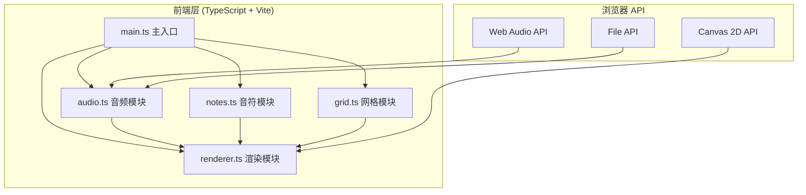

## 1. 架构设计


## 2. 技术说明
- **前端框架**：原生 TypeScript（无 UI 框架），采用模块化架构
- **构建工具**：Vite 5.x，指定入口 index.html
- **核心 API**：
  - Web Audio API：解码音频文件、提取 AudioBuffer、计算波形采样
  - Canvas 2D API：绘制波形、网格、音符标记、波纹动画
  - File API / Drag and Drop API：音频文件导入
- **类型系统**：TypeScript 严格模式，ES2020 模块标准
- **状态管理**：模块内部封装状态，通过事件回调通信
- **性能优化**：
  - 波形渐进渲染（256采样点/帧，requestAnimationFrame 驱动）
  - 音符碰撞检测使用空间划分
  - 拖拽操作使用 requestAnimationFrame 节流
  - Canvas 分层渲染或脏区域重绘

## 3. 文件结构
| 文件路径 | 职责 |
|-------|------|
| `package.json` | 项目元数据、依赖(typescript/vite/@types/node)、启动脚本 |
| `index.html` | 入口HTML，包含主容器、Canvas、轨道面板、导出按钮 |
| `tsconfig.json` | TS配置，严格模式，ES2020模块，目标ES2020 |
| `vite.config.js` | Vite基础配置，入口index.html |
| `src/audio.ts` | 加载/解码音频，提取波形采样数据，提供getWaveform() |
| `src/notes.ts` | 音符CRUD，维护多轨道音符数组，addNote/removeNote/moveNote |
| `src/grid.ts` | BPM网格计算，getSnapPosition()时间吸附 |
| `src/renderer.ts` | Canvas主渲染，波形/网格/音符绘制，鼠标交互处理 |
| `src/main.ts` | 初始化所有模块，数据流连接，导出功能 |

## 4. 数据类型定义
```typescript
interface Note {
  id: string;
  trackIndex: number;
  timestamp: number;
  xOffset: number;
  createdAt: number;
}

interface Track {
  index: number;
  enabled: boolean;
  color: string;
}

interface LevelData {
  songMetadata: {
    name: string;
    duration: number;
    sampleRate: number;
  };
  bpm: number;
  tracks: {
    index: number;
    notes: {
      trackIndex: number;
      timestamp: number;
      xOffset: number;
    }[];
  }[];
}

interface WaveformData {
  samples: Float32Array;
  length: number;
  duration: number;
}
```

## 5. 模块接口
### audio.ts
```typescript
class AudioModule {
  async loadFromFile(file: File): Promise<void>;
  getWaveform(targetSamples?: number): WaveformData;
  getDuration(): number;
  getSampleRate(): number;
  getFileName(): string;
}
```

### notes.ts
```typescript
class NotesManager {
  addNote(trackIndex: number, timestamp: number, xOffset: number): Note | null;
  removeNote(id: string): boolean;
  moveNote(id: string, newTrackIndex: number, newTimestamp: number): boolean;
  getAllNotes(): Note[];
  getNotesByTrack(trackIndex: number): Note[];
  getNoteCount(): number;
  static MAX_NOTES = 200;
}
```

### grid.ts
```typescript
class GridSystem {
  setBPM(bpm: number): void;
  getSnapPosition(timestamp: number): number;
  getGridPositions(duration: number): number[];
  getBeatInterval(): number;
}
```

### renderer.ts
```typescript
interface RendererEvents {
  onNoteAdd: (timestamp: number, x: number) => void;
  onNoteMove: (noteId: string, trackIndex: number, timestamp: number) => void;
  onTrackToggle: (trackIndex: number) => void;
  onTrackAdd: () => void;
}

class Renderer {
  setWaveform(data: WaveformData): void;
  setNotes(notes: Note[]): void;
  setGridPositions(positions: number[]): void;
  setTracks(tracks: Track[]): void;
  startRenderLoop(): void;
  destroy(): void;
}
```
