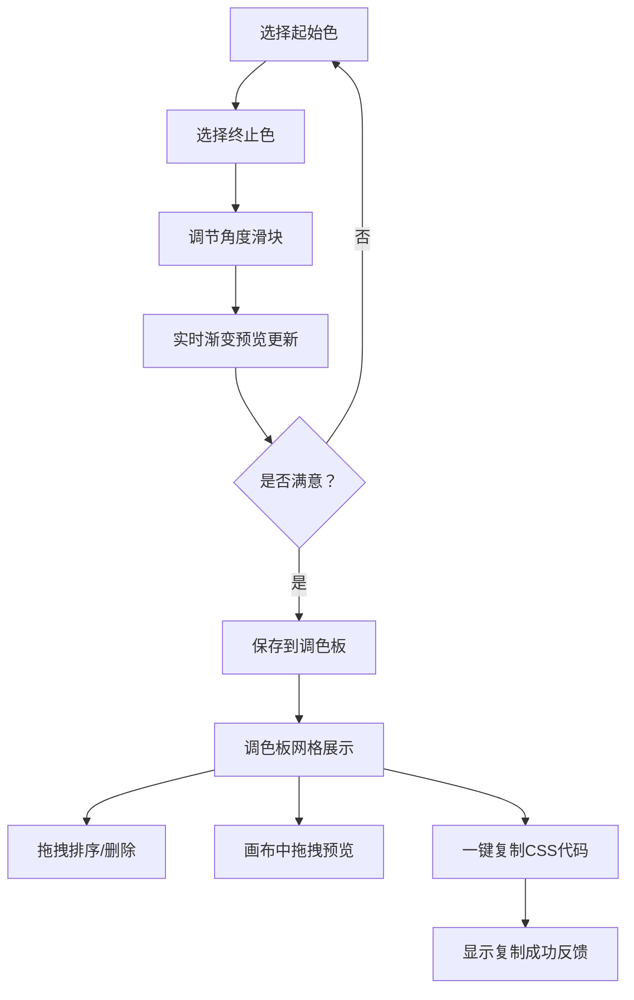

## 1. 产品概述

在线渐变色生成与调色板管理工具，专为前端开发者设计，用于快速生成、预览和管理 CSS 渐变色方案，解决手动调试渐变耗时且缺乏灵感的问题。

- 目标用户：前端开发者、UI 设计师、博客作者
- 核心价值：将渐变色生成流程从手动编码转化为可视化操作，支持实时预览、方案保存和代码导出

## 2. 核心功能

### 2.1 用户角色
| 角色 | 注册方式 | 核心权限 |
|------|----------|----------|
| 普通用户 | 无需注册 | 使用所有渐变色生成、管理和导出功能 |

### 2.2 功能模块
1. **渐变色生成器**：双颜色选择器、角度调节滑块、实时渐变预览
2. **调色板管理器**：方案保存、3列网格展示、拖拽排序、删除动画
3. **画布预览器**：800x400 画布、可拖拽矩形、实时渐变应用、坐标显示
4. **代码导出器**：一键复制 CSS、复制成功反馈

### 2.3 页面详情
| 页面名称 | 模块名称 | 功能描述 |
|----------|----------|----------|
| 首页（单页应用） | 渐变色生成器 | 起始色/终止色选择器（react-colorful 紧凑布局）、角度滑块（0-360度，步长1）、400x200 渐变预览区（圆角12px，200ms过渡） |
| 首页 | 渐变预览区 | 固定高度300px，位于右侧顶部，展示当前渐变色方案 |
| 首页 | 调色板网格 | 3列网格，卡片180x100px圆角8px，展示渐变色预览、色值标签、删除按钮 |
| 首页 | 画布预览 | 800x400px画布，200x120px可拖拽圆角矩形，实时应用渐变，显示坐标 |
| 首页 | 代码导出 | 每张卡片提供复制按钮，CSS格式：`background: linear-gradient(角度deg, 起始色, 终止色);` |

## 3. 核心流程

用户操作主流程：选择起始色 → 选择终止色 → 调节角度 → 查看实时渐变预览 → 满意后保存到调色板 → 在画布中拖拽预览效果 → 一键复制CSS代码

## 4. 用户界面设计

### 4.1 设计风格
- 主背景：#0f172a（深色 slate-900）
- 卡片背景：#1e293b（slate-800）
- 输入区域背景：#334155（slate-700）
- 文字颜色：#f8fafc（slate-50）
- 辅助文字：#94a3b8（slate-400）
- 强调色：#3b82f6（blue-500，滑块头颜色）
- 按钮风格：圆角、悬停上浮 translateY(-2px) 150ms 过渡
- 布局风格：左侧固定400px操作面板 + 右侧可滚动主区域
- 图标风格：使用 lucide-react 简洁线性图标

### 4.2 页面设计概述
| 页面名称 | 模块名称 | UI 元素 |
|----------|----------|----------|
| 首页 | 左侧操作面板 | 起始色选择器组、终止色选择器组、角度滑块组件、保存按钮，每组 hover 时轻微上浮 |
| 首页 | 渐变预览区 | 400x200px 圆角12px 卡片，200ms ease-out 过渡，背景实时更新 |
| 首页 | 调色板网格 | 3列网格，卡片间距16px，卡片尺寸180x100px圆角8px，底部删除按钮，删除时向左滑动淡出300ms |
| 首页 | 画布预览 | 800x400px 画布容器，矩形拖拽时指针 grab/grabbing，位置坐标白色半透明文字 |
| 首页 | 复制反馈 | "已复制"文字淡入淡出动画，1.5秒后自动消失 |

### 4.3 响应式设计
- 桌面端（≥900px）：左侧固定400px操作面板 + 右侧主区域
- 移动端（<900px）：操作面板折叠为顶部60px导航栏，点击展开为模态框，主区域占满全宽，调色板自动调整为2列

### 4.4 动画与交互
- 颜色变化过渡：200ms ease-out
- 删除动画：translateX(-100%) + opacity 0，300ms
- 拖拽卡片：scale(1.05) + box-shadow: 0 4px 12px rgba(0,0,0,0.15)
- 悬停上浮：translateY(-2px)，150ms
- 复制反馈：fade-in → 1.5s → fade-out
- 滑块：轨道高6px，滑块头直径20px圆形蓝色
