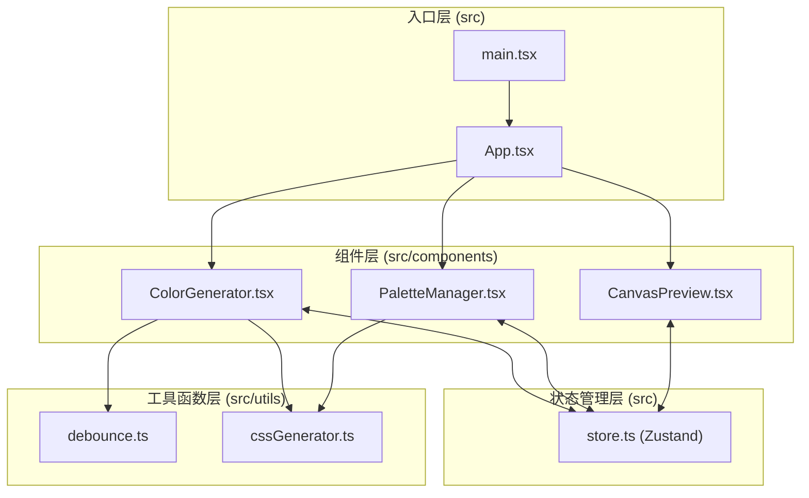

## 1. 架构设计

纯前端单页应用，采用分层架构：组件层 → 状态管理层 → 工具函数层



**数据流向**：
- ColorGenerator：用户操作颜色选择器/滑块 → 防抖150ms → 更新 Zustand store → 触发 UI 重渲染
- PaletteManager：从 store 读取色板列表 → 渲染卡片网格 → 用户拖拽/删除 → 更新 store
- CanvasPreview：从 store 读取当前渐变色 → 应用为矩形背景 → 鼠标拖拽 → 本地 state 更新矩形坐标

## 2. 技术描述

- **前端框架**：React 18 + TypeScript 5
- **构建工具**：Vite 5 + @vitejs/plugin-react
- **状态管理**：Zustand 4（轻量、极简 API）
- **颜色选择器**：react-colorful（无依赖、轻量、HSL 支持）
- **UUID生成**：uuid 9
- **图标库**：lucide-react（按需引入，体积小）
- **后端**：无（纯前端应用）
- **数据库**：localStorage（可选持久化调色板）

## 3. 项目结构

```
auto79/
├── index.html
├── package.json
├── tsconfig.json
├── vite.config.js
└── src/
    ├── main.tsx              # React 入口，挂载 App 组件
    ├── App.tsx               # 根组件，布局与响应式控制
    ├── store.ts              # Zustand 状态仓库
    ├── types.ts              # TypeScript 类型定义
    ├── utils/
    │   ├── debounce.ts       # 防抖工具函数
    │   └── cssGenerator.ts   # CSS 渐变代码生成
    ├── components/
    │   ├── ColorGenerator.tsx    # 渐变色生成组件
    │   ├── PaletteManager.tsx    # 调色板管理组件
    │   ├── PaletteCard.tsx       # 单张调色板卡片
    │   └── CanvasPreview.tsx     # 画布预览组件
    └── styles/
        └── global.css        # 全局样式与 CSS 变量
```

**文件调用关系**：
1. `main.tsx` → 引入 `App.tsx`、初始化全局样式
2. `App.tsx` → 引入 `ColorGenerator`、`PaletteManager`、`CanvasPreview`，从 `store.ts` 读取布局状态
3. `ColorGenerator.tsx` → 引入 `react-colorful`、调用 `store` 的 `setCurrentGradient`、使用 `debounce` 防抖、使用 `cssGenerator` 生成预览
4. `PaletteManager.tsx` → 引入 `PaletteCard`、调用 `store` 的 `palettes` 列表与 `reorder/delete` 方法
5. `PaletteCard.tsx` → 调用 `store` 的 `deletePalette`、使用 `cssGenerator` 生成 CSS 复制代码
6. `CanvasPreview.tsx` → 从 `store` 读取 `currentGradient`、本地 state 管理拖拽坐标
7. `store.ts` → 使用 `uuid` 生成 id

## 4. 数据模型

### 4.1 数据结构定义

```typescript
// 单个渐变色方案
interface Gradient {
  startColor: string;   // 起始色，hex 格式，如 "#ff0000"
  endColor: string;     // 终止色，hex 格式，如 "#0000ff"
  angle: number;        // 角度，0-360 整数
}

// 已保存的调色板项
interface PaletteItem {
  id: string;           // uuid v4
  gradient: Gradient;   // 渐变色方案
  createdAt: number;    // 创建时间戳
}

// Zustand Store 状态
interface GradientStore {
  // 当前编辑的渐变色
  currentGradient: Gradient;
  
  // 已保存的调色板列表
  palettes: PaletteItem[];
  
  // Actions
  setStartColor: (color: string) => void;
  setEndColor: (color: string) => void;
  setAngle: (angle: number) => void;
  setCurrentGradient: (g: Partial<Gradient>) => void;
  saveToPalette: () => void;        // 将当前渐变保存到调色板
  deletePalette: (id: string) => void;
  reorderPalettes: (fromIndex: number, toIndex: number) => void;
}
```

## 5. 性能优化策略

1. **防抖优化**：颜色选择器和滑块使用 150ms 防抖，避免每次像素变化都触发 store 更新
2. **局部状态**：Canvas 拖拽坐标使用 React 本地 state，不写入全局 store
3. **CSS Transform**：拖拽动画使用 `transform` 而非 `top/left`，触发 GPU 加速保持 60fps
4. **React.memo**：`PaletteCard` 组件使用 `React.memo` 包裹，避免父组件重渲染时无关卡片重绘
5. **选择器订阅**：Zustand 使用 selector 精确订阅所需字段，避免全局变化触发组件重渲染

## 6. 拖拽排序实现方案

使用原生 HTML5 Drag and Drop API + React state：
- `PaletteCard` 设置 `draggable={true}`，监听 `onDragStart` 设置 `dataTransfer`
- `PaletteManager` 监听 `onDragOver`（preventDefault）、`onDrop` 获取源索引并计算目标索引
- 拖拽中通过 CSS `:active` + `transform: scale(1.05)` + `box-shadow` 实现视觉反馈
- 释放后调用 `store.reorderPalettes(from, to)` 更新顺序
