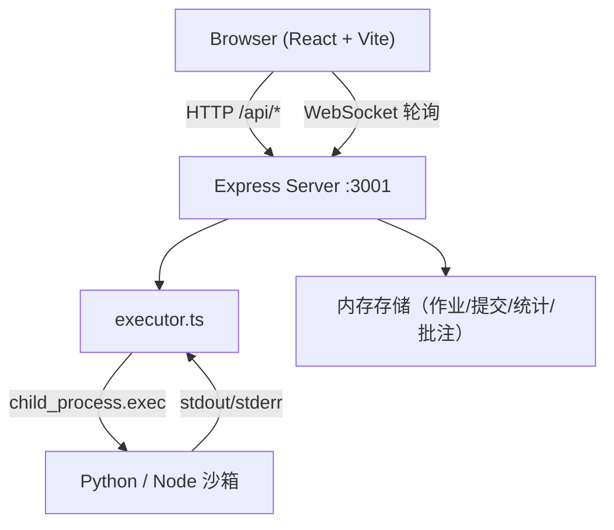
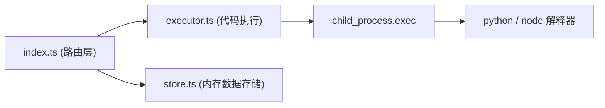

## 1. 架构设计



## 2. 技术说明

- 前端：React 18 + TypeScript + Vite + react-router-dom + axios
- 后端：Express 4 + TypeScript + ts-node + cors + child_process
- 状态管理：Zustand（前端轻量状态）
- 代码编辑器：Monaco Editor（@monaco-editor/react）
- 数据持久化：Node 内存模拟（演示用途）
- 实时通信：短轮询 + Promise 实时返回（≤3秒内完成即同步返回）

## 3. 路由定义

| 路由 | 用途 |
|------|------|
| / | 首页角色选择（学生/教师入口） |
| /student | 学生工作区（代码编辑+提交+结果） |
| /teacher | 教师成绩统计看板 |
| /teacher/assignments | 作业创建与列表 |
| /teacher/review/:submissionId | 批改详情页（双栏） |

## 4. API 定义

```ts
// 测试用例
interface TestCase {
  id: string;
  input: string;
  expected: string;
  hidden: boolean;
}

// 作业
interface Assignment {
  id: string;
  title: string;
  description: string;
  sampleInput: string;
  sampleOutput: string;
  testCases: TestCase[];
  createdAt: number;
}

// 提交
interface Submission {
  id: string;
  assignmentId: string;
  studentId: string;
  studentName: string;
  language: 'python' | 'javascript';
  code: string;
  score: number;
  results: TestResult[];
  comments: Comment[];
  submittedAt: number;
}

// 单条用例结果
interface TestResult {
  caseId: string;
  passed: boolean;
  actual: string;
  expected: string;
  hidden: boolean;
}

// 批注
interface Comment {
  id: string;
  author: 'teacher' | 'student';
  content: string;
  createdAt: number;
}

// POST /api/submit
interface SubmitRequest {
  assignmentId: string;
  studentId: string;
  studentName: string;
  language: 'python' | 'javascript';
  code: string;
}
interface SubmitResponse {
  submissionId: string;
  score: number;
  results: TestResult[];
  stdout?: string;
  stderr?: string;
}

// POST /api/assignment
interface CreateAssignmentRequest {
  title: string;
  description: string;
  sampleInput: string;
  sampleOutput: string;
  testCases: Omit<TestCase, 'id'>[];
}

// GET /api/stats?assignmentId=xxx
interface StatsResponse {
  distribution: { range: string; count: number }[]; // 5段
  submissions: Submission[];
}

// POST /api/submission/:id/comment
interface AddCommentRequest { author: 'teacher' | 'student'; content: string; }
```

## 5. 服务端架构



## 6. 数据模型（内存）

```ts
// server/store.ts
export interface Store {
  assignments: Assignment[];
  submissions: Submission[];
}
```

预置1个示例作业（≥5测试用例，含边界/异常/隐藏用例）和若干模拟学生提交，用于演示成绩分布。
