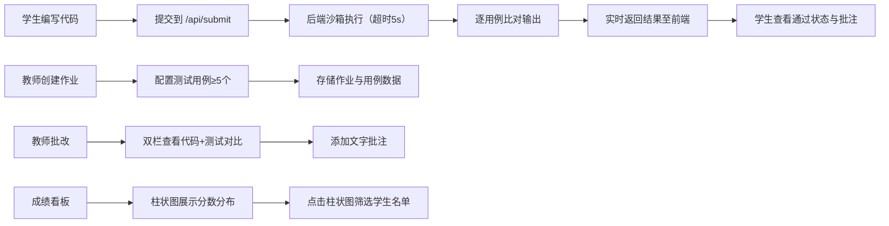

## 1. 产品概述

在线编程作业批改与反馈系统，面向编程教育场景，解决传统人工批改效率低、反馈不及时的痛点。

- 目标用户：编程教师与学生，支持Python和JavaScript两门语言
- 核心价值：自动化代码评测、可视化成绩分析、师生在线批注互动，大幅提升教学批改效率

## 2. 核心特性

### 2.1 用户角色

| 角色 | 注册方式 | 核心权限 |
|------|----------|----------|
| 学生 | 系统预置账号 | 编写/提交代码、查看测试结果、查看教师批注 |
| 教师 | 系统预置账号 | 创建作业、批改提交、添加批注、查看班级成绩统计 |

### 2.2 功能模块

1. **学生端工作区**：代码编辑器（语法高亮/行号/折叠）、语言切换、实时输出面板、提交历史与批注查看
2. **教师作业管理**：作业创建（题目/样例/测试用例）、作业列表
3. **教师批改页面**：双栏布局（代码展示+测试对比）、差异高亮、文字批注
4. **成绩统计看板**：分数段柱状图、筛选交互、学生名单详情

### 2.3 页面详情

| 页面名称 | 模块名称 | 功能描述 |
|----------|----------|----------|
| 学生工作区 | 代码编辑器 | 深色主题，语法高亮，行号显示，代码折叠，支持Python/JS切换 |
| 学生工作区 | 输出面板 | 实时展示stdout/stderr、测试用例通过状态、教师批注列表 |
| 作业创建页 | 表单区域 | 题目描述、输入样例、输出样例、至少5个测试用例（支持隐藏用例） |
| 批改详情页 | 双栏布局 | 左栏只读代码展示（可复制），右栏测试结果对比与批注 |
| 批改详情页 | 差异对比 | 实际输出vs期望输出，绿色(#22c55e)标新增，红色(#ef4444)标缺失 |
| 成绩看板 | 柱状图 | 5个分数段，渐变色生长动画，悬停放大+浮层，点击筛选学生 |

## 3. 核心流程

学生流程：进入工作区 → 选择语言 → 编写代码 → 提交 → 后端沙箱执行测试 → 实时返回结果 → 查看通过状态与批注

教师流程：创建作业（配置题目与测试用例）→ 查看学生提交列表 → 进入批改页（双栏查看代码与测试结果）→ 添加文字批注 → 查看班级成绩看板 → 点击柱状图筛选分段学生

## 4. 用户界面设计

### 4.1 设计风格

- 主背景 `#f5f7fa`，卡片背景 `#ffffff`，主色 `#4f46e5`
- 代码编辑器背景 `#1a1b2e`，字体 `'Fira Code', monospace`
- 差异高亮：新增 `#22c55e`，缺失 `#ef4444`
- 按钮：圆角8px，主色填充，hover阴影过渡
- 布局：左侧导航220px固定宽，顶部工具栏56px固定高，桌面优先

### 4.2 页面设计概览

| 页面名称 | 模块名称 | UI元素 |
|----------|----------|--------|
| 学生工作区 | 代码编辑器 | 深色#1a1b2e背景，Fira Code字体，语法高亮，行号，折叠标识 |
| 学生工作区 | 输出面板 | 白底卡片，测试用例折叠列表，状态徽章（绿/红），批注气泡 |
| 教师批改页 | 左栏代码 | 只读，右上角复制按钮，行号，语法高亮 |
| 教师批改页 | 右栏结果 | 用例卡片，实际/期望双列对比，diff高亮，批注输入框+列表 |
| 成绩看板 | 柱状图 | 从底部向上生长动画（0.8s ease-out），悬停scale(1.1)，渐变填充，数据浮层 |

### 4.3 响应式

- 桌面端：1440px为主布局，侧栏220px展开
- 移动端（<768px）：侧栏折叠为汉堡菜单，顶部展示，双栏改为上下堆叠
