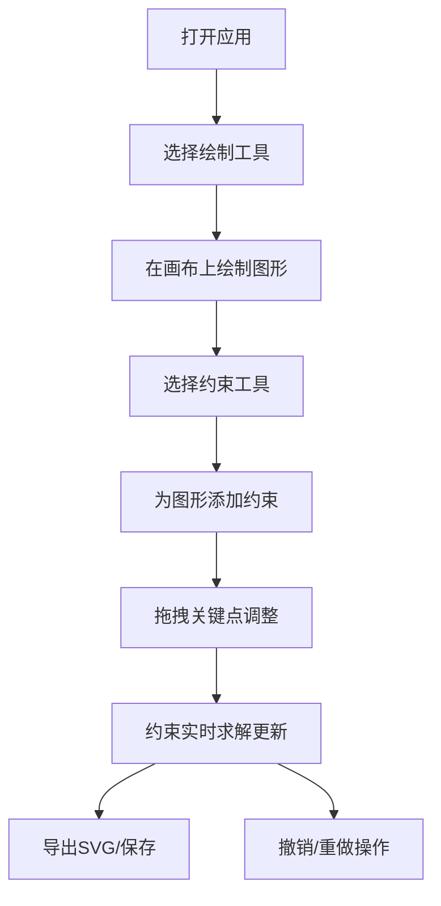

## 1. 产品概述

在线几何画板与交互式图形演示工具，让老师和学生能像在纸上画图一样，在浏览器中使用直尺、圆规和量角器绘制几何图形，并让图形在被拖动或修改时自动保持约束关系，帮助学生直观理解几何定理。

- 主要用途：几何教学、数学演示、交互式学习
- 目标用户：数学教师、学生、几何爱好者
- 产品价值：通过可视化和交互式方式降低几何学习门槛，提升教学效率

## 2. 核心功能

### 2.1 用户角色
无需用户登录，所有功能面向所有访问者开放。

### 2.2 功能模块

1. **无限画布**：支持缩放和平移的网格画布
2. **图形绘制**：点、线段、圆、直线、射线、多边形的绘制
3. **约束系统**：平行、垂直、中点、角度约束的实时求解
4. **交互编辑**：拖拽关键点调整图形，约束自动保持
5. **工具栏**：左侧工具选择面板
6. **菜单栏**：顶部文件操作和编辑操作
7. **撤销/重做**：支持50步历史记录
8. **SVG导入导出**：图形的持久化存储和交换

### 2.3 页面详情

| 页面名称 | 模块名称 | 功能描述 |
|-----------|-------------|---------------------|
| 主界面 | 画布区域 | 无限画布，支持缩放（0.2x-5x）、平移、网格显示，实时渲染所有几何图形 |
| 主界面 | 左侧工具栏 | 8个工具按钮（点、线段、圆、直线、射线、多边形、平行约束、垂直约束、中点约束、角度约束），选中态高亮，SVG图标 |
| 主界面 | 顶部菜单栏 | 新建、保存、导入、导出SVG、撤销、重做按钮 |
| 主界面 | 缩放指示器 | 画布右上角显示当前缩放比例 |
| 主界面 | 步骤指示器 | 底部显示当前撤销/重做步骤编号 |
| 主界面 | 坐标提示 | 拖拽时跟随鼠标的坐标标签 |

## 3. 核心流程

用户打开应用 → 从工具栏选择绘制工具 → 在画布上点击/拖拽创建图形 → 选择约束工具为图形添加约束 → 拖拽关键点调整图形（约束自动求解） → 使用菜单栏导出SVG或保存进度 → 通过撤销/重做修正操作

## 4. 用户界面设计

### 4.1 设计风格
- **主色调**：深蓝 #1e293b（侧边栏）、浅灰蓝 #f8fafc（工作区）、蓝色 #3b82f6（强调色）
- **辅助色**：橙色 #f97316（选中高亮）、紫色 #8b5cf6（圆形）、深灰 #475569（线段）
- **按钮风格**：圆角8px，悬停背景变化，选中态蓝色背景
- **字体**：系统无衬线字体
- **布局风格**：深色侧边栏（64px宽）+ 顶部菜单栏（48px高）+ 浅色工作区的经典布局
- **图标风格**：内联SVG，简洁几何线条风格

### 4.2 页面设计概述

| 页面名称 | 模块名称 | UI元素 |
|-----------|-------------|-------------|
| 主界面 | 左侧工具栏 | 深色背景#1e293b，64px宽，SVG图标32x32px，选中态蓝色#3b82f6圆角8px，工具切换缩放动画0.9→1.0（150ms） |
| 主界面 | 顶部菜单栏 | 白色背景#ffffff，48px高，底部边框#e2e8f0，按钮悬停#f1f5f9 |
| 主界面 | 画布区域 | 背景#f8fafc，主网格40px#e2e8f0，次网格10px#f1f5f9，滚轮缩放（200ms ease-out），空格+拖拽平移 |
| 主界面 | 图形元素 | 点8px蓝色#3b82f6，选中虚线圆环；线段2px#475569，选中橙色#f97316；圆2px#8b5cf6，半透明填充#8b5cf633；创建动画200ms ease-out |
| 主界面 | 坐标提示 | 背景#1e293b，白色文字12px，圆角4px，鼠标偏移6px |
| 主界面 | 缩放指示器 | 13px字号，背景#ffffffcc，圆角6px，padding 4px 10px |

### 4.3 响应式
桌面端优先设计，画布区域自适应窗口大小。

### 4.4 性能要求
- 所有图形渲染和约束求解在60fps下完成
- 拖拽时约束更新在16ms以内完成
- 撤销/重做操作在10ms内完成状态切换
